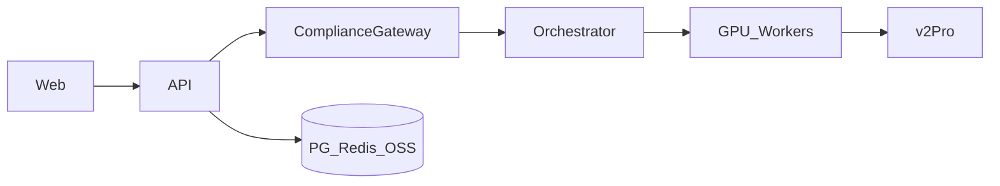

# GPT-SoVITS 语音克隆网络平台 · 系统架构设计（导读）

| 项 | 内容 |
|----|------|
| **版本** | v2.0 |
| **日期** | 2026-06-03 |
| **结构** | 分章文档（`sections/`），按 **背景 → 视图 → 领域 → 运行时 → 技术 → 治理 → 路线图** 阅读 |
| **依据** | [SRS v1.2](../requirements/2026-06-01-mvp-voice-platform-需求规格说明.md)、[PROJECT_CHARTER](../PROJECT_CHARTER.md) |

### 变更记录

| 版本 | 日期 | 说明 |
|------|------|------|
| v1.0 | 2026-06-03 | 单文件首版 |
| v1.1 | 2026-06-03 | 增加设计理由、架构评审 |
| v2.0 | 2026-06-03 | **重构为分章结构**；本文件改为导读与速览 |

---

## 一分钟速览

| 问题 | 答案 |
|------|------|
| 做什么？ | 短剧向语音克隆工作台：授权→训练→合成→合规导出 |
| 怎么拆？ | 自研平台 + GPT-SoVITS v2Pro Worker（`gsv-v2pro-20250606`） |
| 核心机制？ | ComplianceGateway + 统一 Job 队列 + OSS |
| 4 周怎么交？ | Core(W1) → Workflow(W2) → Export(W3) → 加固(W4) |
| 评审结论？ | **有条件通过**；W1 闭合 3 项 TBD/测试 |

**引擎基线**：[RVC-Boss/GPT-SoVITS `20250606v2pro`](https://github.com/RVC-Boss/GPT-SoVITS/releases/tag/20250606v2pro)

---

## 文档地图（分章阅读）

| 部分 | 文件 | 你将了解到 |
|------|------|------------|
| **一** | [01-背景与原则](./sections/01-背景与原则.md) | 目标、五条原则、约束推论、优先级 |
| **二** | [02-架构视图](./sections/02-架构视图.md) | 逻辑/部署/边界图、六层对照 |
| **三** | [03-领域与交付分层](./sections/03-领域与交付分层.md) | 有界上下文、MVP 波次、代码结构、模块映射 |
| **四** | [04-运行时与集成](./sections/04-运行时与集成.md) | 业务流、ER、Job/API、ComplianceGateway |
| **五** | [05-技术决策与质量](./sections/05-技术决策与质量.md) | 选型表、ADR-001~003、扩展点、NFR |
| **六** | [06-设计理由与评审](./sections/06-设计理由与评审.md) | 为何这样设计、评审结论与改进项 |
| **七** | [07-路线图与追溯](./sections/07-路线图与追溯.md) | W1–W4 路线、风险、TBD、REQ 矩阵 |

**图件目录**：[diagrams/](./diagrams/)

**一页纸速览**：[系统架构说明](./2026-06-03-system-architecture-系统架构说明.md)

---

## 按角色推荐阅读路径

| 角色 | 路径 |
|------|------|
| **PM / 评审** | 导读 → 一 → 三 §3.2 波次 → 六 → 七 |
| **后端** | 二 → 三 → 四 → 五 → 七 §7.3 TBD |
| **算法** | 一 → 二 §2.3 → 四 §4.3 → [W1 Spike](./2026-06-03-w1-spike-v2pro-快速验证.md) |
| **前端** | 一 → 四 §4.4 API → [SRS API](../../requirements/2026-06-01-mvp-voice-platform-需求规格说明.md) |
| **运维** | 二 §2.2 → 五 → 七 |

---

## 逻辑架构（总图）

详细图见 [02-架构视图](./sections/02-架构视图.md)。

---

## 关联文档

| 文档 | 说明 |
|------|------|
| [architecture/README.md](./README.md) | 本目录索引 |
| [infra/engine/README.md](../../infra/engine/README.md) | Docker Hub 引擎启动 |
| [requirements/modules/](../requirements/modules/) | 子模块 A–G 规格 |
| [prompts/product-structure-system-prompt.md](../../prompts/product-structure-system-prompt.md) | 架构师输出规范 |

> v1.x 单文件正文已拆入 `sections/`；勿在旧锚点 `#15` `#16` 引用，请改用 [06-设计理由与评审](./sections/06-设计理由与评审.md)。
