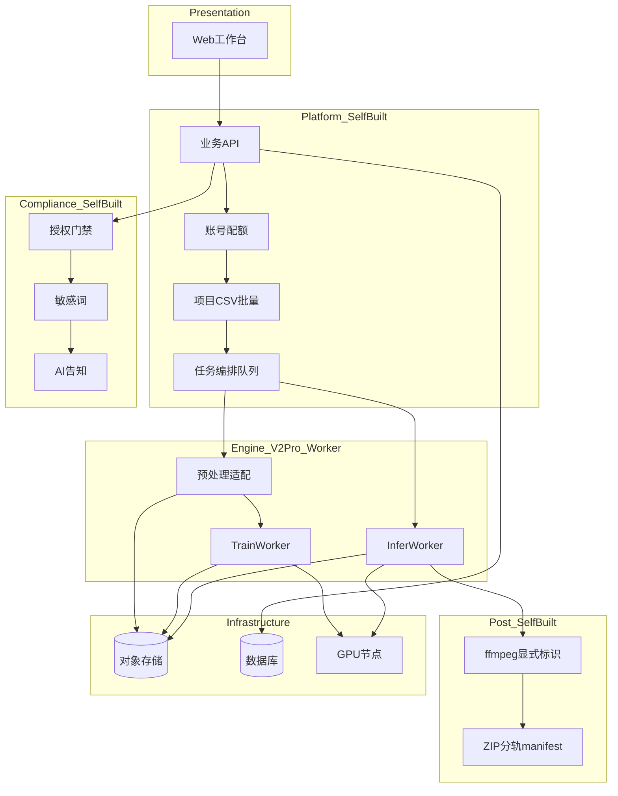
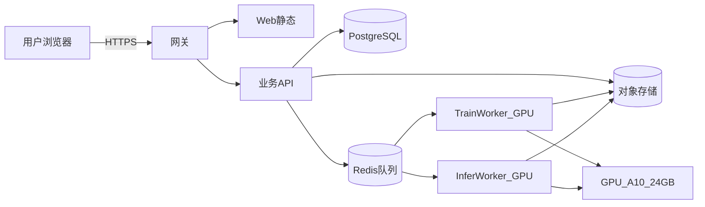

# GPT-SoVITS 语音克隆网络平台 · 系统架构说明

| 项 | 内容 |
|----|------|
| **版本** | v1.0 |
| **日期** | 2026-06-03 |
| **引擎基线** | [RVC-Boss/GPT-SoVITS](https://github.com/RVC-Boss/GPT-SoVITS) release **`20250606v2pro`** |
| **model_tag** | `gsv-v2pro-20250606`（MVP-0 全平台唯一） |
| **上级文档** | [PROJECT_CHARTER.md](../PROJECT_CHARTER.md)、[SRS v1.2](../requirements/2026-06-01-mvp-voice-platform-需求规格说明.md) |

### 变更记录

| 版本 | 日期 | 说明 |
|------|------|------|
| v1.0 | 2026-06-03 | 首版：V2-PRO 选型 ADR、六层架构、MVP-0 部署、Worker 边界 |

---

## 1. 文档范围

- **读者**：后端、前端、算法、运维、PM
- **阶段**：MVP-0（4 周）；MVP+1 演进仅 §9 简述
- **不包含**：具体代码仓库结构（W2 起随实现补充）、支付/市场服务细节

---

## 2. 架构原则

| # | 原则 | 理由 |
|---|------|------|
| P1 | **引擎与平台分离** | 14 条 P0 中合规、CSV 批量、配额属产品层，不应 fork 进模型仓库 |
| P2 | **V2-PRO 版本 pinned** | 训练/推理 `model_tag` 一致，避免 checkpoint 不兼容（REQ-005） |
| P3 | **最小 fork** | Worker 容器调用 upstream；升级 = 换镜像 tag |
| P4 | **合规不可绕过** | 授权、敏感词、显式标识在 API/编排层强制 |
| P5 | **4 周可交付** | 单卡队列跑通；水平扩展留接口 |

---

## 3. 版本选型 ADR：为何 V2-PRO

### 3.1 决策

**MVP-0 默认引擎：GPT-SoVITS v2Pro（非 v3/v4，非 v2ProPlus 首发）。**

### 3.2 理由摘要

| 考量 | v2Pro | v3/v4 | 结论 |
|------|-------|-------|------|
| ~10min 普通干声 | v1/v2 路线，中等质量可训 | 对素材质量更挑剔 | 贴合 REQ-004 与用户上传现实 |
| 相似度目标 ≥90% | +SV（ERes2NetV2）嵌入 | zero-shot 高但 fine-tune 场景不同 | v2Pro 利于 fine-tune 后稳定音色 |
| 推理速度 | ≈ v2 | 另一套 CFM-DiT + 声码器 | 批量 CSV 更可预期 |
| 训练 VRAM | ~12GB | 路径不同 | 单 A10 24GB 可串行训练 |
| 4 周集成成本 | 在 v2 上增量 | 需另维护 v3/v4 Worker | **W1 只维护一条引擎线** |

### 3.3 拒绝方案

- **生产直接用 Gradio WebUI**：无多租户、无 CSV/合规/配额，不满足 14 条 P0。
- **MVP 默认 v3/v4**：训练失败率风险高，与 W1 退出标准冲突。
- **深度 fork 模型代码进业务单体**：upstream 合并成本高，OOM 拖垮 API。

### 3.4 v2Pro 工程要点（来自上游 Wiki）

- 采样率 **32kHz**；S2 增加 **SV 说话人嵌入**引导。
- 训练需 SV 相关特征（如 `5.1-sv` 流程）；推理阶段加载 SV 预训练权重。
- 预训练权重：`v2Pro/s2Dv2Pro.pth`、`s2Gv2Pro.pth`、`sv/pretrained_eres2netv2w24s4ep4.ckpt` 等（HuggingFace `lj1995/GPT-SoVITS`）。

---

## 4. 逻辑架构（六层）



PlantUML 源文件：[diagrams/2026-06-03-logical-architecture.puml](./diagrams/2026-06-03-logical-architecture.puml)

### 4.1 自研 vs 开源边界

| 能力 | 自研平台 | GPT-SoVITS V2-PRO | 说明 |
|------|:--------:|:-----------------:|------|
| 登录/配额/项目/CSV | ✓ | | 模块 A、E |
| 授权/敏感词/AI 告知 | ✓ | | 模块 B、G |
| 素材质检规则 | ✓ | | REQ-004；规则自研 |
| 音频切片/特征/SV 训练前置 | 适配层 | ✓ | wrap upstream CLI **Spike** |
| GPT-SoVITS 训练 | 编排 | ✓ | TrainWorker |
| TTS 推理 | 编排 | ✓ | InferWorker |
| 合规片头/ZIP | ✓ | | ffmpeg，模块 F |
| 生产 WebUI | ✓ | | 不用 Gradio 作正式入口 |

详见 [diagrams/2026-06-03-opensource-boundary.puml](./diagrams/2026-06-03-opensource-boundary.puml)

---

## 5. 集成策略：Worker 容器 + Job API

### 5.1 MVP-0 推荐形态

```
平台 API ──enqueue──► Job Queue ──dispatch──► Worker Pod (Docker)
                                              └─ GPT-SoVITS @ 20250606v2pro
                                              └─ 薄 Adapter（HTTP/CLI）
```

**Adapter 职责**（自研，~数百行级）：

- 输入：JSON（`asset_url`, `text`, `checkpoint_urls`, `model_tag`, `hyperparams`）
- 调用：upstream `api.py` / 训练推理脚本
- 输出：checkpoint/wav 上传 OSS；stdout/stderr 写日志

**不在 MVP-0 做**：修改 `module/models.py`；Gradio 外挂登录。

### 5.2 Job 类型

| JobType | Worker | 输入 | 输出 | VRAM 参考 |
|---------|--------|------|------|-----------|
| `preprocess` | Pre | 原始 wav URL | 切片 + SV 特征路径 | CPU 为主 |
| `train` | Train | 锁定素材 + v2Pro 配置 | GPT.ckpt + SoVITS.pth | ~12GB |
| `synthesize` | Infer | VoiceVersion + text | raw wav URL | ~5GB |
| `export` | Post | raw wav | 合规 wav / ZIP | CPU + ffmpeg |

### 5.3 model_tag 与 VoiceVersion

```text
VoiceVersion.model_tag = "gsv-v2pro-20250606"   # 不可变
VoiceVersion.checkpoint_uri = { gpt, sovits }  # OSS 路径
训练 Job 与推理 Job 必须引用同一 VoiceVersion
```

---

## 6. 关键数据流

### 6.1 训练（W1 退出标准）

1. 用户上传素材 → **QC**（模块 C）
2. **Consent approved**（模块 B）
3. `TrainingJob` → Pre（切片 + SV 特征）→ TrainWorker（v2Pro）
4. 成功 → 写 `VoiceVersion` + 试听默认句

### 6.2 单条合成

Auth → 配额 → 敏感词 → AI 告知 → `SynthesisJob` → InferWorker → （可选）合规 ffmpeg → URL

### 6.3 批量短剧

CSV → `BatchJob` → N×`SynthesisJob` → 行级敏感词隔离 → ZIP + manifest → 合规导出

与 SRS §5 序列图一致，此处不重复。

---

## 7. MVP-0 部署架构



**MVP-0 物理拓扑（最小）**：

| 组件 | 数量 | 说明 |
|------|------|------|
| Web + API | 1 | 可同机；HTTPS |
| GPU Worker | 1 | Train/Infer **分时复用**同一 GPU |
| DB | 1 | 用户/Job/VoiceVersion |
| Redis | 1 | 队列 + 验证码 **待定** |
| OSS | 1 | 境内；私有桶 |

PlantUML：[diagrams/2026-06-03-deployment-mvp0.puml](./diagrams/2026-06-03-deployment-mvp0.puml)

---

## 8. 与需求模块映射

| 架构组件 | 子模块 | REQ |
|----------|--------|-----|
| AuthQ | A | 001, 023 |
| Consent, AIHint | B | 003, 021 |
| Sensitive | G | 009 |
| Pre + QC | C | 004 |
| TrainW + Orch | D | 005, 022 |
| WF | E | 012–014 |
| InferW + Label + Zip | F | 007, 010, 011 |
| Orch | D, F | 022 |

---

## 9. MVP+1 演进（简述）

- 独立 Infer Worker 水平扩展；Train 仍低并发
- `LicensePolicy` / `Authorization` 服务（市场）
- 水印 Worker 旁路；v2ProPlus 作为可选 `model_tag`

---

## 10. 非功能与可观测

摘自 SRS §12：

- Job 全链路 `trace_id`；失败 stderr 保留
- 训练/推理容器 **pinned** `20250606v2pro`；一键回滚上一镜像
- 失败告警飞书

---

## 11. 待定项（TBD）

| ID | 内容 | 负责 | 目标周 |
|----|------|------|--------|
| TBD-ARCH-01 | Pre 是否 100% wrap upstream 切片/SV 脚本 | 算法 | W1 Spike |
| TBD-ARCH-02 | Job 协议 HTTP vs gRPC | 后端 | W1 |
| TBD-ARCH-03 | Redis vs DB 队列 | 后端 | W1 |
| TBD-ARCH-04 | v2Pro 默认超参 JSON | 算法 | W1 |
| TBD-ARCH-05 | Infer 与 Train 是否拆物理 GPU | 运维 | W3 |

---

## 12. 附录

### A. 上游 LICENSE

GPT-SoVITS 为 **MIT License**；保留版权声明；商用需自有合规与用户授权流程。

### B. 今日验证

见 [2026-06-03-w1-spike-v2pro-快速验证.md](./2026-06-03-w1-spike-v2pro-快速验证.md)

### C. 图件索引

| 图 | 文件 |
|----|------|
| 逻辑架构 | [diagrams/2026-06-03-logical-architecture.puml](./diagrams/2026-06-03-logical-architecture.puml) |
| MVP-0 部署 | [diagrams/2026-06-03-deployment-mvp0.puml](./diagrams/2026-06-03-deployment-mvp0.puml) |
| 开源边界 | [diagrams/2026-06-03-opensource-boundary.puml](./diagrams/2026-06-03-opensource-boundary.puml) |
