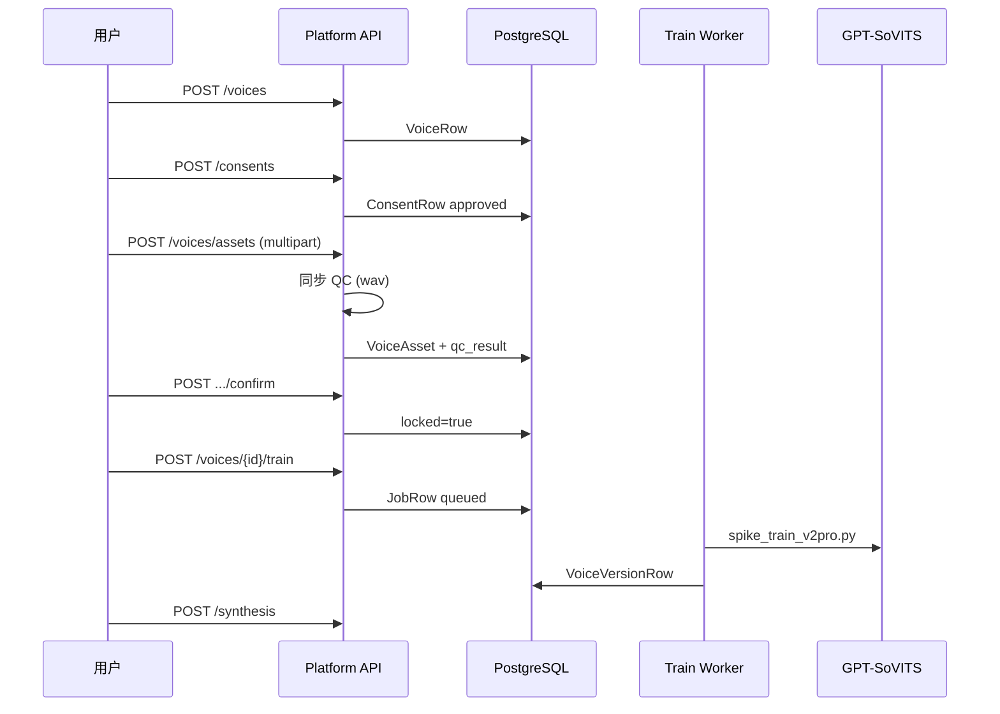

# W2 · 上传音频 → 训练 → 合成闭环

| 项 | 内容 |
|----|------|
| **日期** | 2026-06-03 |
| **状态** | W2 后端 + Web v0.1 可运行 |
| **上级** | [系统架构设计](2026-06-03-system-architecture-design-系统架构设计.md) |

---

## 1 用户目标

用户上传自己的干声音频，经质检与训练后得到可复用的 `voice_version_id`，用于后续 TTS 合成。

## 2 已实现 API（W2 切片）

| 步骤 | 方法 | 路径 |
|------|------|------|
| 创建音色草稿 | POST | `/api/v1/voices` |
| 提交授权（dev 自动通过） | POST | `/api/v1/consents` |
| 上传素材 + 同步质检 | POST | `/api/v1/voices/assets` |
| 查看质检报告 | GET | `/api/v1/voices/assets/{id}/qc` |
| 确认锁定 | POST | `/api/v1/voices/assets/{id}/confirm` |
| 触发训练 | POST | `/api/v1/voices/{voice_id}/train` |
| 轮询任务 | GET | `/api/v1/jobs/{job_id}` |
| 合成 | POST | `/api/v1/synthesis` |

## 3 数据流



## 4 存储约定

- 上传文件：`data/storage/{user_id}/training/{asset_id}.wav`
- `storage_uri`：`local://{user_id}/training/{asset_id}.wav`
- Train Worker `EngineTrainAdapter._resolve_asset` 解析至平台 `data/storage/...`

## 5 环境变量

| 变量 | 默认 | 说明 |
|------|------|------|
| `CONSENT_AUTO_APPROVE` | `true` | dev 跳过人工审授权 |
| `QC_DEV_RELAX_DURATION` | `false` | `true` 时最短 3s（冒烟/Spike） |
| `QC_MIN_DURATION_SEC` | `480` | 生产 8min |
| `QC_MAX_DURATION_SEC` | `3600` | 1h 上限（本地上传与云端训练共用） |

## 6 本地启动

```powershell
.\scripts\platform_start.ps1
```

`TRAIN_MOCK=true`（默认）：训练任务只写 Mock 版本，**不在本机跑 GPU 微调**。  
真实微调：[云端 GPU 训练指南](./2026-06-10-云端GPU训练指南.md)。

## 7 冒烟脚本

```powershell
# .env 建议 QC_DEV_RELAX_DURATION=true
# 真引擎训练默认上传 infra/engine/samples/ref_zh_zero_shot.wav（勿用静音占位）
python scripts\smoke_w2_upload_train.py
```

> **注意**：全静音 wav 仅能通过 QC（mock 训练）；真引擎 1A–1C 预处理需要**含人声**的音频。

## 7 待办（W2 后续）

- [ ] 授权书文件上传（模块 B 真 multipart）
- [ ] flac/mp3 解码（ffmpeg 或 pydub）
- [ ] 异步 QC Worker + VAD/SNR/BGM
- [ ] 断点续传 OSS
- [x] Infer Worker 按 `voice_version.metadata` 自动 `set_gpt/set_sovits`（2026-06-09）
- [ ] 前端上传页
