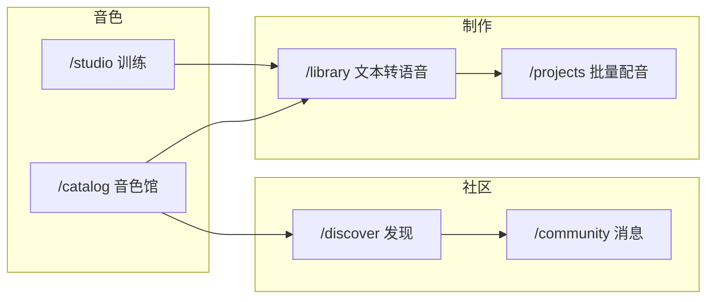

# Web 前端工作流与页面地图

版本：v1.0 · 2026-06-16  
代码索引：`apps/web/src/config/navigation.ts`

## 1. 问题与目标

此前侧栏为 **6 项平铺**，存在：

- **制作 vs 训练** 混淆：`/library`（合成）与 `/studio`（训练）职责不清
- **发现 vs 消息** 边界模糊（已在发现页改版中理顺，见会话记录）
- **默认路由** 指向 `/studio`，与登录后跳转 `/library`、品牌链接不一致
- 顶栏仅显示页面名，缺少 **分组** 与 **步骤提示**

本次整理：**分组导航 + 统一元数据 + 默认落地页 + 文档地图**。

## 2. 信息架构（三条主线）

### 制作 — 已有音色，生成语音

| 页面 | 路由 | 用户目标 | 关键步骤 |
|------|------|----------|----------|
| 文本转语音 | `/library` | 单条/多段配音、返听导出 | 选音色 → 写台本 → 调参合成 |
| 批量配音 | `/projects` | 短剧 CSV 批量生产 | 建项目 → 绑角色 → CSV → ZIP |

### 音色 — 获取与管理可用音色

| 页面 | 路由 | 用户目标 | 关键步骤 |
|------|------|----------|----------|
| 训练工作台 | `/studio` | 自有声纹训练 | 创建 → 上传 → 训练 → 试听 |
| 音色馆 | `/catalog` | 公开音色试听/购买 | 浏览 → 试听 → 购买或私信 |

### 社区 — 发现人与洽谈

| 页面 | 路由 | 用户目标 | 关键步骤 |
|------|------|----------|----------|
| 发现 | `/discover` | 看动态、上新、发帖 | 浏览 Feed → 互动 → 发私信 |
| 消息 | `/community` | 私信收件箱 | 选会话 → 洽谈授权 |

职责分界：**发现 = 看（公开）** · **消息 = 聊（私密）**

## 3. 二级与外链页面

不进入主导航，由业务跳转进入：

| 页面 | 路由 | 入口 |
|------|------|------|
| 实名认证 | `/kyc` | 训练前拦截、KYC 横幅 |
| 创作者主页 | `/creator/:userId` | 发现/音色馆/消息 |
| 相似度评测 | `/quality/:voiceVersionId` | 质量工具链 |
| 授权验真 | `/verify/:authorizationId` | 凭证分享链接 |
| 运营台 | `/admin` | 管理员侧栏「运营」分组 |

## 4. 用户旅程（推荐）

**新用户首日**

1. `/library` — 导入云端权重或选已有音色，合成试听  
2. 若无音色 → `/catalog` 或 `/studio`  
3. 看中创作者音色 → `/discover` 或 `/community` 私信  

**短剧制作方**

1. `/library` 确认音色  
2. `/projects` 建项目、绑角色、跑 CSV  
3. 下载合规 ZIP  

## 5. 实现落点

| 能力 | 文件 |
|------|------|
| 导航分组与页面 meta | `apps/web/src/config/navigation.ts` |
| 侧栏分组渲染 | `apps/web/src/components/AppLayout.vue` |
| 顶栏「分组 / 页面 + 步骤」 | `apps/web/src/components/AppTopBar.vue` |
| 默认路由 `/` → `/library` | `apps/web/src/router/index.ts` |
| 登录落地 `/library` | `apps/web/src/views/LoginView.vue` |

## 6. 命名约定

| 旧称 | 新称 | 原因 |
|------|------|------|
| 配音工作台（/studio） | **训练工作台** | 强调「训练声纹」，避免与「制作配音」混淆 |
| 工作台 /studio 默认首页 | **/library 默认首页** | 合成是高频操作 |

产品副标题仍为「AI 配音工作台」，指整个产品，不单指某一页。

## 7. 相关文档

- [Web 验收清单](./2026-06-10-web-frontend-验收清单.md)
- [复古录音室页面规范](./2026-06-10-web-ui-page-spec-复古录音室页面规范.md)
- [apps/web/README](../../apps/web/README.md)
