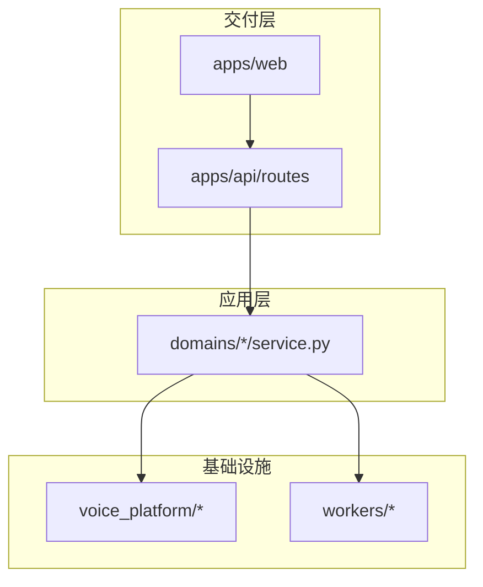

# 全栈模块化架构

版本：v1.0 · 2026-06-19

## 1. 设计目标

| 原则 | 说明 |
|------|------|
| **功能划分清晰** | 用户可见能力按业务模块归类，不混在同一页面上下文 |
| **逻辑结构严密** | HTTP → 用例 → 仓储 单向依赖；合规 Gateway 单通道 |
| **单一注册源** | 前后端各一份 `architecture/*` 注册表，导航/路由/API 由此派生 |
| **渐进迁移** | 路由文件与 View 文件可保留原路径，通过 registry 接线 |

## 2. 模块五分法（对齐前后端）

```
                    ┌─────────────┐
                    │  platform   │  鉴权 · Job · 配额 · 导出
                    └──────┬──────┘
           ┌───────────────┼───────────────┐
           ▼               ▼               ▼
    ┌──────────┐    ┌──────────┐    ┌──────────┐
    │ produce  │    │  voice   │    │  social  │
    │ 制作     │    │ 音色     │    │ 社区     │
    └──────────┘    └──────────┘    └──────────┘
                           │
                    ┌──────┴──────┐
                    │     ops     │  运营 · 开放 API
                    └─────────────┘
```

访客站 `public` 为前端壳层概念，后端无独立模块（路由标记 `meta.public`）。

### 2.1 produce · 制作

| 场景 | 前端路由 | 后端路由 | 领域包 |
|------|----------|----------|--------|
| 智能配音（单人/情景） | `/library` | `synthesis`, `script` | synthesis, script, compliance |
| 短剧批量 CSV | `/projects` | `projects` | projects |

### 2.2 voice · 音色

| 能力 | 前端路由 | 后端路由 | 领域包 |
|------|----------|----------|--------|
| 训练 | `/studio` | `voices`, `assets`, `consents` | voices, training, assets, consents |
| 资产管理 | `/voices` | `voices` | voices |
| 音色馆 | `/catalog`, `/browse` | `catalog`, `licensing` | marketplace, licensing |
| 实名/质量/支付 | `/kyc`, `/quality` | `kyc`, `quality`, `payments`, `settlement` | kyc, quality, payment, settlement |

### 2.3 social · 社区

| 能力 | 前端路由 | 后端路由 | 领域包 |
|------|----------|----------|--------|
| 动态 Feed | `/discover/*`, `/updates` | `community` | community |
| 互动 | — | `social` | social |
| 私信 | `/community` | `community` | community |

### 2.4 ops · 运营

| 能力 | 前端路由 | 后端路由 | 领域包 |
|------|----------|----------|--------|
| 运营台 | `/admin` | `admin` | jobs（读） |
| 开发者 | — | `developer`, `open_api` | developer |

## 3. 分层与依赖规则



**硬性约束**

1. `routes/*` 只调用 `domains/*/service` 或 `ComplianceGateway`，禁止直连 `voice_platform/*/repository`
2. 合成/导出必经 `ComplianceGateway`（敏感词、告知、授权）
3. 前端 `api/*.ts` 按模块经 `api/modules/*` 再导出（新代码优先 `import { produce } from '@/api/modules'`）

## 4. 代码落点索引

| 层级 | 注册表 | 职责 |
|------|--------|------|
| 前端模块 | `apps/web/src/architecture/modules.ts` | 路由、壳层、访客导航 |
| 前端对齐 | `apps/web/src/architecture/registry.ts` | API 客户端、侧栏 name 映射 |
| 前端导航 | `apps/web/src/config/navigation.ts` | PAGE_META + 从 registry 派生侧栏 |
| 前端路由 | `apps/web/src/router/modules/*.routes.ts` | 按模块拆分 Vue Router |
| 前端页面 | `apps/web/src/modules/<id>/views/` | 按业务模块存放 View |
| 前端组件 | `apps/web/src/modules/<id>/components/` | 模块私有 UI |
| 前端逻辑 | `apps/web/src/modules/<id>/composables/` | 模块私有状态与用例 |
| 前端 API | `apps/web/src/api/modules/*.ts` | 按模块 barrel export |
| 共享 UI | `apps/web/src/components/` | 壳层、Page*、studio 录音室控件 |
| 后端 API | `apps/api/architecture/modules.py` | 路由文件 → 模块 → 领域包 |
| 后端注册 | `apps/api/router_registry.py` | `register_api_routers(app)` |
| 领域边界 | `domains/architecture.py` | 领域包归属 |

## 5. 壳层（仅前端）

| shell | 布局 | 模块 |
|-------|------|------|
| `public` | PublicLayout | public |
| `workbench` | AppLayout | produce, voice, social, ops |
| `bare` | 无 | login, verify |

路由 `meta.module` 与 `meta.shell` 必填（工作台/访客路由）。

## 6. 关联文档

- [Web 模块化 IA](./2026-06-19-web-frontend-modular-ia.md)
- [制作场景三分法](../requirements/2026-06-19-制作场景三分法-短剧情景演唱.md)
- [工作流与页面地图](./2026-06-16-web-frontend-工作流与页面地图.md)

## 7. 后续迁移

- ~~将 `views/*` 迁入 `modules/<id>/views/`~~ ✅ 已完成（`apps/web/src/modules/`）
- ~~`types/script.ts` → `modules/produce/types/`~~ ✅ 已完成（`types/script.ts` 保留 re-export）
- ~~`showcase/` 组件~~ ✅ 已迁入 `modules/public/components/`
- 领域包物理目录按 `domains/voice/` 聚合（当前扁平，以 `architecture.py` 逻辑分组）
- OpenAPI 按模块分组展示（读取 `API_MODULES` 生成 tag 描述）
