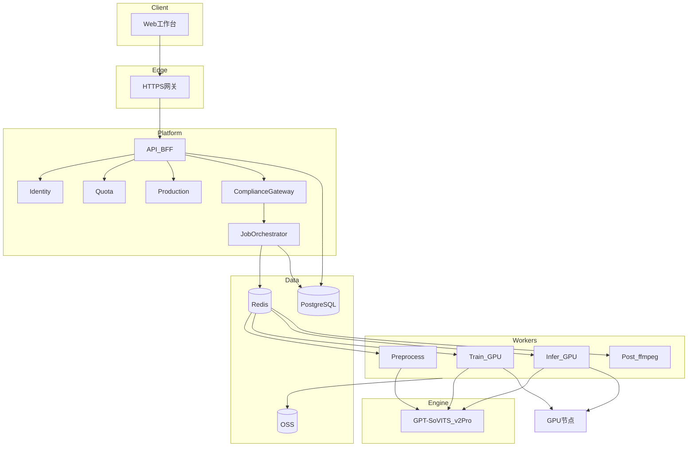
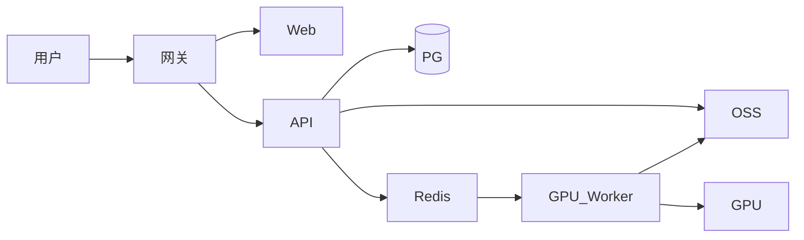

# 第二部分：架构视图

[← 背景与原则](./01-背景与原则.md) | [导读](../2026-06-03-system-architecture-design-系统架构设计.md) | [下一部分：领域与交付 →](./03-领域与交付分层.md)

---

## 2.1 逻辑架构（C4 L1–L2）

| 层 | 组件 | 职责 |
|----|------|------|
| Presentation | Web SPA | 工作台 UI |
| Platform | API、IAM、Production、Orchestrator | 业务与编排 |
| Compliance | Gateway 内规则 | 授权、敏感词、AI 告知 |
| Workers | Pre / Train / Infer / Post | 异步执行 |
| Engine | GPT-SoVITS pinned | 训练与推理 |
| Infrastructure | PG、Redis、OSS、GPU | 持久化与算力 |

**图件**：[logical-architecture.puml](../diagrams/2026-06-03-logical-architecture.puml)

---

## 2.2 部署架构（MVP-0）

| 组件 | MVP-0 | MVP+1 |
|------|-------|-------|
| Web + API | 1 实例 | API 多副本 |
| Redis | 单实例 | 集群 |
| PostgreSQL | 单实例 | 主从 |
| GPU Worker | 1 Pod，Train/Infer **分时** | Infer 池水平扩展 |
| OSS | 私有桶、签名 URL | 生命周期策略 |

**图件**：[deployment-mvp0.puml](../diagrams/2026-06-03-deployment-mvp0.puml)

---

## 2.3 自研 vs 开源边界

| 能力 | 自研 | v2Pro |
|------|:----:|:-----:|
| 账号 / 项目 / CSV / 配额 | ✓ | |
| 授权 / 敏感词 / AI 告知 | ✓ | |
| 素材质检规则 | ✓ | |
| 切片 / SV / s1·s2 / TTS | Adapter | ✓ |
| ffmpeg 合规导出 / ZIP | ✓ | |
| Gradio | | 仅 Spike |

**图件**：[opensource-boundary.puml](../diagrams/2026-06-03-opensource-boundary.puml)、[bounded-context.puml](../diagrams/2026-06-03-bounded-context.puml)

---

## 2.4 六层对照（速查）

| 层 # | 名称 | 主要 REQ 域 |
|------|------|-------------|
| L1 | Presentation | — |
| L2 | Platform | 001, 012–014, 022, 023 |
| L3 | Compliance | 003, 009, 021, 010 |
| L4 | Engine Worker | 004, 005, 007, 011 |
| L5 | Post | 010 |
| L6 | Infrastructure | 全链路 |
