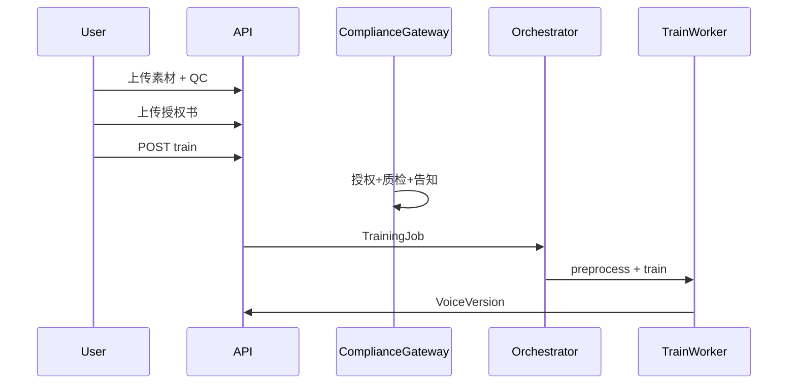
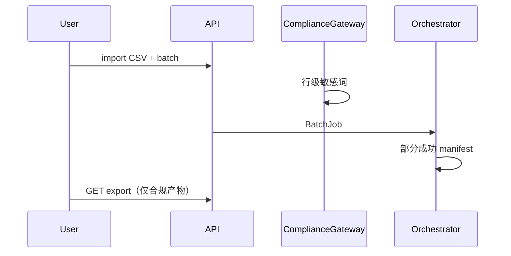
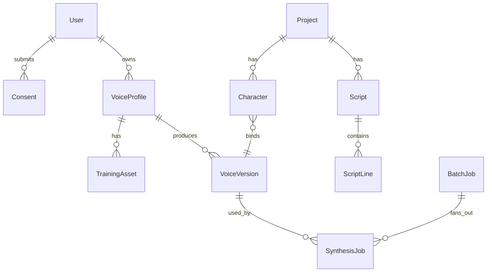

# 第四部分：运行时与集成

[← 领域与交付](./03-领域与交付分层.md) | [导读](../2026-06-03-system-architecture-design-系统架构设计.md) | [下一部分：技术决策 →](./05-技术决策与质量.md)

---

## 4.1 核心业务流

### 4.1.1 训练闭环（W1 退出）



### 4.1.2 单条合成

`Auth → Gateway(敏感词) → SynthesisJob → InferWorker → [Export Job] → 下载 URL`

### 4.1.3 批量短剧（W2）

`CSV 导入 → BatchJob → N×SynthesisJob → 行级失败隔离 → PostWorker → 合规 ZIP`



---

## 4.2 数据模型（逻辑 ER）



**预留字段**：`VoiceVersion.model_tag`、`engine_family`；MVP+1 增 `LicensePolicy` 不改主链。

---

## 4.3 Job 编排

### 4.3.1 Job 统一模型

| 字段 | 说明 |
|------|------|
| `job_id` | UUID |
| `job_type` | `preprocess` \| `train` \| `synthesize` \| `batch` \| `export` |
| `status` | `queued` → `running` → `succeeded` \| `failed` \| `cancelled` |
| `trace_id` | 全链路日志 |
| `payload` | 类型相关 JSON |
| `job_schema_version` | **W1 必定义** |

### 4.3.2 Job 类型一览

| 类型 | Worker | 输入要点 | 输出 | VRAM |
|------|--------|----------|------|------|
| preprocess | Pre | wav URL | 切片+SV 特征 | CPU |
| train | Train | assets + consent | ckpt | Spike **~6.5GB** 峰值（单样本）；生产估 **~12GB** |
| synthesize | Infer | voice_version + text | raw wav | ~5GB |
| export | Post | raw wav | 合规 wav/ZIP | CPU |

### 4.3.3 Worker Payload 示例

**Train**：

```json
{
  "model_tag": "gsv-v2pro-20250606",
  "asset_urls": ["oss://..."],
  "consent_id": "uuid",
  "hyperparams": {}
}
```

**Infer**：

```json
{
  "voice_version_id": "uuid",
  "text": "台词",
  "format": "wav",
  "sample_rate": 32000
}
```

### 4.3.4 队列与调度

```text
JobQueue (interface)
  ├── RedisQueue      # MVP-0 默认
  └── PostgresQueue   # 备选
```

- MVP-0：`gpu:lock` 互斥，Train/Infer 不同时占用 GPU（配置项 `gpu:lock_key`，W1 未强制启用）。
- W1 实现：**Redis BLPOP** 消费（`jobs:infer` / `jobs:train`），闭合 TBD-ARCH-02/03。

### 4.3.5 已实现 API（W1）

| 方法 | 路径 | 说明 |
|------|------|------|
| POST | `/api/v1/auth/sms/send` | 发验证码 |
| POST | `/api/v1/auth/login` | JWT + quota 摘要 |
| GET | `/api/v1/usage/quota` | 配额查询 |
| POST | `/api/v1/synthesis` | 单条合成 |
| POST | `/api/v1/voices/{id}/train` | 训练 |
| GET | `/api/v1/jobs/{id}` | Job 状态 |

详见 [apps/api/README.md](../../../apps/api/README.md)。

---

## 4.4 API 与 ComplianceGateway

### 4.4.1 API 约定

| 项 | 约定 |
|----|------|
| 风格 | REST `/api/v1`，OpenAPI 3 |
| 鉴权 | JWT；`user_id` 贯穿 Job 与 OSS 路径 |
| 存储 | 大文件仅 OSS；DB 存元数据 |

### 4.4.2 资源分组

| 前缀 | 上下文 |
|------|--------|
| `/auth/*` | Identity |
| `/consents/*` | Compliance |
| `/voices/*` | VoiceAsset + VoiceTrain |
| `/synthesis/*` | Synthesis |
| `/projects/*` | Production |
| `/jobs/*` | Platform |
| `/exports/*` | Export |
| `/usage/*` | Platform |

### 4.4.3 ComplianceGateway {#44-compliancegateway}

| 接口 | 门禁 |
|------|------|
| `POST .../train` | Consent approved + QC pass + **配额** |
| `POST /synthesis` | 敏感词 + **配额预检** |
| `POST /synthesis/batch` | 行级敏感词 |
| `GET /exports/*/download` | 仅 `export_compliant=true` |

**ADR-003**：禁止对外直链 Infer 原始 wav。
