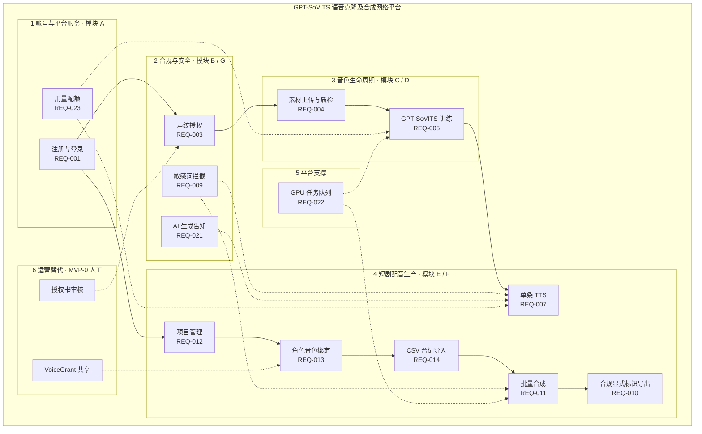
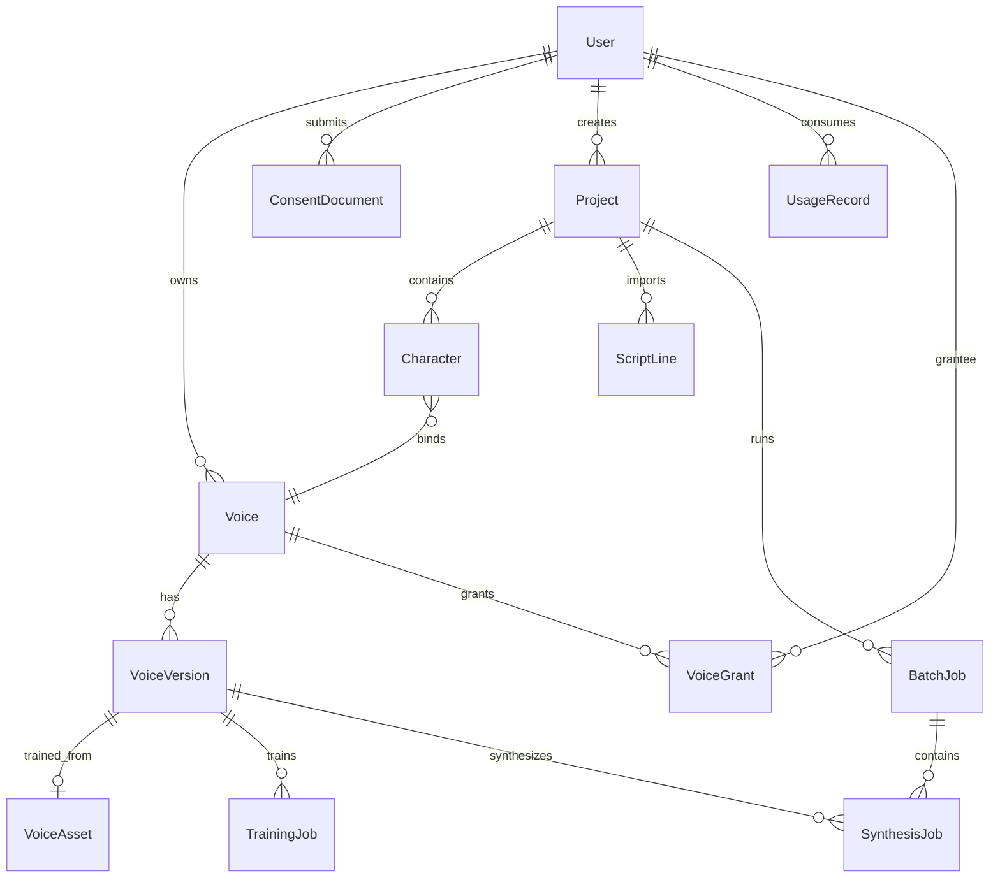

# GPT-SoVITS语音克隆及合成系统需求规格说明书（分析版）

|        |     |      |          |
|:-------|-----|:-----|:---------|
| 拟制   | 陶攀 | 日期 | 2026-06-02 |
| 评审人 | 王文鑫 | 日期 | 2026-06-02 |
| 批准   |     | 日期 |          |

**武汉学链科技有限公司**  
版权所有 不得复制

## 修订记录

| Date 日期 | Revision Version 修订版本 | CR ID /Defect ID | Sec No. 修改章节 | Change Description 修改描述 | Author 作者 |
|----------|---------------------------|------------------|------------------|----------------------------|------------|
| 2026-06-02 | 1.0 |  | 全文 | 首版需求分析（遵循模板章节，引用调研+SRS） | 陶攀 |
| 2026-06-03 | 1.1 |  | 文前/§3.3/§5/§8/§9 | 补摘要、关键词、需求分级表、字段级数据字典、接口与附录 | 陶攀 |

---

**Keywords 关键词**：语音克隆；GPT-SoVITS；短剧配音；文本转语音；深度合成；合规标识；批量合成

**Abstract 摘要**：

本文档描述 GPT-SoVITS 语音克隆及合成系统在 AI 短剧配音场景下的软件需求规格（分析版）。系统以 GPT-SoVITS 为训练与推理引擎，提供「登录→授权→训练→项目/CSV→批量合成→合规分轨导出」工作台化闭环，并在 MVP-0（4 周）阶段交付 14 条 P0 需求，涵盖账号与配额、声纹授权与 AI 告知、素材质检、音色训练、敏感词拦截、显式标识导出及 GPU 任务队列等能力。音色交易市场、三方实名 KYC、隐式水印等纳入 MVP+1 及以后阶段。本文档面向项目管理、设计、开发、测试与运营，实现验收细则以 SRS v1.2 及各子模块规格为准。

---

## 缩略语清单

| Abbreviations缩略语 | Full spelling 英文全名 | Chinese explanation 中文解释 |
|---------------------|------------------------|------------------------------|
| TTS | Text-to-Speech | 文本转语音 |
| KYC | Know Your Customer | 实名/身份核验 |
| MVP | Minimum Viable Product | 最小可行产品 |
| SRS | Software Requirement Specification | 软件需求规格说明 |
| API | Application Programming Interface | 应用程序接口 |
| REST | Representational State Transfer | 表述性状态转移接口风格 |
| GPU | Graphics Processing Unit | 图形处理器（此处指算力） |
| OSS/COS | Object/Cloud Object Storage | 对象存储服务 |
| CSV | Comma-Separated Values | 逗号分隔值文件 |
| JWT | JSON Web Token | 会话令牌格式 |
| VAD | Voice Activity Detection | 语音活动检测 |
| SNR | Signal-to-Noise Ratio | 信噪比 |
| AB | A/B Testing | 对比试听测试 |
| GA | General Availability | 正式发布阶段 |

---

## 目录

- [1 简介](#1-简介)
  - [1.1 目的](#11-目的)
  - [1.2 范围](#12-范围)
- [2 总体概述](#2-总体概述)
  - [2.1 软件概述](#21-软件概述)
  - [2.2 软件功能](#22-软件功能)
  - [2.3 用户特征](#23-用户特征)
  - [2.4 假设和依赖关系](#24-假设和依赖关系)
- [3 具体需求](#3-具体需求)
  - [3.1 系统用例](#31-系统用例)
  - [3.2 子功能模块](#32-子功能模块)
  - [3.3 数据字典](#33-数据字典)
- [4 性能需求](#4-性能需求)
- [5 接口需求](#5-接口需求)
- [6 总体设计约束](#6-总体设计约束)
- [7 软件质量特性](#7-软件质量特性)
- [8 需求分级](#8-需求分级)
- [9 附录](#9-附录)

---

# 1 简介

## 1.1 目的

本需求规格说明书（分析版）用于描述 **GPT-SoVITS语音克隆及合成系统** 在短剧配音场景下的功能、性能与合规要求，便于项目管理、设计、开发、测试与运营在 4 周 MVP-0 阶段形成一致理解。

预期读者：用户代表（短剧统筹）、项目管理人员、测试人员、设计人员、开发人员、运营/合规人员。

本文件与实现验收标准的关系：**实现细则与验收**以 `docs/requirements/2026-06-01-mvp-voice-platform-需求规格说明.md`（SRS v1.2）为准；本文强调“为什么这么做、如何裁剪、如何验收”。

## 1.2 范围

- **包含**：MVP-0（4 周）需求、场景、用例、模块输入/处理/输出、性能与接口、设计约束、质量特性与分级。
- **不包含**：音色交易市场 UI、支付/提现、KYC、隐式水印/指纹完整方案（均为 MVP+1 主题）。

---

# 2 总体概述

## 2.1 软件概述

### 2.1.1 项目介绍

本项目旨在解决微短剧生产中“配音慢、改词重录成本高、角色一致性难、合规过审风险高”的问题。系统以 GPT-SoVITS 为核心训练/推理引擎，提供工作台化生产流程：**项目→角色→CSV→批量合成→分轨导出**，并内置国内合规最低集：授权书、显式标识、敏感词拦截、AI 告知。

关联资料：

- 调研：`docs/research/2026-06-01-voice-marketplace-compliance-产品调研报告.md`
- 宪章：`docs/PROJECT_CHARTER.md`（4 周范围冻结）

### 2.1.2 产品环境介绍

系统组成（MVP-0）：

- Web 工作台（前端）
- 业务 API（后端：账号、项目、任务、导出、配额）
- GPT-SoVITS 训练/推理 Worker（GPU）
- 合规与安全模块（敏感词、显式标识导出、授权书流转）
- 对象存储（音频与素材）

系统架构详见 [架构设计导读](../architecture/2026-06-03-system-architecture-design-系统架构设计.md) 与 [sections/](../architecture/sections/) 分章；图件见 `docs/architecture/diagrams/`。

## 2.2 软件功能

MVP-0 按 **六大功能域** 组织，对应子模块 A–G 与 14 条 P0 需求。下图展示功能结构及主工作流依赖；PlantUML 源文件见 `docs/requirements/diagrams/2026-06-01-mvp-voice-platform-系统功能结构图.puml`。



**功能域概述**：

| 功能域 | 主要能力 | 关联模块 |
|--------|----------|----------|
| 账号与平台 | 手机验证码登录、Token 会话、字符/训练配额 | A |
| 合规与安全 | 授权书审核门禁、AI 告知、合成前敏感词 | B、G |
| 音色生命周期 | ~10min 干声质检、GPT-SoVITS 训练、版本化 | C、D |
| 短剧配音生产 | 项目/角色/CSV、单条与批量 TTS、合规 ZIP 导出 | E、F |
| 平台支撑 | 训练/合成/批量任务排队与进度 | REQ-022 |
| 运营替代 | 飞书审核授权、VoiceGrant 跨用户用音 | 人工 SOP |

**主工作流（7 步）**：

1. 用户登录（手机验证码）
2. 授权书上传（人工审核）
3. 上传约 10 分钟素材并质检
4. 创建训练任务生成音色（VoiceVersion）
5. 创建项目/角色并绑定音色
6. 导入 CSV 台词并批量合成
7. 导出分轨 ZIP（含显式标识）

## 2.3 用户特征

- **短剧工作室统筹**：需要批量、可返工、可过审；对合规最敏感。
- **配音师（后续供给）**：关注声线资产化、防盗用与撤权；MVP-0 以私有音色为主。
- **独立创作者**：低门槛；可用免费额度完成一条成片。

## 2.4 假设和依赖关系

假设：

- 用户能提供较干净的录音素材（否则训练失败率升高）
- 平台导出显式标识可满足分发平台审核要求（需试单验证）

依赖：

- GPU 资源与队列可用
- 对象存储可稳定提供下载
- 敏感词词库来源与更新机制（本地/第三方）

---

# 3 具体需求

## 3.1 系统用例

用例 1：训练并生成私有音色

1. 用户登录
2. 上传授权书（待审核/通过）
3. 上传素材并质检
4. 创建训练任务
5. 训练完成，生成音色版本并可试听默认句

用例 2：短剧批量配音并合规导出

1. 创建项目与角色
2. 绑定音色（自有或运营共享）
3. 导入 CSV 台词
4. 批量合成
5. 合规导出分轨 ZIP（显式标识）

## 3.2 子功能模块

> 模块按「介绍 / 输入 / 处理 / 输出」描述；实现验收标准详见 SRS v1.2 各 REQ。

### 3.2.1 模块 A：账号与配额（REQ-001/023）

> **完整子模块规格**（介绍/输入/处理/输出 全文）：[modules/2026-06-01-module-A-账号与配额.md](../requirements/modules/2026-06-01-module-A-账号与配额.md)

1 **介绍**：提供登录与用量控制，避免滥用并控制成本。覆盖 REQ-001 注册登录、REQ-023 字符/训练配额；非法手机号、错误验证码、Token 失效、配额超额等均有明确错误码（见子模块 §1.2）。

2 **输入**：手机号、验证码、合成文本长度、训练次数；详见子模块 §2（含来源、范围、接口引用）。

3 **处理**：登录会话管理（Token 7 天）；按字符扣减配额、训练成功扣次；超额拒绝并提示升级；含活动图与时序（子模块 §3）。

4 **输出**：登录成功 token 与 quota 摘要；`QUOTA_EXCEEDED` / `AUTH_REQUIRED` 等错误与剩余额度信息；详见子模块 §4。

### 3.2.2 模块 B：授权与告知（REQ-003/021）

> **完整子模块规格**：[modules/2026-06-01-module-B-授权与告知.md](../requirements/modules/2026-06-01-module-B-授权与告知.md)

1 **介绍**：满足「授权先行、AI 告知」合规最低集；未 approved 阻断训练；合成页弹窗+常驻提示。  
2 **输入**：授权书 PDF/图片或视频声明（10–30s）、声明元数据、AI 告知勾选；详见 §2。  
3 **处理**：上传→关键词扫描→人工审核→训练门禁；合成前 AI 告知校验；含序列图与活动图 §3。  
4 **输出**：`consent_id` 与 `review_status`；`CONSENT_REQUIRED`/`CONSENT_REJECTED`；`AI_DISCLOSURE_REQUIRED`；详见 §4。

### 3.2.3 模块 C：素材上传与质检（REQ-004）

> **完整子模块规格**：[modules/2026-06-01-module-C-素材上传与质检.md](../requirements/modules/2026-06-01-module-C-素材上传与质检.md)

1 **介绍**：接收 ~10min 干声，自动质检时长/SNR/BGM/多人，通过后锁定素材供训练。  
2 **输入**：wav/flac/mp3（≤500MB，8–15min 有效语音，采样率≥16kHz）；断点续传会话。  
3 **处理**：解码→VAD→质检 Job→用户确认锁定；失败返回可解释 issues 列表 §3。  
4 **输出**：质检报告 `passed/failed`；锁定 `VoiceAsset`；`QC_*` 错误码；详见 §4。

### 3.2.4 模块 D：训练与音色版本（REQ-005/022）

> **完整子模块规格**：[modules/2026-06-01-module-D-训练与音色版本.md](../requirements/modules/2026-06-01-module-D-训练与音色版本.md)

1 **介绍**：一键 GPT-SoVITS 训练，经 GPU 队列生成不可变 VoiceVersion（model_tag 与推理一致）。  
2 **输入**：voice_id、锁定素材、默认 train_params、幂等键（待定）。  
3 **处理**：门禁链→入队→Worker 训练→失败重试≤2→写 checkpoint；队列位置与 epoch 进度 §3。  
4 **输出**：`job_id`、状态、preview_url；失败 `JOB_FAILED`+stderr；详见 §4。

### 3.2.5 模块 E：项目/角色/CSV（REQ-012–014）

> **完整子模块规格**：[modules/2026-06-01-module-E-项目角色与CSV.md](../requirements/modules/2026-06-01-module-E-项目角色与CSV.md)

1 **介绍**：短剧工作流数据载体：Project、Character–Voice 绑定、CSV 台词导入与角色映射。  
2 **输入**：项目/角色字段、voice_id、UTF-8/GBK CSV（≤200 行，标准列角色名/台词/备注）。  
3 **处理**：CRUD 项目角色→CSV 解析列映射→预览 20 行→校验角色→持久化台词表 §3。  
4 **输出**：项目列表、导入预览、unmapped 提示；`VOICE_NOT_GRANTED`/`CHARACTER_NOT_FOUND`；详见 §4。

### 3.2.6 模块 F：单条/批量合成与导出（REQ-007/011/010）

> **完整子模块规格**：[modules/2026-06-01-module-F-合成与导出.md](../requirements/modules/2026-06-01-module-F-合成与导出.md)

1 **介绍**：单条/批量 TTS，对外须合规显式标识导出（ffmpeg 片头），ZIP 分轨+manifest。  
2 **输入**：voice_version_id、text（≤5000 字）、project/script 批量引用、导出 label 选项。  
3 **处理**：门禁→敏感词→GPU 推理→合规拼接→配额扣减；批量行级失败隔离 §3。  
4 **输出**：audio_url、zip_url、manifest；`SENSITIVE_WORD`/`INVALID_TEXT`；标识元数据 §4。

### 3.2.7 模块 G：敏感词拦截（REQ-009）

> **完整子模块规格**：[modules/2026-06-01-module-G-敏感词拦截.md](../requirements/modules/2026-06-01-module-G-敏感词拦截.md)

1 **介绍**：合成前违禁词匹配，命中拒绝并返回脱敏位置；词库 5 分钟内热更新。  
2 **输入**：待检 text（1–5000 字）、词库版本、批量行号上下文。  
3 **处理**：AC 自动机匹配→构造 hits→放行或 400；批量行级独立 §3。  
4 **输出**：`SENSITIVE_WORD` + `details.hits`；放行进入合成；manifest 行级错误 §4。

## 3.3 数据字典

### 3.3.1 数据字典（字段级）

#### User（用户）

| 字段 | 类型 | 可为空 | 描述 |
|------|------|:------:|------|
| id | UUID | N | 主键 |
| phone | VARCHAR(11) | N | 手机号，唯一 |
| phone_masked | VARCHAR(16) | Y | 脱敏展示，如 138\*\*\*\*5678 |
| verified | BOOLEAN | N | 三方 KYC 通过，MVP+1 默认 false |
| ai_disclosure_ack | BOOLEAN | N | 是否确认 AI 生成告知 |
| ai_disclosure_ack_at | TIMESTAMP | Y | 告知确认时间 |
| role | ENUM | N | user / admin，默认 user |
| status | ENUM | N | active / locked / deleted |
| created_at | TIMESTAMP | N | 创建时间 |

#### ConsentDocument（声纹授权）

| 字段 | 类型 | 可为空 | 描述 |
|------|------|:------:|------|
| id | UUID | N | 主键 |
| user_id | UUID | N | 外键 → User |
| type | ENUM | N | pdf / image / video |
| file_url | VARCHAR(512) | N | 对象存储 URL |
| declarant_name | VARCHAR(50) | Y | 声明人姓名 |
| expiry_date | DATE | Y | 授权期限，空表示长期 |
| review_status | ENUM | N | pending / pending_manual / approved / rejected / expired |
| reject_reason | TEXT | Y | 拒绝原因 |
| submitted_at | TIMESTAMP | N | 提交时间 |
| reviewed_at | TIMESTAMP | Y | 审核时间 |

#### Voice / VoiceVersion / VoiceAsset（音色与素材）

| 字段 | 类型 | 可为空 | 描述 |
|------|------|:------:|------|
| Voice.id | UUID | N | 逻辑音色 ID |
| Voice.owner_id | UUID | N | 所有者 User |
| Voice.status | ENUM | N | draft / active / disabled |
| VoiceVersion.id | UUID | N | 版本 ID |
| VoiceVersion.voice_id | UUID | N | 外键 → Voice |
| VoiceVersion.version | INT | N | 递增版本号，从 1 起 |
| VoiceVersion.model_tag | VARCHAR(64) | N | GPT-SoVITS 模型版本，训练推理一致 |
| VoiceVersion.checkpoint_uri | VARCHAR(512) | N | 模型 checkpoint 存储路径 |
| VoiceAsset.id | UUID | N | 素材 ID |
| VoiceAsset.storage_url | VARCHAR(512) | N | 原始音频 URL |
| VoiceAsset.duration_sec | DECIMAL | Y | 有效语音时长（秒） |
| VoiceAsset.sample_rate | INT | Y | 采样率 Hz |
| VoiceAsset.qc_result | JSON | Y | 质检结果与 issues |
| VoiceAsset.locked | BOOLEAN | N | 是否锁定不可改 |

#### TrainingJob / SynthesisJob / BatchJob（任务）

| 字段 | 类型 | 可为空 | 描述 |
|------|------|:------:|------|
| TrainingJob.id | UUID | N | 训练任务 ID |
| TrainingJob.voice_version_id | UUID | Y | 关联版本 |
| TrainingJob.status | ENUM | N | queued / running / succeeded / failed |
| TrainingJob.retry_count | INT | N | 已重试次数，上限 2 |
| TrainingJob.gpu_meta | JSON | Y | GPU/队列元数据 |
| TrainingJob.stderr_url | VARCHAR(512) | Y | 失败日志链接 |
| SynthesisJob.id | UUID | N | 单条合成 ID |
| SynthesisJob.voice_version_id | UUID | N | 推理音色版本 |
| SynthesisJob.text | TEXT | N | 合成文本 |
| SynthesisJob.status | ENUM | N | 同 TrainingJob |
| SynthesisJob.audio_url | VARCHAR(512) | Y | 输出音频 |
| BatchJob.id | UUID | N | 批量父任务 |
| BatchJob.project_id | UUID | N | 外键 → Project |
| BatchJob.total | INT | N | 总行数 |
| BatchJob.done | INT | N | 已完成行数 |
| BatchJob.failed | INT | N | 失败行数 |
| BatchJob.zip_url | VARCHAR(512) | Y | 合规 ZIP 下载 |

#### Project / Character / ScriptLine（作品）

| 字段 | 类型 | 可为空 | 描述 |
|------|------|:------:|------|
| Project.id | UUID | N | 项目 ID |
| Project.owner_id | UUID | N | 创建者 |
| Project.name | VARCHAR(100) | N | 项目名称 |
| Project.description | VARCHAR(500) | Y | 简介 |
| Project.episode_count | INT | Y | 集数 |
| Project.deleted_at | TIMESTAMP | Y | 软删除时间 |
| Character.id | UUID | N | 角色 ID |
| Character.project_id | UUID | N | 外键 → Project |
| Character.display_name | VARCHAR(50) | N | 角色名，项目内唯一 |
| Character.persona_tag | VARCHAR(64) | Y | 人设标签 |
| Character.voice_id | UUID | Y | 绑定 Voice |
| ScriptLine.id | UUID | N | 台词行 ID |
| ScriptLine.project_id | UUID | N | 所属项目 |
| ScriptLine.line_no | INT | N | 行号 |
| ScriptLine.character_name | VARCHAR(50) | N | CSV 角色名 |
| ScriptLine.text | TEXT | N | 台词内容 |
| ScriptLine.remark | VARCHAR(200) | Y | 备注 |

#### UsageRecord / VoiceGrant / AuditLog（配额与审计）

| 字段 | 类型 | 可为空 | 描述 |
|------|------|:------:|------|
| UsageRecord.id | UUID | N | 用量记录 |
| UsageRecord.user_id | UUID | N | 用户 |
| UsageRecord.chars | INT | Y | 合成扣减字符数 |
| UsageRecord.job_id | UUID | N | 关联 Job |
| UsageRecord.recorded_at | TIMESTAMP | N | 记录时间 |
| VoiceGrant.voice_id | UUID | N | 被授权音色 |
| VoiceGrant.grantee_user_id | UUID | N | 被授权用户 |
| VoiceGrant.expires_at | TIMESTAMP | Y | 过期时间 |
| AuditLog.actor | VARCHAR(64) | N | 操作人 ID |
| AuditLog.action | VARCHAR(64) | N | 操作类型 |
| AuditLog.target | VARCHAR(128) | N | 操作对象 |
| AuditLog.at | TIMESTAMP | N | 操作时间 |

> MVP+1 实体（LicensePolicy、Authorization 等）见 SRS v1.2 §6.1，本版从略。

### 3.3.2 E-R 关系图



**文字关系（摘要）**：

- User 1—N Voice 1—N VoiceVersion；每次训练产生新 Version，关联 1 份 VoiceAsset。
- Project 1—N Character，Character N—1 Voice（绑定）。
- BatchJob 1—N SynthesisJob；Project 1—N ScriptLine。
- VoiceGrant 实现 MVP-0 运营人工跨用户授权。

---

# 4 性能需求

## 4.1 时间性能需求

- 登录接口：P95 < 500ms
- 合成（非流式）：P95 < 30s / 千字（目标）

## 4.2 系统开放性需求

MVP-0 不开放对外开发者 API；仅提供内部 REST API（见 §5.2）。

## 4.3 界面友好性需求

- CSV 导入需支持预览与错误行提示
- 批量任务需提供进度与失败行列表

## 4.4 系统可用性需求

核心 API 目标 99.5%（内测期指标）。

## 4.5 可管理性需求

MVP-0 允许运营人工替代；需有最小审计日志（授权审核/共享开通）。

---

# 5 接口需求

## 5.1 用户接口

MVP-0 Web 工作台须支持以下页面及交互特性：

| 页面 | 主要元素 | 输入/输出时序 | 校验与提示 |
|------|----------|---------------|------------|
| 登录页 | 手机号、验证码、登录按钮 | 发码→输入→跳转工作台 | 格式错误、锁定 15 分钟提示 |
| 授权书页 | 模板下载、文件上传、状态展示 | 上传→pending→approved/rejected | 未通过阻断训练入口 |
| 素材上传页 | 拖拽上传、质检报告、确认锁定 | 上传→QC→确认 | 失败项列表（BGM/时长等） |
| 训练页 | 进度条、队列位置、试听按钮 | 提交→queued→running→完成 | epoch 进度、失败原因 |
| 项目/角色页 | 项目列表、角色表单、音色选择 | CRUD 即时保存 | 未绑定音色警告 |
| CSV/批量页 | 模板下载、预览 20 行、批量进度 | 导入→预览→提交 Job | 错误行高亮、行级失败列表 |
| 合成页 | 文本框、音色选择、AI Banner | 提交→音频播放/下载 | 首次弹窗勾选知悉；≤5000 字 |
| 导出页 | 合规导出（强制）、ZIP 下载 | 批量完成→下载 | 不可关闭显式标识 |

**通用 UI 要求**：错误消息中文可读；长流程提供步骤引导；敏感信息脱敏显示。

## 5.2 软件接口

### 5.2.1 外部软件依赖

| 名称 | 助记符 | 版本 | 来源 | 用途 |
|------|--------|------|------|------|
| GPT-SoVITS | GSV | pinned model_tag | 内部 Worker | 音色训练与 TTS 推理 |
| 对象存储 | OSS/COS | **待定** | 阿里云/腾讯云等 | 素材、音频、模型文件 |
| 短信网关 | SMS | **待定** | 第三方服务商 | 登录验证码 |
| ffmpeg | FFMPEG | ≥4.x | 开源 | 合规标识片头拼接 |
| 关系型数据库 | DB | **待定** | MySQL/PostgreSQL | 业务数据 |
| Redis | REDIS | **待定** | 内部 | 验证码、会话、队列 **待定** |

### 5.2.2 REST API（MVP-0）

**基址**：`https://{domain}/api/v1`  
**鉴权**：`Authorization: Bearer {token}`（除 auth 接口外）  
**统一成功体**：资源 JSON 或 `{ "data": ... }`  
**统一错误体**：`{ "code": string, "message": string, "details": object }`

| 方法 | 路径 | 说明 | 关联 REQ |
|------|------|------|----------|
| POST | `/auth/sms/send` | 发送短信验证码，body: `{ "phone" }` | REQ-001 |
| POST | `/auth/login` | 登录/注册，body: `{ "phone", "code" }` | REQ-001 |
| GET | `/usage/quota` | 查询剩余配额 **待定** | REQ-023 |
| POST | `/consents` | multipart 上传授权书 | REQ-003 |
| GET | `/consents/template` | 下载授权模板 **待定** | REQ-003 |
| POST | `/voices/assets` | 上传训练素材 | REQ-004 |
| POST | `/voices/{id}/train` | 触发训练 | REQ-005 |
| GET | `/jobs/{id}` | 查询训练/合成/批量任务状态 | REQ-022 |
| POST | `/synthesis` | 单条合成，body: `{ "voice_version_id", "text", "format" }` | REQ-007 |
| POST | `/synthesis/batch` | 批量合成，body: `{ "project_id", "script_id" }` | REQ-011 |
| POST | `/projects` | 创建项目 | REQ-012 |
| GET | `/projects` | 项目列表 | REQ-012 |
| POST | `/projects/{id}/characters` | 添加/更新角色 | REQ-013 |
| POST | `/projects/{id}/script/import` | CSV 导入 | REQ-014 |
| GET | `/exports/{id}/download` | 合规 ZIP/音频下载 | REQ-010 |

### 5.2.3 内部集成接口

| 接口 | 方向 | 协议 | 说明 |
|------|------|------|------|
| 训练 Job 提交 | API → Worker | HTTP/gRPC **待定** | 含 voice_asset_uri、model_tag |
| 推理 Job 提交 | API → Worker | 同上 | 含 checkpoint_uri、text |
| 飞书告警 | API → 飞书 | Webhook | Job 失败、审核通知 |

## 5.3 硬件接口

| 项 | 要求 |
|----|------|
| GPU | 训练/推理 Worker 使用 NVIDIA GPU；MVP-0 单卡 A10 级先跑通 **待定** 具体型号 |
| 显存 | 满足 GPT-SoVITS 训练与推理最低显存（Spike 标定） |
| 存储 | 对象存储与本地临时盘；单文件上传上限 500MB |
| 网络 | Worker 与 API 内网互通；公网仅 HTTPS |

## 5.4 通讯接口

| 项 | 规格 |
|----|------|
| Web/API | HTTPS（TLS 1.2+）；JSON UTF-8 |
| 对象存储下载 | 私有桶 + 签名 URL，有效期 **待定**（建议 ≤24h） |
| 短信 | 服务商 HTTPS API，模板 ID **待定** |
| 数据驻留 | 业务数据与音频存储中国大陆境内 |

---

# 6 总体设计约束

## 6.1 标准符合性

- 显式标识导出需满足国内相关标识要求（已在调研报告合规章节引用）。

## 6.2 硬件约束

- 单卡先跑通（W1）；队列可控并可扩展。

## 6.3 技术限制

- 4 周禁止引入交易市场、支付、KYC、水印等大模块（见宪章冻结规则）。

---

# 7 软件质量特性

## 7.1 可靠性

训练/合成任务需记录 trace_id 与失败原因；支持有限重试；确保可定位问题。

## 7.2 易用性

提供 CSV 模板、示例项目、导出结构可直接对接剪辑工具。

---

# 8 需求分级

重要性分类说明：

- **A（必须的）**：MVP-0 必须交付；缺失则产品无法内测验收。
- **B（重要的）**：MVP+1 交付；影响产品完整性与商业化，不阻断 4 周闭环。
- **C（最好有的）**：GA 或更晚；省略不影响 MVP 生存验证。

| Requirement ID | Requirement Name 需求名称 | Classification 需求分级 | 阶段 |
|----------------|---------------------------|:-----------------------:|------|
| REQ-001 | 账号注册与登录 | A | MVP-0 |
| REQ-003 | 声纹授权文件上传与校验 | A | MVP-0 |
| REQ-004 | 训练素材上传与质检 | A | MVP-0 |
| REQ-005 | GPT-SoVITS 音色训练任务 | A | MVP-0 |
| REQ-007 | 文本转语音合成 | A | MVP-0 |
| REQ-009 | 合成前敏感词拦截 | A | MVP-0 |
| REQ-010 | 合规显式标识导出 | A | MVP-0 |
| REQ-011 | 台词表批量合成 | A | MVP-0 |
| REQ-012 | 配音项目管理 | A | MVP-0 |
| REQ-013 | 角色与音色绑定 | A | MVP-0 |
| REQ-014 | 台词表 CSV 导入 | A | MVP-0 |
| REQ-021 | 合成界面 AI 生成告知 | A | MVP-0 |
| REQ-022 | GPU 任务队列与状态 | A | MVP-0 |
| REQ-023 | 用量配额（字符/训练次数） | A | MVP-0 |
| REQ-002 | 训练前实名认证（三方 KYC） | B | MVP+1 |
| REQ-006 | 音色相似度测评与 AB 试听 | B | MVP+1 |
| REQ-008 | 手动情感标签与强度 | B | MVP+1 |
| REQ-015 | 邀请制音色上架申请 | B | MVP+1 |
| REQ-016 | 授权范围与定价配置 | B | MVP+1 |
| REQ-017 | 音色购买与授权记录 | B | MVP+1 |
| REQ-018 | 授权凭证导出 | B | MVP+1 |
| REQ-019 | 导出音频数字水印 | B | MVP+1 |
| REQ-020 | 侵权投诉与下架 | B | MVP+1 |
| REQ-024 | 管理后台审核与风控 | B | MVP+1 |
| REQ-026 | 韵律参数调节（语速/停顿） | B | MVP+1 |
| REQ-030 | 对外 Open API | B | MVP+1 |
| REQ-025 | 高频指纹登记（V1） | C | GA |
| REQ-027 | 自动情感识别 | C | GA |
| REQ-028 | 在线分账提现 | C | GA |
| REQ-029 | 公开音色市场（非邀请） | C | GA |

**MVP-0 合计**：14 条 A 级（P0）。**4 周不交付** B/C 级需求；跨用户用音由运营 `VoiceGrant` 人工替代（见附录 C）。

---

# 9 附录

## 附录 A：REST API 错误码（节选）

| code | HTTP | 说明 |
|------|------|------|
| `AUTH_REQUIRED` | 401 | 未登录或 Token 无效 |
| `INVALID_PHONE` | 400 | 手机号格式非法 |
| `INVALID_OTP` | 401 | 验证码错误或过期 |
| `ACCOUNT_LOCKED` | 429 | 账号锁定 15 分钟 |
| `QUOTA_EXCEEDED` | 402 | 配额不足 |
| `CONSENT_REQUIRED` | 403 | 未上传或未通过授权 |
| `CONSENT_REJECTED` | 403 | 授权审核拒绝 |
| `AI_DISCLOSURE_REQUIRED` | 403 | 未确认 AI 生成告知 |
| `VOICE_NOT_GRANTED` | 403 | 无音色使用权 |
| `SENSITIVE_WORD` | 400 | 命中敏感词 |
| `INVALID_TEXT` | 400 | 空文本或仅标点 |
| `TEXT_TOO_LONG` | 400 | 超过 5000 字 |
| `QC_QUALITY_FAILED` | 422 | 素材质检不通过 |
| `JOB_FAILED` | 500 | 训练/合成失败 |
| `STORAGE_UNAVAILABLE` | 503 | 存储/上传不可用 |

完整列表见 SRS v1.2 附录 B 及各子模块 §1.2。

## 附录 B：CSV 台词模板（MVP-0）

```csv
角色名,台词,备注
男主,你今天怎么来了？,可选
女主,我想你了。,
```

- 编码：UTF-8（推荐）或 GBK  
- 最大行数：200 行/次  
- 列名别名：`角色`/`character`→角色名；`文本`/`text`/`台词`→台词  

## 附录 C：运营手册（4 周人工流程）

**C.1 授权书审核 SOP**

1. 用户上传 → 飞书群机器人通知。  
2. 运营 24h 内核对签名、身份证尾号与手机持有人一致（简核）。  
3. 通过：`review_status=approved`；拒绝：邮件说明原因。

**C.2 跨用户共享音色（替代市场）**

1. 买卖双方线下签约。  
2. 运营插入 `VoiceGrant(grantee_user_id, voice_id, expires_at)`。  
3. 买方在项目内绑定该 `voice_id`。

**C.3 侵权处理（4 周）**

- 邮箱 `abuse@domain` → 72h 内下线 Voice 或撤销 VoiceGrant → 回复举报人。

## 附录 D：MVP-0 测试用例索引

| 编号 | 场景 | 关联 REQ |
|------|------|----------|
| TC-E2E-01 | 新用户注册→授权→训练→单句合成 | 001, 003–005, 007 |
| TC-E2E-02 | 建项目→3 角色→CSV 30 行→ZIP 含标识 | 010–014 |
| TC-E2E-03 | 敏感词行失败不影响其他行 | 009, 011 |
| TC-E2E-04 | 配额用尽拒绝合成 | 023 |
| TC-SEC-01 | 未登录访问合成 API 401 | 001 |
| TC-A01~03 | 注册/锁定/session | 001 |
| TC-C01~03 | 授权阻断/模板/敏感名 | 003 |
| TC-V01~06 | 质检/训练/队列 | 004, 005, 022 |
| TC-S01~03 | 单条合成/权限/配额 | 007, 023 |
| TC-B01~03 | 批量/敏感词/角色绑定 | 011, 013, 014 |
| TC-L01~03 | 合规标识导出 | 010 |

## 附录 E：UML 与子模块规格引用

| 类型 | 路径 |
|------|------|
| 系统用例图（PlantUML） | `docs/requirements/diagrams/2026-06-01-mvp-voice-platform-系统用例图.puml` |
| 子模块 A–G 全文 | `docs/requirements/modules/` |
| 实现 SRS v1.2 | `docs/requirements/2026-06-01-mvp-voice-platform-需求规格说明.md` |

## 附录 F：关联项目文档

| 文档 | 路径 |
|------|------|
| 文档总索引 | `docs/README.md` |
| 项目宪章 | `docs/PROJECT_CHARTER.md` |
| 产品调研报告 | `docs/research/2026-06-01-voice-marketplace-compliance-产品调研报告.md` |
| Word 模板 | `docs/templates/word/` |
| 立项文档 | `docs/pm/2026-06-01-立项文档.md` |
| 项目计划 | `docs/pm/2026-06-01-项目计划文档.md` |

## 附录 G：MVP-0 四周交付切片（摘要）

| 周次 | 目标 | 主要 REQ |
|------|------|----------|
| W1 | 能训能合 | 001, 003–005, 007, 022 |
| W2 | 能批量 | 009, 011–014, 021, 023 |
| W3 | 能合规交付 | 010 + 端到端试单 |
| W4 | 能内测 | Bugfix、文档、监控 |

---

