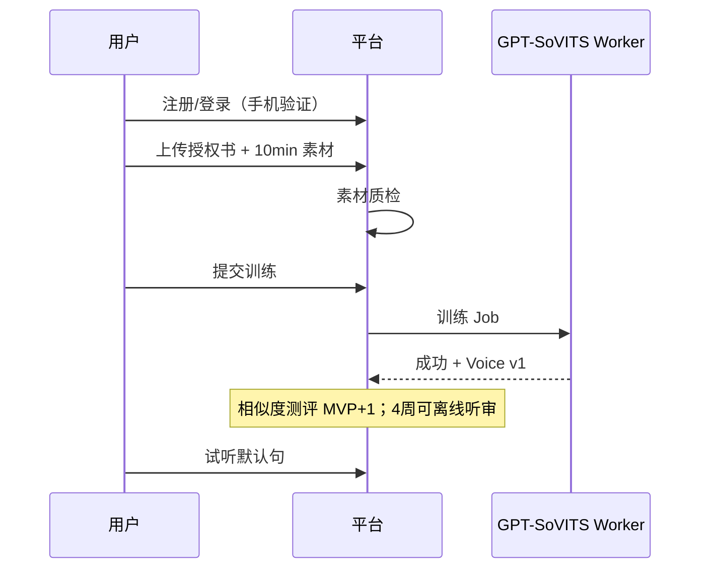
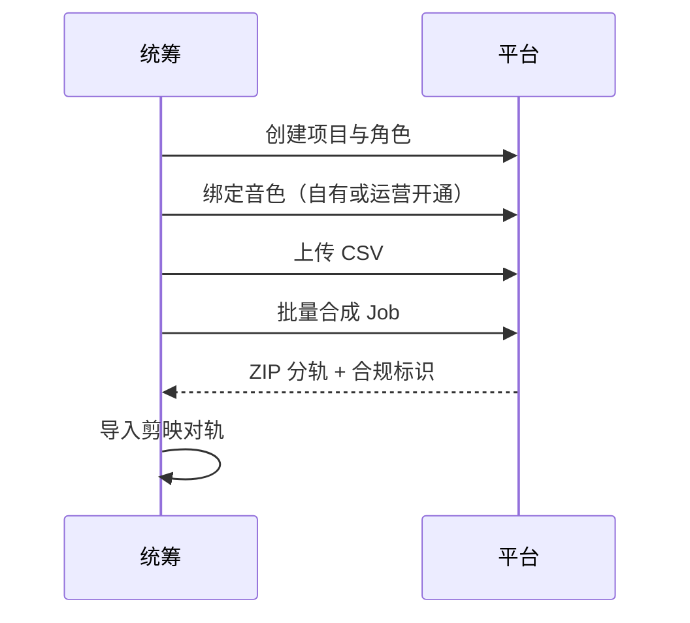
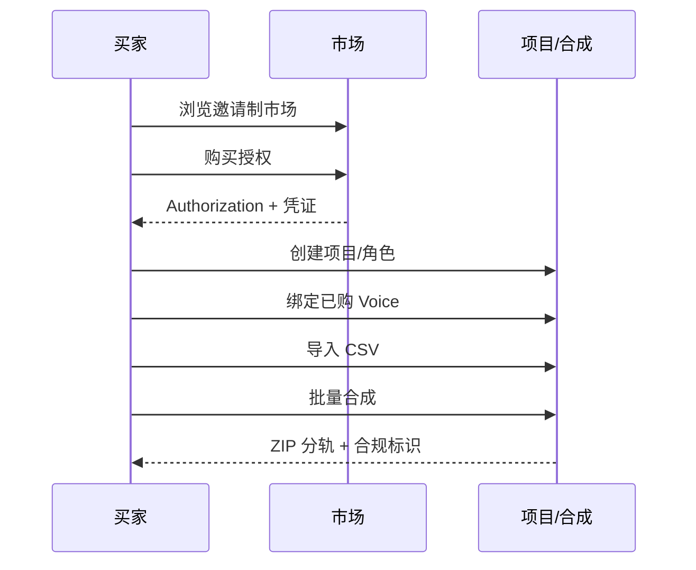
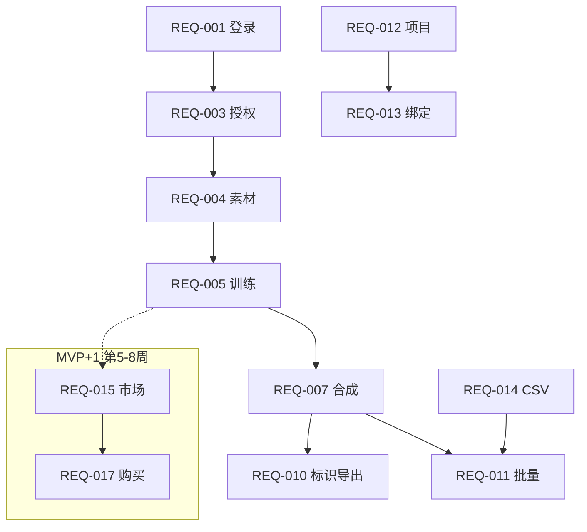

# GPT-SoVITS 语音克隆网络平台 · 需求规格说明（SRS）

## 文档信息

| 项 | 内容 |
|----|------|
| **版本** | v1.2 |
| **日期** | 2026-06-01 |
| **基于调研** | [docs/research/2026-06-01-voice-marketplace-compliance-产品调研报告.md](../research/2026-06-01-voice-marketplace-compliance-产品调研报告.md) |
| **目标阶段** | MVP（**4 周交付**） |
| **约束假设** | Web 端优先；无原生 App；GPU 集群自建；数据存储中国大陆境内；**总工期 4 周，单周迭代** |

### 变更记录

| 版本 | 日期 | 说明 |
|------|------|------|
| v1.0 | 2026-06-01 | 首版 MVP SRS，映射调研报告 |
| v1.1 | 2026-06-01 | 工期压缩为 4 周：P0 收束为 14 条；音色市场/三方实名/水印等延后 MVP+1 |
| v1.2 | 2026-06-01 | 扩充：画像追溯、NFR、API 草案、测试用例、运营手册、GPT-SoVITS 约束 |

---

## 1. 产品目标与范围

### 1.1 目标

在 **4 周**内交付可内测的 **MVP-0（技术+合规闭环）**，验证优先级调整如下：

| 优先级 | 假设 | 4 周内验证方式 |
|--------|------|----------------|
| **P0** | ~10min GPT-SoVITS 中文可生产 | 5 个种子用户训练+合成，内部 AB 听评 |
| **P0** | 短剧批量工作流可用 | 1 个项目、≥3 角色、CSV ≥30 行批量导出 |
| **P0** | 合规不阻断主流程 | 授权书+显式标识+敏感词上线 |
| **延后** | 音色市场交易与付费意愿 | MVP+1（第 5–8 周）；4 周内用 **运营人工授权** 代替 |

**产品一句话（4 周版）**：面向 AI 短剧的 **多角色克隆配音工具**；音色交易市场为下一阶段，不纳入本次交付。

### 1.2 范围内（4 周 MVP-0）

| 模块 | 4 周内交付 |
|------|------------|
| 账号 | 注册登录、手机验证码（**不含**三方实名 KYC） |
| 合规最低集 | 声纹授权书上传、合成页 AI 告知、敏感词、**显式标识导出** |
| 音色 | 上传 ~10min 素材、基础质检、GPT-SoVITS 训练、私有音色库 |
| 合成 | 单条 TTS、**CSV 批量合成**、默认中性（情感标签 MVP+1） |
| 作品 | 项目-角色-音色绑定、台词表导入、ZIP 分轨导出 |
| 平台 | GPU 队列、基础用量配额（硬编码套餐即可） |
| 运营替代 | 人工审核授权书（飞书/邮件）；音色共享由 **管理员后台绑定** |

### 1.3 范围外（4 周内不做 → MVP+1 起）

| 能力 | 计划阶段 | 4 周内替代方案 |
|------|----------|----------------|
| 邀请制音色市场、购买、授权凭证 PDF | MVP+1（约第 5–8 周） | 运营人工开通「共享音色」 |
| 三方实名认证 | MVP+1 | 手机号 + 签署授权书 |
| 相似度自动测评 / AB 平台化 | MVP+1 | 算法侧离线测评 + 人工听审 |
| 手动情感标签与强度 | MVP+1 | 默认中性合成 |
| 数字水印 / 指纹 | MVP+1 | 仅显式标识 |
| 侵权投诉工单系统 | MVP+1 | 客服邮箱处理 |
| 完整管理后台 | MVP+1 | 最小「审核列表」或 SQL 人工 |
| 韵律解耦 UI、自动情感、支付提现、Open API | MVP+1 / Backlog | — |

### 1.4 产品原则（4 周决策过滤器）

1. **合规不可砍**：授权书、敏感词、显式标识、AI 告知 — 与「能合成」同等优先级。  
2. **先闭环再平台**：训练→合成→批量→导出 跑通前，不做市场 UI。  
3. **短剧默认路径**：任何功能若不能缩短「台词表→分轨」路径，W1–W3 不做。  
4. **可运营替代**：审核、跨账号授权、投诉 — 允许人工，须在 SRS 写清 SOP。  
5. **为 MVP+1 预埋**：数据表与 `VoiceVersion` 一次设计对，界面可后补。

### 1.5 成功指标（4 周末验收）

| 指标 | 目标 | 测量方式 |
|------|------|----------|
| 训练成功率 | ≥70%（首周可放宽至 50%） | Job 日志 |
| 批量完成率 | 10 行 CSV ≥95% 行成功 | 集成测试 |
| 合规导出覆盖率 | 100% 对外下载走合规导出 | 审计抽样 |
| 种子工作室留存 | ≥3/5 愿意第 5 周继续 | 访谈 |
| 相似度（离线） | AB 胜率 ≥90%（测评集） | 算法报告 |

---

## 2. 用户故事地图（精简）

| 活动 | 用户故事 | 优先级 |
|------|----------|--------|
| 入驻 | 作为创作者，我要签署声纹授权并绑定手机，以便合法训练 | P0 |
| 克隆 | 作为创作者，我要上传 10 分钟干声并完成训练 | P0 |
| 合成 | 作为统筹，我要 CSV 批量生成多角色台词 | P0 |
| 合规导出 | 作为统筹，我要导出带 AI 显式标识的音频 | P0 |
| 上架/购买 | 作为配音师/买家，我要交易音色 | **MVP+1**（4 周内运营人工） |
| 风控 | 作为运营，我要人工审核授权材料 | P0（人工流程） |
| 变现 | 作为配音师，我要查看收益 | MVP+1 |

### 2.1 调研画像 → 需求追溯

| 调研画像 | 核心痛点 | MVP-0 需求 | MVP+1 |
|----------|----------|------------|-------|
| 短剧统筹 | 改词慢、多角色、审核 | REQ-011–014, 010 | 市场购音 015–018 |
| 配音师 | 声纹变现、防盗用 | REQ-003–005 | 015–019, 025 |
| 独立创作者 | 低门槛 | REQ-001, 004–007 | 008, 订阅 |
| 企业 | 授权链、审计 | 部分 010 | 002, 018, 私有化 |

---

## 3. 需求分级总表

> **4 周 MVP-0 仅交付表中 `4周` 列为「✓」的 P0 项（共 14 条）。** 其余条目保留编号，阶段标为 MVP+1，避免后续文档断层。

### 3.1 四周 MVP-0 交付清单（P0）

| ID | 名称 | 4周 |
|----|------|:---:|
| REQ-001 | 账号注册与登录 | ✓ |
| REQ-003 | 声纹授权文件上传与校验 | ✓ |
| REQ-004 | 训练素材上传与质检 | ✓ |
| REQ-005 | GPT-SoVITS 音色训练任务 | ✓ |
| REQ-007 | 文本转语音合成 | ✓ |
| REQ-009 | 合成前敏感词拦截 | ✓ |
| REQ-010 | 合规显式标识导出 | ✓ |
| REQ-011 | 台词表批量合成 | ✓ |
| REQ-012 | 配音项目管理 | ✓ |
| REQ-013 | 角色与音色绑定 | ✓ |
| REQ-014 | 台词表 CSV 导入 | ✓ |
| REQ-021 | 合成界面 AI 生成告知 | ✓ |
| REQ-022 | GPU 任务队列与状态 | ✓ |
| REQ-023 | 用量配额（字符/训练次数） | ✓ |

### 3.2 全量需求表

| ID | 名称 | 级别 | 4周 | 域 | 依赖 | 阶段 |
|----|------|------|:---:|-----|------|------|
| REQ-001 | 账号注册与登录 | P0 | ✓ | 账号 | - | MVP-0 |
| REQ-002 | 训练前实名认证（三方 KYC） | P1 | | 账号 | REQ-001 | MVP+1 |
| REQ-003 | 声纹授权文件上传与校验 | P0 | ✓ | 合规 | REQ-001 | MVP-0 |
| REQ-004 | 训练素材上传与质检 | P0 | ✓ | 音色 | REQ-003 | MVP-0 |
| REQ-005 | GPT-SoVITS 音色训练任务 | P0 | ✓ | 音色 | REQ-004 | MVP-0 |
| REQ-006 | 音色相似度测评与 AB 试听 | P1 | | 音色 | REQ-005 | MVP+1 |
| REQ-007 | 文本转语音合成 | P0 | ✓ | 合成 | REQ-005 | MVP-0 |
| REQ-008 | 手动情感标签与强度 | P1 | | 合成 | REQ-007 | MVP+1 |
| REQ-009 | 合成前敏感词拦截 | P0 | ✓ | 安全 | REQ-007 | MVP-0 |
| REQ-010 | 合规显式标识导出 | P0 | ✓ | 合规 | REQ-007 | MVP-0 |
| REQ-011 | 台词表批量合成 | P0 | ✓ | 合成 | REQ-007, REQ-014 | MVP-0 |
| REQ-012 | 配音项目管理 | P0 | ✓ | 作品 | REQ-001 | MVP-0 |
| REQ-013 | 角色与音色绑定 | P0 | ✓ | 作品 | REQ-012, REQ-005 | MVP-0 |
| REQ-014 | 台词表 CSV 导入 | P0 | ✓ | 作品 | REQ-012 | MVP-0 |
| REQ-015 | 邀请制音色上架申请 | P1 | | 市场 | REQ-005, REQ-003 | MVP+1 |
| REQ-016 | 授权范围与定价配置 | P1 | | 市场 | REQ-015 | MVP+1 |
| REQ-017 | 音色购买与授权记录 | P1 | | 市场 | REQ-016 | MVP+1 |
| REQ-018 | 授权凭证导出 | P1 | | 市场 | REQ-017 | MVP+1 |
| REQ-019 | 导出音频数字水印 | P1 | | 安全 | REQ-007 | MVP+1 |
| REQ-020 | 侵权投诉与下架 | P1 | | 合规 | REQ-015 | MVP+1 |
| REQ-021 | 合成界面 AI 生成告知 | P0 | ✓ | 合规 | REQ-001 | MVP-0 |
| REQ-022 | GPU 任务队列与状态 | P0 | ✓ | 平台 | REQ-005, REQ-007 | MVP-0 |
| REQ-023 | 用量配额（字符/训练次数） | P0 | ✓ | 平台 | REQ-001 | MVP-0 |
| REQ-024 | 管理后台审核与风控 | P1 | | 平台 | REQ-015 | MVP+1 |
| REQ-025 | 高频指纹登记（V1） | P2 | | 安全 | REQ-019 | GA |
| REQ-026 | 韵律参数调节（语速/停顿） | P1 | | 合成 | REQ-007 | MVP+1 |
| REQ-027 | 自动情感识别 | P2 | | 合成 | REQ-008 | GA |
| REQ-028 | 在线分账提现 | P2 | | 市场 | REQ-017 | GA |
| REQ-029 | 公开音色市场（非邀请） | P2 | | 市场 | REQ-024 | GA |
| REQ-030 | 对外 Open API | P1 | | 平台 | REQ-007 | MVP+1 |

---

## 4. 详细需求（P0 全文 + 关键 P1）

> **阅读说明**：MVP-0 实现以 §3.1 的 14 条为准；下列各条 **边界/异常** 与 **测试要点** 为研发与 QA 共用。

### 域 A：账号与权限

#### REQ-001 账号注册与登录

- **级别**：P0
- **用户故事**：As a 用户, I want 使用手机号或邮箱注册登录, so that 我能使用平台功能。
- **验收标准**：
  1. Given 未注册用户 When 输入有效手机号并完成验证码 Then 账号创建成功并进入工作台。
  2. Given 已注册用户 When 使用正确凭证登录 Then 进入上次工作区且 session 7 天内有效。
  3. Given 错误验证码连续 5 次 When 尝试登录 Then 账号锁定 15 分钟并提示。
- **非功能**：登录接口 P95 <500ms。
- **合规**：记录登录日志（留存 ≥6 个月）。
- **技术备注**：OAuth 微信可列为 P1。
- **边界/异常**：同一手机仅绑 1 账号；注销后 30 天内不可复用手机注册。
- **测试要点**：TC-A01 正常注册；TC-A02 验证码错误锁定；TC-A03 session 过期跳转登录。

---

#### REQ-002 训练前实名认证

- **级别**：P1（**4 周不做**；MVP-0 以 REQ-003 授权书 + 手机验证替代）
- **用户故事**：As a 平台, I want 用户在首次训练音色前完成实名, so that 满足声纹处理合规与追溯。
- **验收标准**：
  1. Given 未实名用户 When 点击「开始训练」Then 引导至实名流程且训练 API 返回 403。
  2. Given 用户提交身份证+人脸核验 When 第三方核验通过 Then 账户标记 `verified=true`。
  3. Given 未成年身份证 When 提交实名 Then 拒绝并提示需监护人流程（MVP 不支持未成年训练）。
- **非功能**：实名结果写入不可篡改审计表。
- **合规**：《个人信息保护法》敏感个人信息处理前提。
- **技术备注**：对接合规实名服务商（待决）。

---

### 域 B：音色生命周期

#### REQ-003 声纹授权文件上传与校验

- **级别**：P0（4 周 MVP-0；不依赖 REQ-002 三方实名）
- **用户故事**：As a 音色所有者, I want 上传声纹授权声明, so that 平台可证明克隆合法性。
- **验收标准**：
  1. Given 用户准备训练 When 未上传授权书/视频声明 Then 无法创建训练任务。
  2. Given 上传他人声纹素材 When 声明主体与实名不一致且无转授权文件 Then 审核拒绝并说明原因。
  3. Given 上传含名人/公众人物关键词的素材名或元数据 When 系统检测 Then 自动进入人工审核队列。
- **合规**：《深度合成管理规定》单独同意。
- **技术备注**：提供标准授权书 PDF 模板下载；视频声明时长 10–30s。
- **边界/异常**：授权书过期（若填期限）→ 阻断训练；PDF 与视频二选一即可（4 周）。
- **测试要点**：TC-C01 无授权阻断；TC-C02 模板下载；TC-C03 含「习近平」等敏感名素材进人工队列（规则待法务）。

---

#### REQ-004 训练素材上传与质检

- **级别**：P0
- **用户故事**：As a 创作者, I want 上传约 10 分钟干声并获质检反馈, so that 提高训练成功率。
- **验收标准**：
  1. Given 用户上传音频 When 总有效语音时长 8–15 分钟、采样率 ≥16kHz、单声道/立体声均可 Then 质检通过。
  2. Given 信噪比低于阈值或含 BGM When 上传 Then 返回具体问题项（噪声/音乐/多人混杂）。
  3. Given 质检通过 When 用户确认 Then 素材锁定不可篡改（仅可废弃重传新版本）。
- **非功能**：单文件上传支持断点续传；500MB 上限。
- **技术备注**：`TECH: GPT-SoVITS` 预处理流水线。
- **素材规范（用户可见）**：干声、无 BGM、少混响；采样率建议 24kHz/44.1kHz；格式 wav/flac/mp3。
- **测试要点**：TC-V01 9min 拒绝；TC-V02 含 BGM 拒绝并提示；TC-V03 断点续传大文件。

---

#### REQ-005 GPT-SoVITS 音色训练任务

- **级别**：P0
- **用户故事**：As a 创作者, I want 一键启动训练并查看进度, so that 获得可合成音色。
- **验收标准**：
  1. Given 质检通过素材 When 用户提交训练 Then 创建 Job，状态 `queued→running→succeeded|failed`。
  2. Given 训练成功 When 完成 Then 生成 `Voice` 实体 v1 且可试听默认句。
  3. Given 训练失败 When 系统重试 2 次仍失败 Then 告知原因（素材/资源）并释放配额。
- **非功能**：P95 训练完成时间 ≤4h（单卡 A10 级，待 Spike 标定）；任务幂等。
- **技术备注**：`TECH: GPT-SoVITS`；需 GPU 队列 REQ-022。
- **GPT-SoVITS 约束**：模型版本写入 `VoiceVersion.model_tag`；训练与推理 **同 tag**；失败保留日志 `stderr` 供运维。
- **测试要点**：TC-V04 训练成功生成试听；TC-V05 失败重试 2 次；TC-V06 并发 2 训练排队。

---

#### REQ-006 音色相似度测评与 AB 试听

- **级别**：P1（4 周：算法离线评测 + 运营人工听审，不做平台 AB 页）
- **用户故事**：As a 创作者/审核员, I want 查看相似度报告与 AB 试听, so that 确认是否达发布标准。
- **验收标准**：
  1. Given 训练成功 When 系统自动评测 Then 输出相似度分数（基于固定中文测评句集 + speaker embedding  cosine，文档化公式）。
  2. Given 分数 ≥ 内部阈值（默认 0.90，可配置）When 评测 Then 标记 `quality_pass=true`。
  3. Given 任意音色 When 用户打开 AB 页 Then 可盲听「原素材 vs 合成」并提交主观评分（存日志）。
- **非功能**：测评与训练解耦，异步 ≤10min。
- **技术备注**：阈值上线前用 20 人 AB 校准；避免「90%」无定义。

---

### 域 C：合成与编辑

#### REQ-007 文本转语音合成

- **级别**：P0
- **用户故事**：As a 统筹, I want 输入文本选择音色生成语音, so that 用于短剧配音。
- **验收标准**：
  1. Given 可用 Voice 与合法文本 When 提交合成 Then 返回音频 URL，中文 ≤5000 字/次。
  2. Given 用户无权限音色 When 合成 Then 403 并提示购买或绑定项目。
  3. Given 合成请求 When 完成 Then 记录字符用量至 REQ-023。
- **非功能**：流式首包 P95 <2s（可选）；非流式整段 P95 <30s/千字。
- **技术备注**：`TECH: GPT-SoVITS` 推理服务。
- **边界/异常**：空文本、仅标点 → 400；超长文本 → 提示拆分；无权限 `voice_id` → 403。
- **测试要点**：TC-S01 500 字合成；TC-S02 未授权音色；TC-S03 用量扣减正确。

---

#### REQ-008 手动情感标签与强度

- **级别**：P1（4 周：合成固定「中性」）
- **用户故事**：As a 统筹, I want 为台词选择情感标签和强度, so that 角色表演更贴切。
- **验收标准**：
  1. Given 合成界面 When 用户选择 {平静,喜,怒,哀,惧} 之一并拖动强度 0–100 Then 合成参数写入 Job。
  2. Given 强度 50 When 合成同文本 0 与 100 Then 听感差异通过内部听评合格（≥80% 分辨，试点）。
  3. Given 未选情感 When 合成 Then 默认「平静/中性」。
- **技术备注**：情感映射模块可自研或标签 prompt；`TECH: GPT-SoVITS` + 自研映射层。

---

#### REQ-009 合成前敏感词拦截

- **级别**：P0
- **用户故事**：As a 平台, I want 在合成前拦截违法违规文本, so that 降低内容风险。
- **验收标准**：
  1. Given 文本命中违禁词库 When 提交合成 Then 拒绝并返回命中词位置（脱敏显示）。
  2. Given 管理员更新词库 When 保存 Then 5 分钟内对新请求生效。
  3. Given 误拦 When 用户申诉 Then 管理后台可复核并放行单次（审计记录）。
- **合规**：内容安全义务。
- **技术备注**：支持导入监管类别词库；可接第三方内容安全 API（待决）。

---

#### REQ-010 合规显式标识导出

- **级别**：P0
- **用户故事**：As a 统筹, I want 导出音频自动含 AI 显式标识, so that 满足 GB 45438-2025。
- **验收标准**：
  1. Given 用户导出 WAV/MP3 When 选择「合规导出」Then 文件头或尾含语音标识（含「人工智能/AI」+「生成/合成」要素）或可选「短长短短」节奏标识。
  2. Given 导出完成 When 下载 Then 元数据记录标识类型与时间戳。
  3. Given 用户非企业合规账号 When 尝试关闭显式标识 Then 不允许（MVP 无关闭选项）。
- **合规**：《人工智能生成合成内容标识办法》；GB 45438-2025。
- **技术备注**：标识时长可配置 1–3s；预设「短剧 1s 片头」模板。
- **实现提示**：ffmpeg 拼接预制 tts 标识 wav；元数据 `comment=AI_GENERATED` 可选。
- **测试要点**：TC-L01 导出含片头；TC-L02 标识含 AI+合成要素；TC-L03 无法关闭标识。

---

#### REQ-011 台词表批量合成

- **级别**：P0
- **用户故事**：As a 统筹, I want 按台词表批量生成多条音频, so that 提升短剧产能。
- **验收标准**：
  1. Given 合法 CSV（列：角色ID, 文本, 情感可选）When 提交批量 Job Then 为每行创建子任务并汇总进度%。
  2. Given 100 行台词 When 批量完成 Then 提供 ZIP 分轨下载，文件名含角色名与序号。
  3. Given 任一行命中敏感词 When 批量 Then 该行失败其余继续，最终报告列出失败行。
- **非功能**：100 行批量 P95 完成 <30min（与 GPU 规模相关，可调整）。
- **依赖**：REQ-014。
- **ZIP 结构**：`/{角色名}/{序号}_{角色名}.wav`；附 `manifest.json` 列出行状态。
- **测试要点**：TC-B01 10 行全成功；TC-B02 1 行敏感词失败其余成功；TC-B03 角色未绑定报错。

---

### 域 D：作品与协作

#### REQ-012 配音项目管理

- **级别**：P0
- **用户故事**：As a 统筹, I want 创建短剧项目, so that 管理多集与多角色。
- **验收标准**：
  1. Given 登录用户 When 创建项目 Then 可填名称、简介、集数（可选）。
  2. Given 项目 When 列表页 Then 展示角色数、最近合成时间。
  3. Given 项目 When 删除 Then 软删除且 30 天内可恢复。
- **非功能**：单用户 MVP 上限 20 个项目（可配置）。

---

#### REQ-013 角色与音色绑定

- **级别**：P0
- **用户故事**：As a 统筹, I want 为角色绑定音色, so that 批量合成自动选音。
- **验收标准**：
  1. Given 项目 When 添加角色（名称、人设标签）Then 可绑定一个私有或已购 Voice。
  2. Given 台词表含角色名 When 批量合成 Then 自动匹配绑定音色，未绑定行报错。
  3. Given 更换绑定 When 保存 Then 不影响历史已生成音频。

---

#### REQ-014 台词表 CSV 导入

- **级别**：P0
- **用户故事**：As a 统筹, I want 导入 CSV 台词, so that 无需逐条粘贴。
- **验收标准**：
  1. Given 标准模板 CSV When 上传 Then 预览前 20 行并校验列名。
  2. Given 角色名不存在 When 导入 Then 提示创建或映射表。
  3. Given UTF-8/GBK When 上传 Then 均能正确解析。

**CSV 模板（MVP-0）**：

```csv
角色名,台词,备注
男主,你今天怎么来了？,可选
女主,我想你了。,
```

- 列名别名：`角色`/`character`、`文本`/`text`/`台词` 可配置映射。
- 最大行数 MVP：200 行/次（防滥用）。

---

### 域 E：音色市场与交易（邀请制）— **整体 MVP+1，4 周不开发**

> 4 周内「跨用户用音」由运营在库内 **手动复制 Voice 授权** 或数据库授权字段完成，不实现 REQ-015–018 界面。

#### REQ-015 邀请制音色上架申请

- **级别**：P1
- **用户故事**：As a 配音师, I want 在受邀后申请上架, so that 平台控风险冷启动。
- **验收标准**：
  1. Given 无邀请码用户 When 访问市场上架 Then 展示 waitlist，不可提交。
  2. Given 有效邀请码且 `quality_pass=true` When 提交上架申请 Then 进入审核 `pending`。
  3. Given 审核通过 When 管理员通过 Then 音色在市场可见且状态 `listed`。
- **依赖**：REQ-006。

---

#### REQ-016 授权范围与定价配置

- **级别**：P1
- **用户故事**：As a 卖家, I want 配置授权类型与价格, so that 买家清楚权利边界。
- **验收标准**：
  1. Given 上架表单 When 卖家选择 {个人非商用, 商用标准, 商用独家} 与字符单价或包月价 Then 保存至 `LicensePolicy`。
  2. Given 禁止领域（金融/医疗/政治等）When 勾选 Then 买家合成时若项目类型匹配则拒绝。
  3. Given 政策变更 When 卖家修改 Then 已售订单不受影响，新版本仅对新订单生效。

---

#### REQ-017 音色购买与授权记录

- **级别**：P1
- **用户故事**：As a 买家, I want 购买音色使用权, so that 在项目中合法合成。
- **验收标准**：
  1. Given  listed 音色 When 买家支付（MVP：模拟支付/管理员开通）Then 生成 `Authorization` 含 ID、范围、额度、过期时间。
  2. Given 有效授权 When 在项目绑定该音色 Then 合成允许；过期则 403。
  3. Given 购买完成 When 记录 Then 卖家侧可见使用量统计（字符数）。
- **合规**：交易可追溯。
- **技术备注**： metering 按合成字符扣减额度。

---

#### REQ-018 授权凭证导出

- **级别**：P1
- **用户故事**：As a 买家, I want 下载授权证明, so that 向短剧平台证明商用合法。
- **验收标准**：
  1. Given 有效订单 When 点击导出 Then 生成 PDF/JSON，含授权 ID、买卖双方、音色 ID、范围、有效期、平台签章。
  2. Given PDF When 第三方扫码（可选）Then 跳转平台验真页显示状态有效。
  3. Given 授权撤销 When 验真 Then 显示 revoked。

---

### 域 F：安全与合规

#### REQ-019 导出音频数字水印

- **级别**：P1（4 周仅 REQ-010 显式标识）
- **用户故事**：As a 平台, I want 在导出音频嵌入可检测水印, so that 支持侵权溯源。
- **验收标准**：
  1. Given 任意合规导出 When 完成 Then 嵌入隐式水印，携带 `user_id, voice_id, job_id, timestamp`。
  2. Given 平台检测 API 输入可疑音频 When 水印存在 Then 返回匹配记录 ID（误报率待 Spike）。
  3. Given 水印嵌入 When 听感 Then MOS 相对无水印下降 ≤0.2（内部测评）。
- **技术备注**：算法选型待 Spike；与 REQ-025 指纹可并存。

---

#### REQ-020 侵权投诉与下架

- **级别**：P1（4 周：客服邮箱 + 人工下架）
- **用户故事**：As a 权利人/用户, I want 提交侵权投诉, so that 平台及时处理。
- **验收标准**：
  1. Given 用户发现侵权 When 提交投诉（链接、描述、证据）Then 生成工单 `complaint_id`。
  2. Given 管理员确认 When 处理 Then 72h 内下架音色并通知买卖双方（目标 SLA）。
  3. Given 下架音色 When 买家已购 Then 授权撤销且合成 403，保留历史凭证供争议。

---

#### REQ-021 合成界面 AI 生成告知

- **级别**：P0
- **用户故事**：As a 用户, I want 清楚知晓内容为 AI 生成, so that 满足透明度义务。
- **验收标准**：
  1. Given 进入合成页 When 首次使用 Then 弹窗告知深度合成属性，需勾选知悉。
  2. Given 合成页 When 常驻显示「内容由 AI 生成」提示。
  3. Given 导出文件 When 查看 Then 与 REQ-010 标识一致。

---

### 域 G：平台

#### REQ-022 GPU 任务队列与状态

- **级别**：P0
- **用户故事**：As a 用户/运维, I want 看到训练与合成任务排队状态, so that 可预期等待时间。
- **验收标准**：
  1. Given 提交训练/合成 When 资源繁忙 Then 返回队列位置或预计等待时间（误差±30%）。
  2. Given 任务 running When 查询 Then 展示进度条（训练：epoch；合成：行数）。
  3. Given Worker 崩溃 When 任务 Then 自动重试 1 次并告警运维。

---

#### REQ-023 用量配额（字符/训练次数）

- **级别**：P0
- **用户故事**：As a 平台, I want 限制免费与付费额度, so that 控制成本。
- **验收标准**：
  1. Given 免费套餐 When 月字符超 2 万或训练 >1 次 Then 拒绝并引导升级（数值可配置）。
  2. Given 付费套餐 When 购买算力包 Then 即时增加额度。
  3. Given 任意合成 When 成功 Then 扣减字符数 = 文本长度（含标点）。

---

#### REQ-024 管理后台审核与风控

- **级别**：P1（4 周：授权书人工审核走飞书/邮件；可选极简只读列表）
- **用户故事**：As a 审核员, I want 后台审核音色与授权材料, so that 降低违规上架。
- **验收标准**：
  1. Given 待审队列 When 审核员打开 Then 可听素材、看授权文件、相似度报告。
  2. Given 拒绝 When 操作 Then 必填原因并通知用户。
  3. Given 敏感操作 When 执行 Then 记入审计日志（人、时、操作、对象）。

---

### 域 H：P1 摘要（MVP+1）

#### REQ-025 高频指纹登记（V1）

- **级别**：P1
- **用户故事**：As a 平台, I want 登记导出音频指纹, so that 辅助盗用检测。
- **验收标准**：给定导出文件，指纹入库；检索返回 Top-K 相似；与 REQ-019 水印至少一项上线即可对外宣称溯源。

#### REQ-026 韵律参数调节

- **级别**：P1
- **用户故事**：As a 统筹, I want 调节语速/停顿而不重训音色, so that 改词后快速适配。
- **验收标准**：调节后同音色 ID 合成；`TECH: GPT-SoVITS` + 韵律解耦模块（研发 Spike）。

---

## 5. 核心用户流程

### 5.1 创作者训练私有音色



### 5.2 短剧统筹批量配音（MVP-0 主路径）



### 5.3 买家购买音色并批量配音（MVP+1）



---

## 6. 数据实体

### 6.1 实体字段（简表）

| 实体 | 关键字段 | 说明 |
|------|----------|------|
| User | id, phone, verified, role | 用户；`verified` MVP+1 用于 KYC |
| Voice | id, owner_id, status | 逻辑音色 |
| VoiceVersion | voice_id, version, model_tag, checkpoint_uri | **训练产物不可变版本** |
| VoiceAsset | voice_version_id, storage_url, duration, qc_result | 训练素材 |
| ConsentDocument | user_id, type, file_url, review_status | 授权文件；`pending/approved/rejected` |
| TrainingJob | id, voice_version_id, status, gpu_meta | 训练任务 |
| SynthesisJob | id, voice_version_id, text, status | 合成；emotion MVP+1 |
| BatchJob | id, project_id, total, done, failed | 批量父任务 |
| Project | id, owner_id, name | 短剧项目 |
| Character | id, project_id, voice_id, display_name | 角色绑定 |
| VoiceGrant | voice_id, grantee_user_id, expires_at | **4 周跨用户授权（运营录入）** |
| LicensePolicy | voice_id, scope, price | MVP+1 |
| Authorization | id, buyer_id, voice_id, quota | MVP+1 |
| UsageRecord | user_id, chars, job_id | 用量 |
| AuditLog | actor, action, target, at | 审计 |

### 6.2 关系（文字 ER）

- `User` 1—N `Voice` 1—N `VoiceVersion` 1—1 `VoiceAsset`（每次训练新 version）
- `Project` 1—N `Character` N—1 `Voice`（通过绑定）
- `BatchJob` 1—N `SynthesisJob`
- `VoiceGrant` 实现 4 周内「运营开通共享音色」而不做市场 UI

---

## 7. API/集成边界（MVP）

| 边界 | 方向 | 说明 |
|------|------|------|
| GPT-SoVITS 训练/推理 | 内部 | gRPC/HTTP Job 提交，模型版本 pinned |
| 实名认证 | MVP+1 | 4 周不做；仅手机+授权书 |
| 内容安全 | 外部 | 敏感词本地 + 可选云审 |
| 支付 | MVP 内部 | 模拟支付；MVP+1 微信/支付宝 |
| 对象存储 | 外部 | 音频/素材 COS/OSS，境内节点 |
| 短信验证码 | 外部 | 登录注册 |

**不提供**：MVP 对外开放 Developer API（REQ-030 为 P1）。

### 7.1 REST API 草案（MVP-0）

| 方法 | 路径 | 说明 | 需求 |
|------|------|------|------|
| POST | `/api/v1/auth/sms/send` | 发验证码 | REQ-001 |
| POST | `/api/v1/auth/login` | 登录 | REQ-001 |
| POST | `/api/v1/consents` | 上传授权 | REQ-003 |
| POST | `/api/v1/voices/assets` | 上传素材 | REQ-004 |
| POST | `/api/v1/voices/{id}/train` | 触发训练 | REQ-005 |
| GET | `/api/v1/jobs/{id}` | 任务状态 | REQ-022 |
| POST | `/api/v1/synthesis` | 单条合成 | REQ-007 |
| POST | `/api/v1/synthesis/batch` | 批量 | REQ-011 |
| POST | `/api/v1/projects` | 建项目 | REQ-012 |
| POST | `/api/v1/projects/{id}/characters` | 角色 | REQ-013 |
| POST | `/api/v1/projects/{id}/script/import` | CSV | REQ-014 |
| GET | `/api/v1/exports/{id}/download` | 合规下载 | REQ-010 |

**统一错误体**：`{ code, message, details }`；敏感词返回 `SENSITIVE_WORD` + 位置。

---

## 8. MVP 切片建议（**总工期 4 周，按周交付**）

| 周次 | 目标 | 交付物 | 需求 ID | 退出标准 |
|------|------|--------|---------|----------|
| **W1** | 能训能合 | 登录、授权书上传、素材质检、训练 Job、单条 TTS、队列 | REQ-001, 003–005, 007, 022 | 内部完成 1 个音色训练并合成 1 句 |
| **W2** | 能批量 | 项目/角色/CSV、批量合成、敏感词、AI 告知、配额 | REQ-009, 011–014, 021, 023 | CSV 10 行批量成功 |
| **W3** | 能合规交付 | 显式标识导出、分轨 ZIP、端到端短剧试单 | REQ-010 + 整合 | 种子用户完成 1 集短剧配音导出 |
| **W4** | 能内测 | Bugfix、文档、监控；**可选**极简审核列表 | 缓冲 | 5 家工作室内测签字 |

### 8.1 MVP+1 路线图（第 5–8 周，供排期参考）

| 周次 | 交付 |
|------|------|
| 5–6 | REQ-002 实名、REQ-006 测评、REQ-008 情感、REQ-019 水印 |
| 7–8 | REQ-015–018 邀请制市场、REQ-024 后台、REQ-020 投诉 |

**内测节奏**：**第 3 周末** 邀请 3 家短剧团队试单；**第 4 周末** 演示 MVP-0，同步启动 MVP+1 市场功能设计。

### 8.2 4 周人力建议（参考）

| 角色 | 人数 | 侧重 |
|------|------|------|
| 后端 | 1–2 | API、队列、存储 |
| 算法/GPT-SoVITS | 1 | 训练推理管线 |
| 前端 | 1 | 工作台 + 批量页 |
| 产品/运营 | 0.5 | 授权审核、种子用户 |

并行原则：**W1 未跑通训练推理前，不启动市场相关任何开发。**

---

## 9. 需求依赖图（关键路径）



**4 周关键路径**：登录 → 授权书 → 训练 → 单条合成 → 项目 CSV 批量 → 合规导出。

---

## 10. 待决问题

| # | 问题 | 负责人 | 影响需求 |
|---|------|--------|----------|
| D-01 | 实名/KYC 服务商选型 | 法务+研发 | REQ-002（**延后 MVP+1**） |
| D-02 | 相似度测评集与 0.90 阈值标定 | 算法 | REQ-006（**W3 前离线完成即可**） |
| D-03 | 水印算法选型 | 算法 | REQ-019（**MVP+1**） |
| D-04 | MVP 支付方案 | 产品+财务 | REQ-017（**MVP+1**） |
| D-07 | 4 周是否接受「无市场仅人工共享」 | 产品 | 范围 |
| D-05 | 生成式 AI/深度合成算法备案是否需办 | 法务 | 全平台 |
| D-06 | 显式标识片头时长对短剧平台过审 | 运营 | REQ-010 |

---

## 11. 质量自检（v1.2 · 4 周）

- [x] **MVP-0 共 14 条 P0**，每条有 Given-When-Then（见 §3.1）
- [x] 4 周合规最低集：REQ-003 授权、REQ-009 敏感词、REQ-010 标识、REQ-021 告知（无「全部合规延后」）
- [x] 音色交易（REQ-015–018）已明确 **MVP+1**，`VoiceGrant` 支持运营替代
- [x] 相似度 ≥90% 在 4 周内以 **离线测评** 验证（REQ-006 平台化延后）
- [x] 市场/实名/水印/投诉不挤占 W1–W2 关键路径
- [x] 已补充 NFR、API 草案、E2E 测试索引、运营 SOP（§12–14）

---

## 12. 非功能需求（NFR）

| 类别 | MVP-0 要求 | 测量 |
|------|------------|------|
| 性能 | 登录 P95 <500ms；合成非流式 P95 <30s/千字 | APM |
| 可用性 | 核心 API 目标 99.5%（4 周内测） | 心跳 |
| 安全 | HTTPS；素材与音频私有桶；鉴权 Bearer | 渗透抽检 |
| 隐私 | 数据境内；日志脱敏手机号 | 运维审计 |
| 可维护 | 训练/推理容器版本 pinned；一键回滚上一 tag | 发布记录 |
| 可观测 | Job 全链路 trace_id；失败告警飞书 | 告警 |

---

## 13. 运营手册（4 周人工流程）

### 13.1 授权书审核 SOP

1. 用户上传 → 飞书群机器人通知。  
2. 运营 24h 内核对：签名、身份证尾号与账号手机持有人一致（4 周简核）。  
3. 通过：DB `consent.review_status=approved`；拒绝：邮件模板说明原因。

### 13.2 跨用户共享音色（替代市场）

1. 买卖双方线下签约。  
2. 运营在后台（或 SQL）插入 `VoiceGrant(grantee_user_id, voice_id, expires_at)`。  
3. 买方在项目内绑定该 `voice_id`。

### 13.3 侵权处理（4 周）

- 邮箱 `abuse@domain` 收件 → 运营 72h 内下线 `Voice` 或撤销 `VoiceGrant` → 回复举报人。

---

## 14. MVP-0 测试用例索引

| 编号 | 场景 | 关联 REQ |
|------|------|----------|
| TC-E2E-01 | 新用户注册→授权→训练→单句合成 | 001,003–005,007 |
| TC-E2E-02 | 建项目→3 角色→CSV30 行→ZIP 下载含标识 | 010–014 |
| TC-E2E-03 | 敏感词行失败不影响其他行 | 009,011 |
| TC-E2E-04 | 配额用尽拒绝合成 | 023 |
| TC-SEC-01 | 未登录访问合成 API 401 | 001 |

---

## 附录 A：功能域 N/A 声明（MVP）

| 域 | N/A 项 |
|----|--------|
| D 协作 | 多人实时协作、评论、版本 diff → MVP+1 |
| E 市场 | 4 周内整块不做；自动提现、公开上架 → MVP+1/GA |
| F 安全 | 音频后审、全量指纹检索 → P1/P2 |
| G 商业化 | 订阅自动续费复杂阶梯 → MVP 仅套餐+算力包 |
| H NFR | 99.99% SLA、多地域 → GA |

## 附录 B：错误码（节选）

| code | HTTP | 说明 |
|------|------|------|
| `AUTH_REQUIRED` | 401 | 未登录 |
| `CONSENT_REQUIRED` | 403 | 未上传或未通过授权 |
| `QUOTA_EXCEEDED` | 402 | 配额不足 |
| `SENSITIVE_WORD` | 400 | 命中敏感词 |
| `VOICE_NOT_GRANTED` | 403 | 无音色使用权 |
| `JOB_FAILED` | 500 | 训练/合成失败（附 job_id） |
