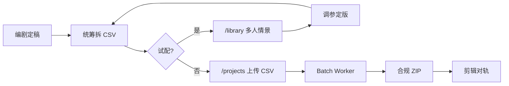

# 短剧批量配音方案

| 项 | 内容 |
|----|------|
| **版本** | v1.0 |
| **日期** | 2026-06-25 |
| **适用** | MVP-0 平台 `/projects` 批量工作流 |
| **关联** | [模块 E](./modules/2026-06-01-module-E-项目角色与CSV.md) · [模块 F](./modules/2026-06-01-module-F-合成与导出.md) · [制作场景三分法](./2026-06-19-制作场景三分法-短剧情景演唱.md) |

---

## 1. 目标与边界

### 1.1 解决什么问题

短剧统筹需要把 **几十到几百句台词**，按 **多角色** 批量生成配音，并一次性拿到 **分轨 wav + 合规说明**，供剪辑对轨。

### 1.2 用哪条产品路径

| 需求 | 入口 | 产出 |
|------|------|------|
| 大批量、多角色、分轨交付 | **`/projects` 批量配音** | 合规 ZIP |
| 剧本试配、快速返听 | `/library` 多人情景 | 单条拼接音频 |
| 单句精修 | `/library` 单人朗读 | 单条 wav |

本方案只覆盖 **批量配音 + 合规 ZIP**。

### 1.3 能力边界（当前实现）

- CSV 单次最多 **500 行**（建议单集 30–120 行，超长集拆批）
- 角色须在项目内 **预先绑定音色版本**
- 每行独立合成；**敏感词仅该行失败**，其余继续
- 对外下载 **仅合规 ZIP**（含节奏标识 + manifest），无裸 wav 出口

---

## 2. 角色与组织方式

### 2.1 推荐项目结构

```
项目名：{剧名}-{季}-{集号}
示例：北原风云-S1-E03
```

一个 **项目 = 一集（或一版台词定稿）**。多集分别建项目，便于重跑与对账。

### 2.2 角色绑定表（开工前必填）

在平台上为每个 CSV 会出现的 `role` 绑定唯一 `voice_version_id`：

| 角色名（CSV） | 人设标签 | 绑定音色 | 语速基准 | 备注 |
|---------------|----------|----------|----------|------|
| 龙宫 | 反派首领 | `vv_龙宫_v2` | 1.05 | 气势强 |
| 方源 | 男主 | `vv_方源_v1` | 1.0 | 冷静 |
| 旁白 | 解说 | `vv_旁白_v1` | 0.95 | 偏低沉 |

**命名规则**

- 角色名与 CSV **完全一致**（区分大小写，不用空格别名）
- 同一角色全剧共用一条音色版本；换音色 = 新建版本后改绑定，历史 ZIP 不受影响

### 2.3 台词来源分工



1. 编剧输出剧本文本  
2. 统筹在 Excel/飞书表维护，**导出 UTF-8 CSV**  
3. 可选：先在 `/library` 多人情景抽 5–10 句试音色与情感  
4. 定稿后上传 `/projects` 跑批量  

---

## 3. CSV 规范

### 3.1 必填列

| 列名（英/中） | 说明 |
|---------------|------|
| `role` / `角色` | 必须与项目绑定名一致 |
| `text` / `台词` | 单行台词，1–5000 字 |

### 3.2 可选列（行级覆盖全局默认）

| 列名 | 类型 | 说明 |
|------|------|------|
| `emotion` / `情感` | 枚举 | 如 `angry` `calm` `happy`；空=中性 |
| `emotion_strength` / `情感强度` | 0–1 | 默认 0.5 |
| `speed` / `语速` | float | 默认 1.0，戏剧略快可用 1.05–1.12 |
| `pause` / `停顿` | 秒 | 句尾停顿时长，剪辑前可忽略 |

### 3.3 编写约定

1. **一行一句**，不要把两句台词合并在一格  
2. **按剪辑顺序排列**（行号即序号，ZIP 内文件名为 `0001`、`0002`…）  
3. 避免纯标点、空行；空行会被跳过或报错  
4. 文件编码：**UTF-8（带 BOM 亦可）**  
5. 敏感词、未授权名人仿声等合规红线台词 **不得入库**（见项目合规规则）

### 3.4 模板与示例

- 平台模板：`apps/web/public/samples/batch_template.csv`  
- 单角色 20 行试跑：`scripts/fixtures/guzhenren_batch_20.csv`  
- **三角色示例**：`scripts/fixtures/shortdrama_3roles_ep01.csv`（见本文 §6）

---

## 4. 标准作业流程（SOP）

### 阶段 A · 准备（D-1）

| 步骤 | 动作 | 验收 |
|------|------|------|
| A1 | Studio 训练/导入各角色音色，QC 通过 | `/library` 可选到版本 |
| A2 | 创建项目 `{剧名}-E{集号}` | 项目列表可见 |
| A3 | 绑定全部角色 → voice_version | 绑定数 = CSV 角色种类数 |
| A4 | 估算字符量，确认月配额 | `GET /usage/quota` 或页面配额 |
| A5 | 确认 `batch` worker 运行 | `.\scripts\platform_status.ps1` |

### 阶段 B · 试配（可选，D0 上午）

1. 打开 `/library` → **多人情景**  
2. 粘贴本集前 8–12 句对话，为每段选角色音色  
3. 记录满意的 `speed` / `emotion` / `emotion_strength`  
4. 回写进 CSV 可选列（或作为该角色默认值）

### 阶段 C · 批量合成（D0）

1. 打开 **http://127.0.0.1:5173/projects**  
2. 选择项目 → 上传 CSV  
3. 等待任务完成（页面轮询 `succeeded_count` / `failed_count`）  
4. 点击 **下载合规 ZIP**

API 等价调用：

```http
POST /api/v1/projects/{project_id}/batch   # multipart: file
GET  /api/v1/jobs/{job_id}
GET  /api/v1/exports/{job_id}/download
```

### 阶段 D · 质检与交付（D0）

| 检查项 | 方法 |
|--------|------|
| 行数一致 | `manifest.json` 中 `succeeded` 数 = 预期句数 − 已知失败行 |
| 合规标识 | 随机抽 3 条 wav，听开头 **短-长-短-短** 节奏音 |
| 角色分轨 | 目录 `{角色名}/` 下文件齐全 |
| 失败行 | 页面「查看行明细」→ 改 CSV 后 **重试失败行** |
| 剪辑导入 | 按 `0001_角色.wav` 顺序拖入时间线 |

### 阶段 E · 归档

- 保留：定稿 CSV、batch `job_id`、ZIP、`manifest.json`  
- 命名：`{剧名}_E{集号}_batch_{job_id前8位}.zip`

---

## 5. 交付物结构

解压合规 ZIP 后：

```
COMPLIANCE_README.txt     # AI 合成告知（禁止去标识误导传播）
manifest.json             # 每行 index / role / status / file / label 元数据
龙宫/
  0001_龙宫.wav
  0004_龙宫.wav
方源/
  0002_方源.wav
  0003_方源.wav
旁白/
  0005_旁白.wav
```

剪辑建议：**不要裁掉片头节奏标识**；若平台要求成片再标识，由合规同事二次确认。

---

## 6. 示例：三角色迷你集

**剧目**：《客栈夜话》第 1 集（12 句）

| 角色 | 音色设定 | 默认语速 |
|------|----------|----------|
| 掌柜 | 中年男声，沉稳 | 1.0 |
| 侠客 | 青年男声，利落 | 1.08 |
| 旁白 | 中性解说 | 0.95 |

试跑文件：`scripts/fixtures/shortdrama_3roles_ep01.csv`

操作：

1. `/projects` 新建项目 `客栈夜话-E01`  
2. 绑定 `掌柜` `侠客` `旁白` 三个角色  
3. 上传上述 CSV → 下载 ZIP  
4. 本地验证：`python scripts/smoke_e2e_guzhenren.py`（可替换 `CSV_PATH` 环境变量）

---

## 7. 参数策略（听感）

| 场景 | speed | temperature | emotion | emotion_strength |
|------|-------|-------------|---------|------------------|
| 旁白解说 | 0.95–1.0 | 0.62–0.75 | calm | 0.35–0.45 |
| 日常对话 | 1.0–1.05 | 0.75–0.82 | （空） | 0.45 |
| 争吵/对峙 | 1.08–1.12 | 0.85–0.92 | angry | 0.65–0.75 |
| 低声独白 | 0.92–0.98 | 0.70–0.78 | calm | 0.55 |

行级 CSV 列优先于角色默认；未填列则走引擎默认。

更细调参见：[听感调参指南](../architecture/2026-06-16-004听感调参指南.md)。

---

## 8. 异常与恢复

| 现象 | 原因 | 处理 |
|------|------|------|
| `ROLE_UNBOUND` | CSV 角色名未绑定 | 补绑定或改 CSV 角色名 |
| `QUOTA_EXCEEDED` | 月字符不足 | 删失败行重跑或升级配额 |
| 行级 `SENSITIVE_WORD` | 敏感词 | 改台词 → 重试该行 |
| `CHARACTER_VOICE_UNBOUND` / 行失败 | 音色无权限 | 检查授权/购买记录 |
| 任务一直 queued | batch worker 未启动 | `platform_start.ps1` |
| 全部行失败 | 引擎未就绪 | 检查 9880 / `ENGINE_MOCK` |

重试 API：`POST /api/v1/jobs/{job_id}/batch-lines/retry` + `line_indices[]`

---

## 9. 产能与拆分建议

| 集时长 | 建议台词行数 | 拆分策略 |
|--------|--------------|----------|
| 1–3 分钟 | 15–40 行 | 单 CSV 一次跑 |
| 3–8 分钟 | 40–120 行 | 单 CSV；高峰时段拆 2 批 |
| 8 分钟以上 | 120+ 行 | 按 **场次** 拆多个 CSV/项目，剪辑再合并 |

单用户并发：同一项目避免并行多个 batch job，以免配额与队列争抢。

---

## 10. 合规清单（上线前必勾）

- [ ] 各角色声纹均有 **本人或权利人授权**（Consent 已通过）  
- [ ] 台词无未授权名人仿声、无敏感违规内容  
- [ ] 下载包仅使用 **合规 ZIP**，不向外部提供无标识源文件  
- [ ] 成片发布按业务要求保留 AI 告知（片头/简介/水印策略）  
- [ ] `manifest.json` 随项目归档备查  

---

## 11. 相关命令

```powershell
# 启动全栈（含 batch worker）
.\scripts\dev_restart.ps1 -Background
.\scripts\web_dev.ps1

# 状态
.\scripts\platform_status.ps1

# 端到端冒烟（单角色 20 行 + ZIP）
python scripts/smoke_e2e_guzhenren.py

# 行级失败隔离
python scripts/smoke_e2e_batch_mixed.py
```

---

## 变更记录

| 版本 | 日期 | 说明 |
|------|------|------|
| v1.0 | 2026-06-25 | 首版：SOP、CSV 规范、三角色示例、交付与合规 |
