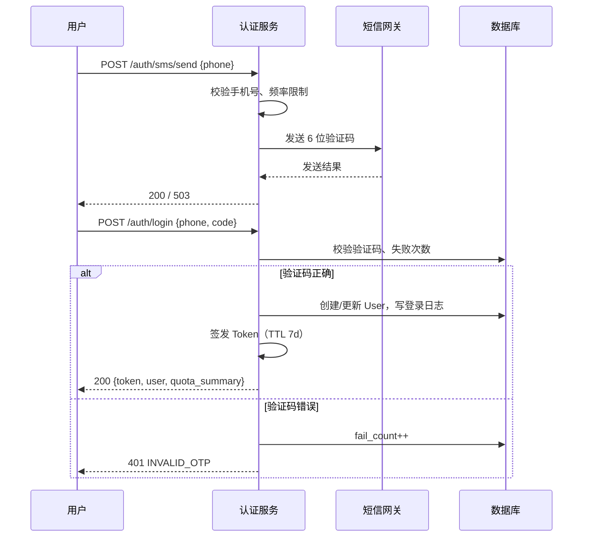
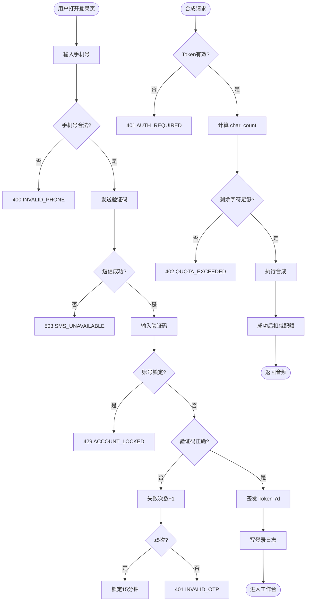

# 子模块规格 · 模块 A：账号与配额

| 项 | 内容 |
|----|------|
| **模块编号** | A |
| **关联需求** | REQ-001（账号注册与登录）、REQ-023（用量配额） |
| **阶段** | MVP-0（4 周） |
| **版本** | v1.0 |
| **日期** | 2026-06-03 |
| **上级文档** | [2026-06-01-mvp-voice-platform-需求规格说明.md](../2026-06-01-mvp-voice-platform-需求规格说明.md) v1.2 |

---

## 1 介绍

本模块提供 **用户身份认证** 与 **用量配额控制**，确保仅合法用户可访问平台能力，并通过字符数与训练次数上限控制 GPU 与短信等成本，防止滥用。

### 1.1 功能需求清单

| ID | 需求描述 | 优先级 | 可验证方式 |
|----|----------|--------|------------|
| A-FR-01 | 用户可使用中国大陆手机号 + 短信验证码完成注册或登录 | P0 | TC-A01 |
| A-FR-02 | 登录成功后签发会话凭证（Bearer Token），7 天内有效 | P0 | TC-A03 |
| A-FR-03 | 同一手机号仅绑定一个账号；注销后 30 天内不可复用该号注册 | P0 | 边界用例 |
| A-FR-04 | 连续 5 次验证码错误则锁定账号 15 分钟 | P0 | TC-A02 |
| A-FR-05 | 未携带有效 Token 访问受保护 API 时返回 401 | P0 | TC-SEC-01 |
| A-FR-06 | 免费套餐默认：月合成字符 ≤20,000、月训练次数 ≤1（数值可配置） | P0 | TC-E2E-04 |
| A-FR-07 | 合成成功按文本长度（含标点）扣减字符配额；训练成功扣减 1 次训练配额 | P0 | TC-S03 |
| A-FR-08 | 配额不足时拒绝请求并返回剩余额度与升级引导 | P0 | TC-E2E-04 |
| A-FR-09 | 记录登录日志，留存 ≥6 个月（手机号脱敏存储） | P0 | 运维审计 |
| A-FR-10 | 邮箱注册/OAuth 微信登录 | P1 | MVP+1，本模块标「待定」 |

### 1.2 非法条件与无效输入响应

| 场景 | 系统响应 | HTTP | 错误码 |
|------|----------|------|--------|
| 手机号格式非法 | 拒绝发送验证码/登录，提示格式错误 | 400 | `INVALID_PHONE` |
| 验证码错误或过期 | 拒绝登录，累计失败次数 | 401 | `INVALID_OTP` |
| 连续 5 次验证码错误 | 锁定 15 分钟 | 429 | `ACCOUNT_LOCKED` |
| 未登录访问受保护接口 | 拒绝 | 401 | `AUTH_REQUIRED` |
| Token 过期或无效 | 拒绝，引导重新登录 | 401 | `AUTH_REQUIRED` |
| 注销未满 30 天手机号重复注册 | 拒绝 | 403 | `PHONE_COOLDOWN` |
| 合成文本长度为 0 或仅标点 | 不参与配额预检；合成 API 返回 400（见 REQ-007） | 400 | `INVALID_TEXT` |
| 请求字符数超过当月剩余配额 | 拒绝合成/批量 | 402 | `QUOTA_EXCEEDED` |
| 训练次数已达月上限 | 拒绝创建训练 Job | 402 | `QUOTA_EXCEEDED` |
| 短信网关失败 | 返回发送失败，可重试 | 503 | `SMS_UNAVAILABLE` |
| 配额服务不可用 | 拒绝扣费类操作（合成/训练），只读查询可降级 | 503 | `QUOTA_SERVICE_ERROR` |

---

## 2 输入

### 2.1 输入数据详细说明

#### 2.1.1 手机号（phone）

| 属性 | 说明 |
|------|------|
| **输入来源** | 用户 Web 端注册/登录表单；API 请求体 |
| **数量** | 每次请求 1 个 |
| **度量单位** | 字符串（E.164 或国内 11 位） |
| **时间要求** | 实时；发送验证码接口 P95 <500ms |
| **有效范围** | 中国大陆手机号：`^1[3-9]\d{9}$`；前后空格需 trim |
| **精度与容忍度** | 精确匹配，不允许通配或模糊 |
| **非法输入处理** | 返回 `INVALID_PHONE`，不调用短信网关 |

#### 2.1.2 短信验证码（otp / code）

| 属性 | 说明 |
|------|------|
| **输入来源** | 用户表单；`POST /api/v1/auth/login` |
| **数量** | 每次登录 1 个 |
| **度量单位** | 数字字符串 |
| **时间要求** | 验证码有效期 **5 分钟**（可配置）；登录校验 P95 <500ms |
| **有效范围** | 6 位数字 `^\d{6}$` |
| **精度与容忍度** | 与服务器侧 Redis/DB 存储值完全一致；大小写 N/A |
| **非法输入处理** | 非 6 位 → 400；不匹配 → 401 并累计失败计数 |

#### 2.1.3 合成文本长度（char_count）

| 属性 | 说明 |
|------|------|
| **输入来源** | 合成/批量合成 API 请求体中的 `text` 字段；系统内部计算 |
| **数量** | 单条合成 1 次；批量为各行之和（预检）或逐行扣减（执行） |
| **度量单位** | 字符（Unicode code point 计数，**含标点与空格**） |
| **时间要求** | 配额预检在业务逻辑之前同步完成，P95 <50ms |
| **有效范围** | 单条：1～5000 字（REQ-007）；批量：各行合计不超过当月剩余配额 |
| **精度与容忍度** | 整数，无小数；计数算法见 §3.4 |
| **非法输入处理** | 超长 → 400；超额 → 402 `QUOTA_EXCEEDED` |

#### 2.1.4 训练次数（training_count）

| 属性 | 说明 |
|------|------|
| **输入来源** | 用户触发 `POST /api/v1/voices/{id}/train`；系统读取当月已用次数 |
| **数量** | 每次训练请求计 1 次 |
| **度量单位** | 次/自然月 |
| **时间要求** | 创建 TrainingJob 前同步校验 |
| **有效范围** | 免费套餐默认：0～1 次/月（已用+本次 ≤ 上限）；付费套餐按 `UsagePlan` 配置 |
| **精度与容忍度** | 整数；训练 **成功** 后扣减，失败且重试耗尽后不重复扣减（幂等按 `job_id`） |
| **非法输入处理** | 超限 → 402，body 含 `remaining_trainings: 0` |

#### 2.1.5 会话凭证（Authorization Header）

| 属性 | 说明 |
|------|------|
| **输入来源** | 客户端 HTTP Header `Authorization: Bearer {token}` |
| **数量** | 每个受保护请求 1 个 |
| **度量单位** | JWT 或 opaque token 字符串 |
| **时间要求** | 网关/中间件同步校验 |
| **有效范围** | 未过期、未吊销、签名有效 |
| **非法输入处理** | 缺失/无效 → 401 `AUTH_REQUIRED` |

### 2.2 接口规格参考

| 接口 | 方法 | 路径 | 说明 |
|------|------|------|------|
| 发送验证码 | POST | `/api/v1/auth/sms/send` | 见 SRS §7.1 |
| 登录/注册 | POST | `/api/v1/auth/login` | 见 SRS §7.1 |
| 配额查询 | GET | `/api/v1/usage/quota` | **待定**（MVP-0 建议提供；未实现则随 402 返回剩余量） |
| 单条合成 | POST | `/api/v1/synthesis` | 内含配额扣减，REQ-007 |
| 触发训练 | POST | `/api/v1/voices/{id}/train` | 内含训练次数校验，REQ-005 |

**统一请求/响应约定**：见 SRS §7.1 及附录 B 错误码。

---

## 3 处理

### 3.1 输入有效性检测

1. **手机号**：正则 + 长度；黑名单/注销冷却表查询。  
2. **验证码**：格式 → 有效期 → 常量时间比较（防时序攻击）→ 失败计数。  
3. **Token**：解析 → 签名校验 → 过期检查 → 用户状态（未锁定、未注销）。  
4. **配额预检**：读取 `UsageRecord` 当月汇总 + 请求预估消耗；`remaining >= required` 才放行。  
5. **文本长度**：空/仅标点由合成模块拒绝；合法文本按 §3.4 计数。

### 3.2 操作时序

#### 3.2.1 注册/登录流程



#### 3.2.2 配额扣减流程（合成）

| 步骤 | 事件 | 说明 |
|------|------|------|
| 1 | 鉴权 | 401 若 Token 无效 |
| 2 | 预检 | `char_count = len(text)`；若 `remaining_chars < char_count` → 402 |
| 3 | 业务 | 进入合成流水线（敏感词等） |
| 4 | 提交成功 | 创建 SynthesisJob 后 **预扣** 或 Job 成功后 **实扣**（实现二选一，MVP-0 推荐 Job `succeeded` 后实扣） |
| 5 | 失败回滚 | Job 失败不扣减；超时 **待定** 对账策略 |

#### 3.2.3 配额扣减流程（训练）

| 步骤 | 事件 | 说明 |
|------|------|------|
| 1 | 鉴权 + 授权书校验 | 见 REQ-003 |
| 2 | 预检 | `used_trainings + 1 > limit` → 402 |
| 3 | 创建 TrainingJob | 状态 `queued` |
| 4 | Job `succeeded` | `training_count += 1`，写 `UsageRecord` |
| 5 | Job `failed`（含重试耗尽） | 不扣训练次数 |

### 3.3 异常情况回应

| 异常 | 处理策略 |
|------|----------|
| **溢出** | 字符配额使用 64 位整数；单月上限配置 ≤ 10^9，防溢出 |
| **通信失败（短信）** | 不写入验证码；返回 503；客户端 60s 内限发 1 次 |
| **通信失败（DB/Redis）** | 登录/扣费失败关闭（fail closed）；返回 503 |
| **并发扣减** | 使用 DB 行锁或 Redis 原子 decr；批量合成按父 Job 串行汇总 |
| **时钟漂移** | 配额按 **自然月**（Asia/Shanghai）重置；Token 过期以 UTC 为准 |
| **重复提交** | 登录幂等返回新 Token；合成/训练按 `Idempotency-Key` **待定** |

### 3.4 转换规则与算法

**字符计数**：

```
char_count = len(text)   // Unicode 码点数量，含标点、空格、换行
扣减量   = char_count    // 合成成功时写入 UsageRecord.chars
```

**训练计数**：

```
IF TrainingJob.status == 'succeeded' AND NOT already_recorded(job_id):
    monthly_training_used += 1
```

**剩余配额**：

```
remaining_chars     = plan.monthly_char_limit - sum(chars in current_month)
remaining_trainings = plan.monthly_train_limit - count(succeeded trainings in current_month)
```

**默认免费套餐（可配置）**：

| 项 | 默认值 |
|----|--------|
| 月字符上限 | 20,000 |
| 月训练上限 | 1 |

### 3.5 活动图（登录 + 配额校验）



---

## 4 输出

### 4.1 输出数据详细说明

#### 4.1.1 登录成功响应

| 属性 | 说明 |
|------|------|
| **输出到** | HTTP 响应体 → Web 客户端本地存储（内存/localStorage） |
| **数量** | 1 组凭证 + 用户摘要 |
| **度量单位** | JSON |
| **时序** | 验证码校验通过后 **同步** 返回，P95 <500ms |
| **有效范围** | `token` 非空字符串；`expires_in` 默认 604800（秒） |
| **非法值处理** | 不返回部分 token；失败时不泄漏用户是否存在 |
| **错误消息** | 见 §1.2 |

**示例（200）**：

```json
{
  "token": "eyJhbGciOiJIUzI1NiIs...",
  "expires_in": 604800,
  "user": {
    "id": "usr_xxx",
    "phone_masked": "138****5678"
  },
  "quota": {
    "monthly_char_limit": 20000,
    "chars_used": 0,
    "chars_remaining": 20000,
    "monthly_train_limit": 1,
    "trainings_used": 0,
    "trainings_remaining": 1,
    "reset_at": "2026-07-01T00:00:00+08:00"
  }
}
```

#### 4.1.2 配额不足响应（QUOTA_EXCEEDED）

| 属性 | 说明 |
|------|------|
| **输出到** | HTTP 响应体 → 前端弹窗/Toast |
| **数量** | 1 条错误 + 剩余额度结构 |
| **度量单位** | JSON（统一错误体） |
| **时序** | 预检阶段 **同步** 返回，不创建合成/训练 Job |
| **有效范围** | HTTP 402；`code` 固定为 `QUOTA_EXCEEDED` |
| **非法值处理** | N/A（服务端生成） |
| **错误消息** | 中文用户可读文案 + 升级引导链接 **待定** |

**示例（402）**：

```json
{
  "code": "QUOTA_EXCEEDED",
  "message": "本月合成字符额度不足，请升级套餐或下月再试",
  "details": {
    "quota_type": "chars",
    "required": 1500,
    "remaining": 200,
    "monthly_limit": 20000,
    "used": 19800,
    "reset_at": "2026-07-01T00:00:00+08:00",
    "upgrade_url": "/billing"
  }
}
```

#### 4.1.3 未授权响应（AUTH_REQUIRED）

| 属性 | 说明 |
|------|------|
| **输出到** | HTTP 响应 → 前端跳转登录页 |
| **时序** | 网关鉴权失败即返回 |
| **HTTP** | 401 |
| **code** | `AUTH_REQUIRED` |

#### 4.1.4 审计与持久化输出

| 输出 | 去向 | 留存 |
|------|------|------|
| `AuditLog`（login） | 数据库 | ≥6 个月 |
| `UsageRecord` | 数据库 | 与账单周期一致 |
| 登录日志 | 日志系统（手机号脱敏） | ≥6 个月 |

### 4.2 接口规格参考

同 §2.2。错误码全集见 SRS 附录 B。

### 4.3 输入/输出对与状态行为

本模块会话行为可建模为有限状态：

| 当前状态 | 输入 | 下一状态 | 输出 |
|----------|------|----------|------|
| 未登录 | 正确验证码 | 已登录 | token + quota |
| 未登录 | 错误验证码（<5） | 未登录 | INVALID_OTP |
| 未登录 | 错误验证码（≥5） | 锁定 | ACCOUNT_LOCKED |
| 锁定 | 任意登录 | 锁定 | ACCOUNT_LOCKED（15min 内） |
| 已登录 | 有效 API 请求 | 已登录 | 业务响应 |
| 已登录 | Token 过期 | 未登录 | AUTH_REQUIRED |
| 已登录 | 配额足够合成 | 已登录 | 音频 + chars_used 增加 |
| 已登录 | 配额不足 | 已登录 | QUOTA_EXCEEDED（状态不变） |

---

## 5 测试要点

| 编号 | 场景 | 关联 |
|------|------|------|
| TC-A01 | 新手机号注册成功并返回 token | A-FR-01 |
| TC-A02 | 连续 5 次错误验证码锁定 15 分钟 | A-FR-04 |
| TC-A03 | Token 7 天内有效，过期 401 | A-FR-02 |
| TC-E2E-04 | 配额用尽后合成返回 402 且含 remaining | A-FR-08 |
| TC-S03 | 合成成功后 chars_used 增加 = 文本长度 | A-FR-07 |
| TC-SEC-01 | 无 Token 访问合成 API 返回 401 | A-FR-05 |

---

## 6 待定项

| # | 内容 | 影响 |
|---|------|------|
| TBD-A01 | 邮箱/OAuth 登录方案 | A-FR-10，MVP+1 |
| TBD-A02 | 付费套餐与算力包购买流程（REQ-023-2） | MVP+1 模拟支付 |
| TBD-A03 | 合成失败/超时是否预扣配额 | 对账策略 |
| TBD-A04 | `Idempotency-Key` 是否 MVP-0 必做 | 防重复扣费 |
| TBD-A05 | 独立 `GET /api/v1/usage/quota` 是否 W1 交付 | 前端展示剩余量 |
