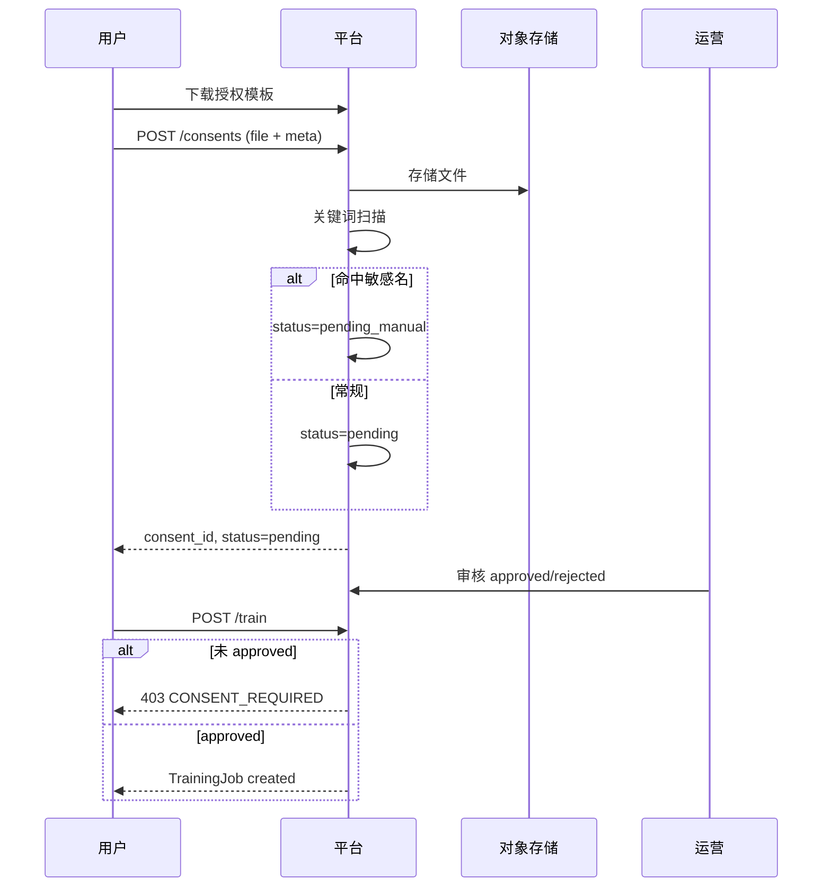
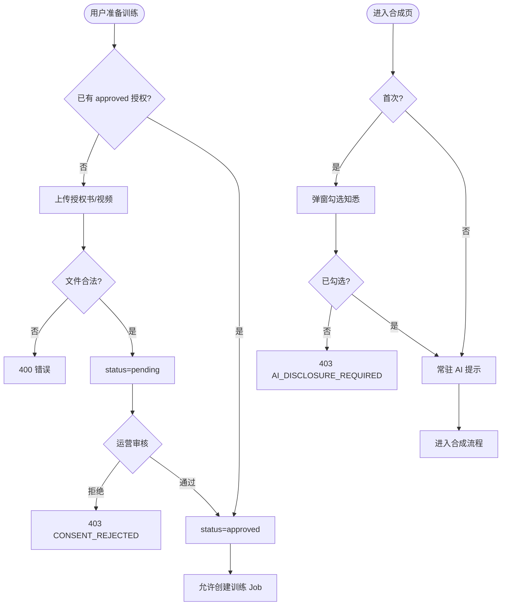

# 子模块规格 · 模块 B：授权与告知

| 项 | 内容 |
|----|------|
| **模块编号** | B |
| **关联需求** | REQ-003（声纹授权文件上传与校验）、REQ-021（合成界面 AI 生成告知） |
| **阶段** | MVP-0（4 周） |
| **版本** | v1.0 |
| **日期** | 2026-06-03 |
| **上级文档** | [2026-06-01-mvp-voice-platform-需求规格说明.md](../2026-06-01-mvp-voice-platform-需求规格说明.md) v1.2 |

---

## 1 介绍

本模块实现 **合规最低集** 中的「授权先行」与「AI 透明度告知」：用户在训练音色前须提交声纹授权材料并经审核通过；进入合成能力前须确认深度合成告知。未满足条件时 **阻断训练**，合成页 **常驻提示** AI 生成属性。

### 1.1 功能需求清单

| ID | 需求描述 | 优先级 | 可验证方式 |
|----|----------|--------|------------|
| B-FR-01 | 用户可下载标准声纹授权书 PDF 模板 | P0 | TC-C02 |
| B-FR-02 | 用户可上传授权书（PDF/图片）或视频声明（10–30s），二选一 | P0 | TC-C01 |
| B-FR-03 | 未上传或未通过审核时，无法创建训练任务 | P0 | TC-C01 |
| B-FR-04 | 含名人/公众人物关键词的素材名或元数据自动进入人工审核队列 | P0 | TC-C03 |
| B-FR-05 | 运营 24h 内人工审核，结果写入 `review_status` | P0 | 运营 SOP |
| B-FR-06 | 授权书若填写期限且已过期，阻断训练 | P0 | 边界用例 |
| B-FR-07 | 用户首次进入合成页须弹窗勾选「知悉 AI 生成」 | P0 | TC-E2E-02 |
| B-FR-08 | 合成页常驻显示「内容由 AI 生成」 | P0 | 界面验收 |
| B-FR-09 | 导出音频标识与告知文案一致（REQ-010 联动） | P0 | TC-L02 |
| B-FR-10 | 三方实名 KYC 与 REQ-002 联动 | P1 | MVP+1，待定 |

### 1.2 非法条件与无效输入响应

| 场景 | 系统响应 | HTTP | 错误码 |
|------|----------|------|--------|
| 未登录上传授权 | 拒绝 | 401 | `AUTH_REQUIRED` |
| 文件类型非 PDF/JPG/PNG/MP4 | 拒绝 | 400 | `INVALID_FILE_TYPE` |
| 文件超过大小上限（PDF/图 20MB，视频 100MB） | 拒绝 | 400 | `FILE_TOO_LARGE` |
| 视频声明时长 <10s 或 >30s | 拒绝 | 400 | `INVALID_VIDEO_DURATION` |
| 无授权或未 approved 时提交训练 | 拒绝 | 403 | `CONSENT_REQUIRED` |
| 授权被拒绝（rejected） | 训练阻断，提示重新上传 | 403 | `CONSENT_REJECTED` |
| 授权过期 | 训练阻断 | 403 | `CONSENT_EXPIRED` |
| 未勾选 AI 告知即提交合成 | 拒绝 | 403 | `AI_DISCLOSURE_REQUIRED` |
| 存储/upload 服务失败 | 返回失败，可重试 | 503 | `STORAGE_UNAVAILABLE` |

---

## 2 输入

### 2.1 输入数据详细说明

#### 2.1.1 授权书文件（consent_file）

| 属性 | 说明 |
|------|------|
| **输入来源** | 用户 Web 上传；`POST /api/v1/consents` multipart |
| **数量** | 每次 1 个文件（PDF/图片）或 1 个视频 |
| **度量单位** | 二进制文件；MIME：`application/pdf`、`image/jpeg`、`image/png`、`video/mp4` |
| **时间要求** | 上传 P95 <30s（100MB 内）；审核 SLA 24h（运营） |
| **有效范围** | PDF/图片 ≤20MB；视频 10–30s、≤100MB |
| **精度与容忍度** | 文件 MD5 入库防重复；损坏文件解析失败即拒 |
| **非法输入处理** | 见 §1.2 |

#### 2.1.2 声明元数据（consent_meta）

| 属性 | 说明 |
|------|------|
| **输入来源** | 表单字段或 PDF 解析 **待定** |
| **数量** | 1 组 |
| **度量单位** | JSON：`declarant_name`、`id_last4`、`expiry_date`（可选） |
| **时间要求** | 与文件同步提交 |
| **有效范围** | 姓名 2–50 字符；`expiry_date` ≥ 当日（若填写） |
| **非法输入处理** | 缺必填 → 400 `INVALID_CONSENT_META` |

#### 2.1.3 AI 告知确认（ai_disclosure_ack）

| 属性 | 说明 |
|------|------|
| **输入来源** | 合成页首次弹窗勾选；持久化至 User 偏好 |
| **数量** | 每用户 1 次（MVP-0） |
| **度量单位** | 布尔 `acknowledged=true` + 时间戳 |
| **时间要求** | 合成 API 调用前校验 |
| **有效范围** | 必须为 true |
| **非法输入处理** | false/缺失 → 403 `AI_DISCLOSURE_REQUIRED` |

#### 2.1.4 运营审核输入（review_action）

| 属性 | 说明 |
|------|------|
| **输入来源** | 飞书/邮件流程或极简后台 **待定** |
| **数量** | 每份授权 1 次决策 |
| **度量单位** | `approved` / `rejected` + `reason`（拒绝必填） |
| **时间要求** | 24h 内 |
| **非法输入处理** | 拒绝无原因 → 400 |

### 2.2 接口规格参考

| 接口 | 方法 | 路径 | 说明 |
|------|------|------|------|
| 上传授权 | POST | `/api/v1/consents` | SRS §7.1 |
| 下载模板 | GET | `/api/v1/consents/template` | **待定** 路径 |
| 查询授权状态 | GET | `/api/v1/consents/current` | **待定** |
| 确认 AI 告知 | POST | `/api/v1/users/me/ai-disclosure` | **待定** |
| 触发训练 | POST | `/api/v1/voices/{id}/train` | 内含 CONSENT 校验 |

---

## 3 处理

### 3.1 输入有效性检测

1. 鉴权 Token 有效。  
2. 文件 MIME、大小、视频时长检测。  
3. 敏感名关键词扫描（素材名、文件名、元数据）。  
4. 训练 API 调用前：`ConsentDocument.review_status == approved` 且未过期。  
5. 合成 API 调用前：`User.ai_disclosure_ack == true`。

### 3.2 操作时序

### 3.3 异常情况回应

| 异常 | 处理策略 |
|------|----------|
| OSS 上传中断 | 支持分片续传 **待定**；失败不创建 ConsentDocument |
| 审核超时 | 保持 pending；用户可见「审核中」 |
| 并发重复上传 | 以最新一条 pending/approved 为准；旧版 archived |
| 通信失败 | 503；不部分更新 review_status |

### 3.4 转换规则

- **训练门禁**：`can_train = (consent.status == 'approved') AND (expiry IS NULL OR expiry >= today)`  
- **合成门禁**：`can_synthesize = ai_disclosure_ack AND 其他模块门禁`  
- **人工队列**：`filename OR meta CONTAINS keyword_list` → `pending_manual`

### 3.5 活动图

---

## 4 输出

### 4.1 输出数据详细说明

#### 4.1.1 授权上传成功

| 属性 | 说明 |
|------|------|
| **输出到** | HTTP JSON → 前端状态页 |
| **时序** | 上传完成同步返回 |
| **示例** | `{ "consent_id": "cst_xxx", "review_status": "pending", "submitted_at": "..." }` |

#### 4.1.2 训练阻断 CONSENT_REQUIRED

| 属性 | 说明 |
|------|------|
| **输出到** | HTTP 403 → 前端引导上传/等待审核 |
| **HTTP** | 403 |
| **code** | `CONSENT_REQUIRED` / `CONSENT_REJECTED` / `CONSENT_EXPIRED` |
| **details** | `consent_id`、`review_status`、`reject_reason`（若有） |

#### 4.1.3 AI 告知状态

| 属性 | 说明 |
|------|------|
| **输出到** | 用户 profile；合成页 UI |
| **内容** | `ai_disclosure_ack: true`、`ack_at`；页面 Banner 文案固定：「内容由 AI 生成」 |

#### 4.1.4 持久化

| 实体 | 关键字段 |
|------|----------|
| `ConsentDocument` | `user_id`, `type`, `file_url`, `review_status`, `expiry_date` |
| `AuditLog` | 审核人、操作、时间 |

### 4.2 接口规格参考

同 §2.2；错误码见 SRS 附录 B。

### 4.3 状态机（授权）

| 状态 | 输入 | 下一状态 | 输出 |
|------|------|----------|------|
| 无记录 | 上传 | pending | consent_id |
| pending | 运营通过 | approved | 可训练 |
| pending | 运营拒绝 | rejected | CONSENT_REJECTED |
| approved | 过期日到达 | expired | CONSENT_EXPIRED |
| rejected | 重新上传 | pending | 新 consent_id |

---

## 5 测试要点

| 编号 | 场景 | 关联 |
|------|------|------|
| TC-C01 | 无授权无法训练 | B-FR-03 |
| TC-C02 | 模板可下载 | B-FR-01 |
| TC-C03 | 敏感名进人工队列 | B-FR-04 |
| TC-E2E-02 | 合成页告知与导出一致 | B-FR-07~09 |

---

## 6 待定项

| # | 内容 |
|---|------|
| TBD-B01 | 敏感名人关键词表（法务确认） |
| TBD-B02 | 极简审核后台 vs 纯飞书 SOP |
| TBD-B03 | PDF 元数据自动解析是否 MVP-0 |
| TBD-B04 | 视频声明 ASR 校验 **待定** |
