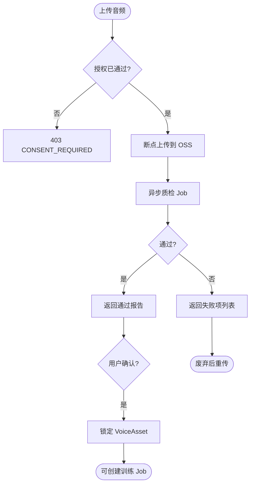

# 子模块规格 · 模块 C：素材上传与质检

| 项 | 内容 |
|----|------|
| **模块编号** | C |
| **关联需求** | REQ-004（训练素材上传与质检） |
| **阶段** | MVP-0（4 周） |
| **版本** | v1.0 |
| **日期** | 2026-06-03 |
| **上级文档** | [2026-06-01-mvp-voice-platform-需求规格说明.md](../2026-06-01-mvp-voice-platform-需求规格说明.md) v1.2 |

---

## 1 介绍

本模块接收用户 **约 10 分钟干声音频**，执行自动 **质检**（时长、采样率、信噪比、BGM、多说话人等），输出可解释的通过/失败结果。质检通过且用户确认后，素材 **锁定** 并允许进入训练模块（REQ-005）。

### 1.1 功能需求清单

| ID | 需求描述 | 优先级 | 可验证方式 |
|----|----------|--------|------------|
| C-FR-01 | 支持 wav/flac/mp3 上传，单文件 ≤500MB | P0 | TC-V03 |
| C-FR-02 | 支持断点续传 | P0 | TC-V03 |
| C-FR-03 | 有效语音时长 8–15 分钟通过；<8 或 >15 拒绝 | P0 | TC-V01 |
| C-FR-04 | 采样率 ≥16kHz；单声道/立体声均可 | P0 | 质检报告 |
| C-FR-05 | SNR 低于阈值、含 BGM、多人混杂时拒绝并列出原因 | P0 | TC-V02 |
| C-FR-06 | 质检通过后用户确认，素材锁定不可篡改 | P0 | 边界用例 |
| C-FR-07 | 仅可废弃后重传新版本（新 VoiceAsset） | P0 | 版本追溯 |
| C-FR-08 | 依赖 REQ-003 授权已通过 | P0 | 门禁联动 |

### 1.2 非法条件与无效输入响应

| 场景 | 系统响应 | HTTP | 错误码 |
|------|----------|------|--------|
| 未登录 | 拒绝 | 401 | `AUTH_REQUIRED` |
| 授权未通过 | 拒绝 | 403 | `CONSENT_REQUIRED` |
| 不支持格式（如 aac） | 拒绝 | 400 | `INVALID_AUDIO_FORMAT` |
| 文件 >500MB | 拒绝 | 400 | `FILE_TOO_LARGE` |
| 有效时长 <8min | 质检失败 | 200/422 | `QC_DURATION_TOO_SHORT` |
| 有效时长 >15min | 质检失败 | 200/422 | `QC_DURATION_TOO_LONG` |
| 采样率 <16kHz | 质检失败 | 422 | `QC_SAMPLE_RATE_LOW` |
| 含 BGM/噪声/多人 | 质检失败 | 422 | `QC_QUALITY_FAILED` |
| OSS 不可用 | 上传失败 | 503 | `STORAGE_UNAVAILABLE` |
| 已锁定素材再次修改 | 拒绝 | 409 | `ASSET_LOCKED` |

---

## 2 输入

### 2.1 输入数据详细说明

#### 2.1.1 音频文件（audio_file）

| 属性 | 说明 |
|------|------|
| **输入来源** | Web 上传；`POST /api/v1/voices/assets` |
| **数量** | 每次 1 个文件 |
| **度量单位** | 字节；时长秒；采样率 Hz |
| **时间要求** | 上传支持断点；质检异步 P95 <3min（**待定** 标定） |
| **有效范围** | 格式 wav/flac/mp3；≤500MB；时长 8–15min 有效语音；采样率 ≥16000 |
| **精度与容忍度** | 时长精度 ±1s；SNR 阈值 **待定**（算法 Spike） |
| **非法输入处理** | 见 §1.2 |

#### 2.1.2 上传会话（upload_id / chunks）

| 属性 | 说明 |
|------|------|
| **输入来源** | 断点续传协议 **待定**（TUS/S3 multipart） |
| **数量** | 1 会话多 chunk |
| **时间要求** | 会话 TTL 24h |
| **非法输入处理** | 过期会话 → 400 重新发起 |

#### 2.1.3 用户确认（confirm_qc）

| 属性 | 说明 |
|------|------|
| **输入来源** | 质检报告页「确认使用」按钮 |
| **数量** | 1 次/素材 |
| **度量单位** | 布尔 |
| **前置条件** | `qc_result.status == passed` |

### 2.2 接口规格参考

| 接口 | 方法 | 路径 | 说明 |
|------|------|------|------|
| 上传素材 | POST | `/api/v1/voices/assets` | SRS §7.1 |
| 查询质检 | GET | `/api/v1/voices/assets/{id}/qc` | **待定** |
| 确认锁定 | POST | `/api/v1/voices/assets/{id}/confirm` | **待定** |

---

## 3 处理

### 3.1 输入有效性检测

1. Token + CONSENT approved。  
2. MIME/扩展名与魔数校验。  
3. 文件大小 ≤500MB。  
4. 解码音频：采样率、声道、时长。  
5. VAD 提取有效语音段累计时长。  
6. SNR、BGM 检测、说话人数量估计（算法 pipeline）。

### 3.2 操作时序

| 步骤 | 事件 |
|------|------|
| 1 | 创建 upload 会话，写入临时 OSS |
| 2 | 合并完成，触发 QC Job |
| 3 | QC Worker 分析，写 `VoiceAsset.qc_result` |
| 4 | 用户查看报告 |
| 5 | 用户 confirm → `locked=true`，关联 Voice 草稿 |

### 3.3 异常情况回应

| 异常 | 处理 |
|------|------|
| 上传中断 | 续传；超 TTL 清理临时对象 |
| QC Worker 失败 | 重试 1 次；仍失败 → `qc_status=error` |
| 磁盘/存储满 | 503 |
| 损坏音频 | `QC_DECODE_FAILED` |

### 3.4 转换规则

```
effective_duration = sum(VAD_segments.duration)
pass = (8 <= effective_duration <= 15)
    AND (sample_rate >= 16000)
    AND (snr >= SNR_THRESHOLD)
    AND (bgm_score < BGM_THRESHOLD)
    AND (speaker_count == 1)
```

阈值常量配置化，默认值 **待定** 于算法 Spike。

### 3.5 活动图



---

## 4 输出

### 4.1 输出数据详细说明

#### 4.1.1 质检报告（qc_result）

| 属性 | 说明 |
|------|------|
| **输出到** | HTTP JSON；前端报告页 |
| **时序** | QC Job 完成后可轮询 GET |
| **结构** | `status: passed|failed`, `duration_sec`, `sample_rate`, `issues: [{code, message}]` |
| **失败 issues 示例** | `BGM_DETECTED`, `LOW_SNR`, `MULTI_SPEAKER`, `DURATION_TOO_SHORT` |

#### 4.1.2 锁定成功

| 属性 | 说明 |
|------|------|
| **输出到** | DB `VoiceAsset` |
| **字段** | `locked=true`, `storage_url`, `qc_result`, `voice_version_id`（训练前关联） |

#### 4.1.3 错误响应

统一 `{ code, message, details }`；422 用于质检不通过（业务失败非 HTTP 5xx）。

### 4.2 接口规格参考

同 §2.2。

### 4.3 状态机（素材）

| 状态 | 输入 | 下一状态 |
|------|------|----------|
| uploading | 完成 | qc_pending |
| qc_pending | QC 完成 pass | qc_passed |
| qc_pending | QC 完成 fail | qc_failed |
| qc_passed | 用户 confirm | locked |
| locked | 训练使用 | consumed_by_training |
| qc_failed | 废弃重传 | archived → 新 uploading |

---

## 5 测试要点

| 编号 | 场景 |
|------|------|
| TC-V01 | 9min 有效语音拒绝（<8 边界） |
| TC-V02 | 含 BGM 拒绝并提示 |
| TC-V03 | 大文件断点续传 |

---

## 6 待定项

| # | 内容 |
|---|------|
| TBD-C01 | SNR/BGM/多人检测阈值 |
| TBD-C02 | 断点续传协议选型 |
| TBD-C03 | QC 异步 SLA |
