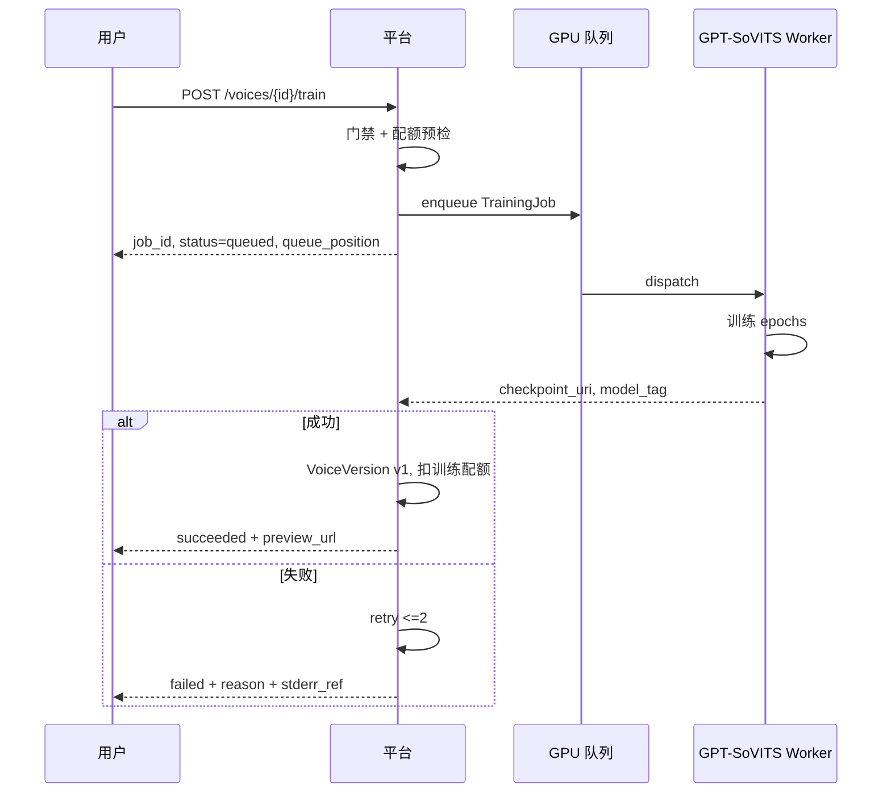
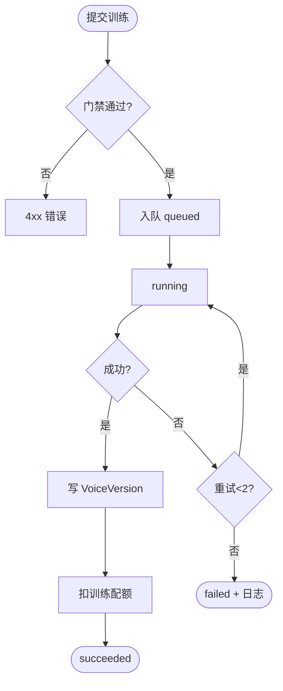

# 子模块规格 · 模块 D：训练与音色版本

| 项 | 内容 |
|----|------|
| **模块编号** | D |
| **关联需求** | REQ-005（GPT-SoVITS 音色训练）、REQ-022（GPU 任务队列，本模块消费） |
| **阶段** | MVP-0（4 周） |
| **版本** | v1.0 |
| **日期** | 2026-06-03 |
| **上级文档** | [2026-06-01-mvp-voice-platform-需求规格说明.md](../2026-06-01-mvp-voice-platform-需求规格说明.md) v1.2 |

---

## 1 介绍

本模块在素材锁定后 **一键启动 GPT-SoVITS 训练**，经 GPU 队列调度生成不可变 **VoiceVersion**（含 `model_tag`、`checkpoint_uri`），供合成模块推理。训练与推理 **必须使用相同 model_tag**。

### 1.1 功能需求清单

| ID | 需求描述 | 优先级 | 可验证方式 |
|----|----------|--------|------------|
| D-FR-01 | 提交训练创建 TrainingJob，状态 queued→running→succeeded\|failed | P0 | TC-V04 |
| D-FR-02 | 成功生成 Voice + VoiceVersion v1，可试听默认句 | P0 | TC-V04 |
| D-FR-03 | 失败自动重试 2 次，仍失败释放训练配额 | P0 | TC-V05 |
| D-FR-04 | P95 训练完成 ≤4h（A10 单卡，待 Spike） | P0 | 监控 |
| D-FR-05 | 任务幂等，相同 asset 重复提交不重复扣配额 | P0 | 幂等测试 |
| D-FR-06 | 返回队列位置/预计等待（REQ-022） | P0 | TC-V06 |
| D-FR-07 | running 时展示 epoch 进度 | P0 | UI/API |
| D-FR-08 | 失败保留 stderr 日志供运维 | P0 | 日志验收 |
| D-FR-09 | 相似度平台 AB（REQ-006） | P1 | MVP+1 离线 |

### 1.2 非法条件与无效输入响应

| 场景 | 系统响应 | HTTP | 错误码 |
|------|----------|------|--------|
| 未登录 | 拒绝 | 401 | `AUTH_REQUIRED` |
| 授权未通过 | 拒绝 | 403 | `CONSENT_REQUIRED` |
| 素材未锁定 | 拒绝 | 403 | `ASSET_NOT_READY` |
| 训练配额不足 | 拒绝 | 402 | `QUOTA_EXCEEDED` |
| voice_id 不属于当前用户 | 拒绝 | 403 | `FORBIDDEN` |
| GPU 队列满且超时 **待定** | 503 | `QUEUE_UNAVAILABLE` |
| Worker 崩溃 | 自动重试 1 次 + 告警 | — | `JOB_FAILED` |
| 训练最终失败 | 返回原因 | 500/422 | `JOB_FAILED` |

---

## 2 输入

### 2.1 输入数据详细说明

#### 2.1.1 音色 ID（voice_id）

| 属性 | 说明 |
|------|------|
| **输入来源** | URL 路径；前置创建 Voice 实体 **待定** API |
| **数量** | 1 |
| **有效范围** | UUID；owner_id = 当前用户 |

#### 2.1.2 锁定素材（voice_asset_id）

| 属性 | 说明 |
|------|------|
| **输入来源** | 模块 C 产出；训练请求体或 Voice 关联 |
| **前置** | `locked=true`, `qc_result.passed` |

#### 2.1.3 训练参数（train_params）

| 属性 | 说明 |
|------|------|
| **输入来源** | MVP-0 使用平台默认；可选覆盖 **待定** |
| **度量单位** | JSON：`model_tag`, `epochs`, `batch_size` 等 |
| **有效范围** | `model_tag` 必须为平台 pinned 版本之一 |

#### 2.1.4 幂等键（Idempotency-Key）

| 属性 | 说明 |
|------|------|
| **输入来源** | HTTP Header **待定** MVP-0 |
| **用途** | 防重复创建 Job |

### 2.2 接口规格参考

| 接口 | 方法 | 路径 | 说明 |
|------|------|------|------|
| 触发训练 | POST | `/api/v1/voices/{id}/train` | SRS §7.1 |
| 任务状态 | GET | `/api/v1/jobs/{id}` | REQ-022 |

---

## 3 处理

### 3.1 输入有效性检测

门禁链：Auth → Consent → Asset locked → Quota → Voice 归属。

### 3.2 操作时序



### 3.3 异常情况回应

| 异常 | 处理 |
|------|------|
| OOM/GPU 不可用 | 重试；计入 2 次上限 |
| 素材损坏 | failed，不扣配额 |
| 并发 2 训练 | 排队（TC-V06） |
| Worker 崩溃 | REQ-022 重试 1 次 + 飞书告警 |

### 3.4 转换规则

- 成功：`VoiceVersion.version = prior_max + 1`  
- `checkpoint_uri` 写入对象存储；`model_tag` immutable  
- 试听默认句：固定中文句 **待定** 文案，合成一次缓存 URL

### 3.5 活动图



---

## 4 输出

### 4.1 输出数据详细说明

#### 4.1.1 创建 Job 响应

```json
{
  "job_id": "trn_xxx",
  "status": "queued",
  "queue_position": 2,
  "eta_seconds": 3600
}
```

#### 4.1.2 成功响应（GET /jobs/{id}）

| 字段 | 说明 |
|------|------|
| `status` | succeeded |
| `voice_version_id` | 新版本 ID |
| `model_tag` | GPT-SoVITS 版本 |
| `preview_audio_url` | 默认句试听 |
| `progress` | epoch 当前/总数 |

#### 4.1.3 失败响应

| 字段 | 说明 |
|------|------|
| `code` | `JOB_FAILED` |
| `details.reason` | `material` / `resource` / `unknown` |
| `details.stderr_url` | 日志链接（内网） |

### 4.2 接口规格参考

同 §2.2。

### 4.3 状态机（TrainingJob）

`queued → running → succeeded | failed`；failed 经 retry 仍 failed 为终态。

---

## 5 测试要点

TC-V04~V06；TC-E2E-01 训练链路。

---

## 6 待定项

| # | 内容 |
|---|------|
| TBD-D01 | 默认训练超参与 model_tag 列表 |
| TBD-D02 | 试听默认句文案 |
| TBD-D03 | Idempotency-Key MVP-0 是否必做 |
