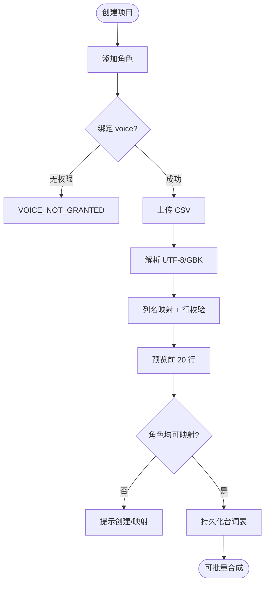

# 子模块规格 · 模块 E：项目、角色与 CSV

| 项 | 内容 |
|----|------|
| **模块编号** | E |
| **关联需求** | REQ-012（配音项目管理）、REQ-013（角色与音色绑定）、REQ-014（台词表 CSV 导入） |
| **阶段** | MVP-0（4 周） |
| **版本** | v1.0 |
| **日期** | 2026-06-03 |
| **上级文档** | [2026-06-01-mvp-voice-platform-需求规格说明.md](../2026-06-01-mvp-voice-platform-需求规格说明.md) v1.2 |

---

## 1 介绍

本模块为 **短剧批量配音工作流** 提供数据载体：创建 **Project**、维护 **Character** 与 **Voice** 绑定、导入 **CSV 台词表** 并校验角色映射，为批量合成（模块 F）提供结构化输入。

### 1.1 功能需求清单

| ID | 需求描述 | 优先级 | 可验证方式 |
|----|----------|--------|------------|
| E-FR-01 | 登录用户可创建项目（名称、简介、集数可选） | P0 | TC-E2E-02 |
| E-FR-02 | 项目列表展示角色数、最近合成时间 | P0 | UI 验收 |
| E-FR-03 | 项目软删除，30 天内可恢复 | P0 | 边界用例 |
| E-FR-04 | 单用户项目上限 20 个（可配置） | P0 | 配置项 |
| E-FR-05 | 项目内添加角色（名称、人设标签），绑定一个 Voice | P0 | TC-B03 |
| E-FR-06 | 绑定音色可为私有 Voice 或运营 VoiceGrant 共享音 | P0 | VoiceGrant |
| E-FR-07 | 更换绑定不影响历史已生成音频 | P0 | 数据验收 |
| E-FR-08 | CSV 上传预览前 20 行并校验列名 | P0 | CSV 导入 |
| E-FR-09 | 支持 UTF-8/GBK；列名别名可映射 | P0 | 编码测试 |
| E-FR-10 | 最大 200 行/次；角色不存在时提示创建或映射 | P0 | 错误行提示 |
| E-FR-11 | 未绑定角色的台词行在批量合成时报错 | P0 | TC-B03 |

### 1.2 非法条件与无效输入响应

| 场景 | 系统响应 | HTTP | 错误码 |
|------|----------|------|--------|
| 未登录 | 拒绝 | 401 | `AUTH_REQUIRED` |
| 项目数达上限 | 拒绝 | 403 | `PROJECT_LIMIT_EXCEEDED` |
| 项目名空或 >100 字 | 拒绝 | 400 | `INVALID_PROJECT_NAME` |
| 绑定无权限 Voice | 拒绝 | 403 | `VOICE_NOT_GRANTED` |
| CSV 非文本/损坏 | 拒绝 | 400 | `INVALID_CSV` |
| 行数 >200 | 拒绝 | 400 | `CSV_TOO_MANY_ROWS` |
| 缺少必填列 | 拒绝 | 400 | `CSV_MISSING_COLUMN` |
| 编码无法识别 | 拒绝 | 400 | `CSV_ENCODING_ERROR` |
| 角色名无法映射 | 预览警告/导入失败行 | 422 | `CHARACTER_NOT_FOUND` |

---

## 2 输入

### 2.1 输入数据详细说明

#### 2.1.1 项目信息（project）

| 属性 | 说明 |
|------|------|
| **输入来源** | `POST /api/v1/projects` |
| **字段** | `name`（必填 1–100）、`description`（可选 ≤500）、`episode_count`（可选 int ≥1） |
| **时间要求** | 同步 P95 <300ms |

#### 2.1.2 角色信息（character）

| 属性 | 说明 |
|------|------|
| **输入来源** | `POST /api/v1/projects/{id}/characters` |
| **字段** | `display_name`（1–50）、`persona_tag`（可选）、`voice_id`（可选，可后绑） |
| **有效范围** | 同项目内角色名唯一 |

#### 2.1.3 音色绑定（voice_id）

| 属性 | 说明 |
|------|------|
| **输入来源** | 角色创建/更新 |
| **有效范围** | 用户拥有 Voice 或有效 VoiceGrant |
| **非法** | 无权限 → `VOICE_NOT_GRANTED` |

#### 2.1.4 CSV 文件（script_csv）

| 属性 | 说明 |
|------|------|
| **输入来源** | `POST /api/v1/projects/{id}/script/import` |
| **数量** | 1 文件，≤200 数据行 |
| **度量单位** | 文本 CSV |
| **编码** | UTF-8（BOM 可识别）或 GBK |
| **标准列** | `角色名`, `台词`, `备注`（备注可选） |
| **列别名** | `角色`/`character`→角色名；`文本`/`text`/`台词`→台词 |
| **台词长度** | 单行 ≤5000 字（与 REQ-007 一致） |

**模板示例**：

```csv
角色名,台词,备注
男主,你今天怎么来了？,可选
女主,我想你了。,
```

### 2.2 接口规格参考

| 接口 | 方法 | 路径 |
|------|------|------|
| 建项目 | POST | `/api/v1/projects` |
| 列表/详情 | GET | `/api/v1/projects`, `/api/v1/projects/{id}` |
| 删/恢复 | DELETE/POST | `/api/v1/projects/{id}` **待定** 恢复路径 |
| 角色 CRUD | POST/PATCH | `/api/v1/projects/{id}/characters` |
| CSV 导入 | POST | `/api/v1/projects/{id}/script/import` |

---

## 3 处理

### 3.1 输入有效性检测

1. 项目字段长度与数量上限。  
2. `voice_id` 权限：owner 或 VoiceGrant 未过期。  
3. CSV：编码探测 → 解析 → 列映射 → 行数 → 角色名匹配项目 Character 表。  
4. 预览模式：仅校验不持久化 **待定** 是否分接口。

### 3.2 操作时序

| 步骤 | 操作 |
|------|------|
| 1 | 创建 Project |
| 2 | 添加 Character，绑定 voice_id |
| 3 | 上传 CSV → 解析 → 生成 ScriptLine 预览 |
| 4 | 用户确认导入 → 持久化台词表 |
| 5 | 模块 F 读取台词 + 角色→voice 映射批量合成 |

### 3.3 异常情况回应

| 异常 | 处理 |
|------|------|
| 部分角色未映射 | 返回 `unmapped_characters[]`；用户创建角色或映射表 |
| 软删项目访问 | 404 或只读 **待定** |
| 并发编辑 | 乐观锁 version **待定** |

### 3.4 转换规则

```
character_name (CSV) --normalize(trim)--> lookup Character.display_name
IF NOT FOUND → error row OR prompt mapping
script_line.voice_id = character.voice_id (批量合成时)
```

### 3.5 活动图



---

## 4 输出

### 4.1 输出数据详细说明

#### 4.1.1 项目创建/列表

```json
{
  "project_id": "prj_xxx",
  "name": "短剧A",
  "character_count": 3,
  "last_synthesis_at": "2026-06-01T12:00:00+08:00"
}
```

#### 4.1.2 CSV 导入预览

| 字段 | 说明 |
|------|------|
| `preview_rows` | 最多 20 行 |
| `total_rows` | 总行数 |
| `errors` | `[{ line, code, message }]` |
| `unmapped_characters` | 未匹配角色名列表 |

#### 4.1.3 持久化实体

- `Project`, `Character`, `ScriptLine`（或等价表）

### 4.2 接口规格参考

同 §2.2。

### 4.3 状态机（项目）

`active → soft_deleted → restored | purged(30d后)` **purge 策略待定**。

---

## 5 测试要点

TC-E2E-02；TC-B03 角色未绑定。

---

## 6 待定项

| # | 内容 |
|---|------|
| TBD-E01 | 角色名模糊匹配 vs 精确匹配 |
| TBD-E02 | CSV 预览与正式导入是否同一 API |
| TBD-E03 | 软删项目 30 天后物理删除策略 |
