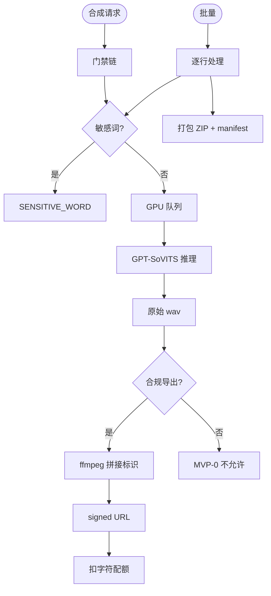

# 子模块规格 · 模块 F：单条/批量合成与导出

| 项 | 内容 |
|----|------|
| **模块编号** | F |
| **关联需求** | REQ-007（单条 TTS）、REQ-011（批量合成）、REQ-010（合规显式标识导出）、REQ-022（队列） |
| **阶段** | MVP-0（4 周） |
| **版本** | v1.0 |
| **日期** | 2026-06-03 |
| **上级文档** | [2026-06-01-mvp-voice-platform-需求规格说明.md](../2026-06-01-mvp-voice-platform-需求规格说明.md) v1.2 |

---

## 1 介绍

本模块将文本转为语音，支持 **单条合成** 与 **CSV 驱动批量合成**，对外下载须走 **合规显式标识导出**（GB 45438-2025）：ffmpeg 拼接标识片头/节奏标识，批量输出 ZIP 分轨与 `manifest.json`。合成前调用模块 G 敏感词拦截；情感固定 **中性**（REQ-008 MVP+1）。

### 1.1 功能需求清单

| ID | 需求描述 | 优先级 | 可验证方式 |
|----|----------|--------|------------|
| F-FR-01 | 单条合成：合法文本 + 可用 VoiceVersion → 音频 URL | P0 | TC-S01 |
| F-FR-02 | 中文 ≤5000 字/次；空文本/仅标点 → 400 | P0 | 边界 |
| F-FR-03 | 无权限音色 → 403 | P0 | TC-S02 |
| F-FR-04 | 合成成功扣减字符配额（模块 A） | P0 | TC-S03 |
| F-FR-05 | 批量：每行子任务，汇总进度 % | P0 | TC-B01 |
| F-FR-06 | 100 行 ZIP 分轨，路径 `/{角色名}/{序号}_{角色名}.wav` | P0 | TC-E2E-02 |
| F-FR-07 | 单行敏感词失败不影响其他行 | P0 | TC-B02 |
| F-FR-08 | 合规导出含 AI+合成要素，不可关闭 | P0 | TC-L01~03 |
| F-FR-09 | 导出元数据记录标识类型与时间戳 | P0 | TC-L02 |
| F-FR-10 | 非流式 P95 <30s/千字；流式首包 P95 <2s 可选 | P0 | NFR |
| F-FR-11 | 队列位置与合成进度（行数） | P0 | REQ-022 |
| F-FR-12 | 手动情感标签 | P1 | MVP+1 |

### 1.2 非法条件与无效输入响应

| 场景 | 系统响应 | HTTP | 错误码 |
|------|----------|------|--------|
| 未登录 | 拒绝 | 401 | `AUTH_REQUIRED` |
| 未 AI 告知确认 | 拒绝 | 403 | `AI_DISCLOSURE_REQUIRED` |
| 配额不足 | 拒绝 | 402 | `QUOTA_EXCEEDED` |
| 空/仅标点文本 | 拒绝 | 400 | `INVALID_TEXT` |
| 文本 >5000 字 | 拒绝 | 400 | `TEXT_TOO_LONG` |
| 无 voice 权限 | 拒绝 | 403 | `VOICE_NOT_GRANTED` |
| 敏感词命中 | 拒绝 | 400 | `SENSITIVE_WORD` |
| 批量角色未绑定 | 行级失败 | — | `CHARACTER_VOICE_UNBOUND` |
| model_tag 推理不可用 | Job failed | 500 | `JOB_FAILED` |
| 尝试关闭显式标识 | 拒绝 | 403 | `LABEL_REQUIRED` |

---

## 2 输入

### 2.1 输入数据详细说明

#### 2.1.1 单条合成（synthesis_request）

| 属性 | 说明 |
|------|------|
| **输入来源** | `POST /api/v1/synthesis` |
| **字段** | `voice_version_id`, `text`, `format`（wav/mp3，默认 wav） |
| **数量** | text 1 段 |
| **有效范围** | text 1–5000 字符；voice 须可推理 |

#### 2.1.2 批量合成（batch_request）

| 属性 | 说明 |
|------|------|
| **输入来源** | `POST /api/v1/synthesis/batch` |
| **字段** | `project_id`, `script_id` 或 inline lines **待定** |
| **数量** | ≤200 行 |
| **列** | 角色名/角色ID, 文本, 情感（MVP-0 忽略，默认中性） |

#### 2.1.3 导出选项（export_options）

| 属性 | 说明 |
|------|------|
| **输入来源** | 下载/导出 API |
| **字段** | `compliant=true`（MVP-0 强制 true）, `label_type`（voice_header/rhythm **待定**） |
| **标识时长** | 1–3s 可配置，默认短剧 1s 片头 |

### 2.2 接口规格参考

| 接口 | 方法 | 路径 |
|------|------|------|
| 单条合成 | POST | `/api/v1/synthesis` |
| 批量合成 | POST | `/api/v1/synthesis/batch` |
| 任务状态 | GET | `/api/v1/jobs/{id}` |
| 合规下载 | GET | `/api/v1/exports/{id}/download` |

---

## 3 处理

### 3.1 输入有效性检测

门禁：Auth → AI disclosure → Quota 预检 → Voice 权限 → 文本合法性 → **敏感词（模块 G）** → model_tag 可用。

### 3.2 操作时序

**单条**：

1. 创建 SynthesisJob → 入队  
2. Worker GPT-SoVITS 推理  
3. 原始 wav 存 OSS  
4. 若合规导出：ffmpeg 拼接标识 wav → 写 metadata  
5. 返回 URL；成功后扣配额  

**批量**：

1. 创建 BatchJob + N 个 SynthesisJob  
2. 逐行：映射 voice → 敏感词 → 合成 → 行级状态  
3. 全部完成：打包 ZIP + manifest.json  
4. 合规标识应用于每个导出文件  

### 3.3 异常情况回应

| 异常 | 处理 |
|------|------|
| 行级敏感词 | 该行 failed，其余 continue |
| Worker 失败 | 行级/Job 级重试 1 次 |
| ZIP 打包失败 | BatchJob failed，保留已成功行 URL **待定** |
| ffmpeg 失败 | 阻断对外下载，告警 |

### 3.4 转换规则

**合规拼接**：

```
output = concat(label_wav(1~3s), synthesis_wav)
metadata.comment = "AI_GENERATED"
metadata.label_type = config.label_type
metadata.labeled_at = ISO8601
```

**批量进度**：

```
progress_pct = floor(100 * done / total)
```

**ZIP 结构**：

```
/{角色名}/{序号}_{角色名}.wav
/manifest.json  // [{line, status, file, error_code}]
```

### 3.5 活动图



---

## 4 输出

### 4.1 输出数据详细说明

#### 4.1.1 单条成功

```json
{
  "job_id": "syn_xxx",
  "status": "succeeded",
  "audio_url": "https://...",
  "duration_sec": 12.5,
  "chars_billed": 500
}
```

#### 4.1.2 批量完成

| 字段 | 说明 |
|------|------|
| `batch_job_id` | 父任务 |
| `progress` | 0–100 |
| `zip_url` | 合规 ZIP |
| `manifest` | 行级 success/failed |
| `failed_lines` | `[{line, code, message}]` |

#### 4.1.3 敏感词/错误

见模块 G；`SENSITIVE_WORD` + 脱敏位置。

#### 4.1.4 合规元数据（侧写 DB）

`export_id`, `label_type`, `labeled_at`, `user_id`, `voice_id`, `job_id`

### 4.2 接口规格参考

同 §2.2；附录 B。

### 4.3 输入/输出对（批量行）

| 输入行 | 成功输出 | 失败输出 |
|--------|----------|----------|
| 男主,台词 | wav 文件 | manifest.error |
| 敏感词行 | — | SENSITIVE_WORD |
| 未绑定角色 | — | CHARACTER_VOICE_UNBOUND |

---

## 5 测试要点

TC-S01~03；TC-B01~02；TC-L01~03；TC-E2E-02~03。

---

## 6 待定项

| # | 内容 |
|---|------|
| TBD-F01 | 流式合成 MVP-0 是否交付 |
| TBD-F02 | 标识类型默认 voice vs rhythm |
| TBD-F03 | 批量部分失败是否仍提供 ZIP |
