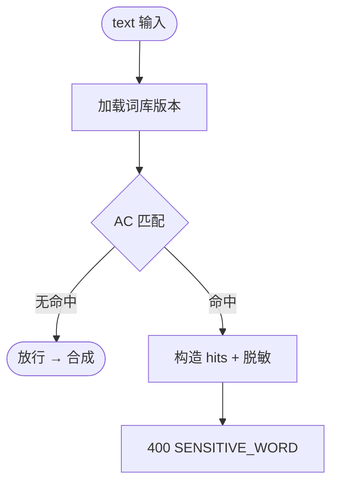

# 子模块规格 · 模块 G：敏感词拦截

| 项 | 内容 |
|----|------|
| **模块编号** | G |
| **关联需求** | REQ-009（合成前敏感词拦截） |
| **阶段** | MVP-0（4 周） |
| **版本** | v1.0 |
| **日期** | 2026-06-03 |
| **上级文档** | [2026-06-01-mvp-voice-platform-需求规格说明.md](../2026-06-01-mvp-voice-platform-需求规格说明.md) v1.2 |

---

## 1 介绍

本模块在 **合成请求进入 GPT-SoVITS 推理之前**，对文本进行违禁词匹配，命中则 **拒绝合成** 并返回 **脱敏后的命中位置**；支持词库更新与误拦申诉（MVP+1 完整后台，MVP-0 运营人工 **待定**）。被模块 F 单条/批量合成 **include** 调用。

### 1.1 功能需求清单

| ID | 需求描述 | 优先级 | 可验证方式 |
|----|----------|--------|------------|
| G-FR-01 | 文本命中违禁词库则拒绝合成 | P0 | TC-E2E-03 |
| G-FR-02 | 返回命中词位置，展示脱敏（如首尾各 1 字） | P0 | TC-E2E-03 |
| G-FR-03 | 管理员更新词库后 5 分钟内对新请求生效 | P0 | 词库刷新 |
| G-FR-04 | 支持导入监管类别词库 | P0 | 运维 |
| G-FR-05 | 批量合成行级拦截，不影响其他行 | P0 | TC-B02 |
| G-FR-06 | 误拦申诉与单次放行 + 审计 | P1 | MVP+1 / 人工 |
| G-FR-07 | 可选第三方内容安全 API | P1 | **待定** |

### 1.2 非法条件与无效输入响应

| 场景 | 系统响应 | HTTP | 错误码 |
|------|----------|------|--------|
| 空文本 | 不进入本模块；上游 INVALID_TEXT | 400 | `INVALID_TEXT` |
| 命中违禁词 | 拒绝合成 | 400 | `SENSITIVE_WORD` |
| 词库为空/未加载 | fail closed：拒绝或 **待定** 仅告警 | 503 | `WORDLIST_UNAVAILABLE` |
| 文本超长 | 上游 TEXT_TOO_LONG | 400 | `TEXT_TOO_LONG` |
| 词库更新格式错误 | 拒绝保存 | 400 | `INVALID_WORDLIST` |

---

## 2 输入

### 2.1 输入数据详细说明

#### 2.1.1 待检文本（text）

| 属性 | 说明 |
|------|------|
| **输入来源** | 模块 F 合成 API 内部调用 |
| **数量** | 单条 1 段；批量每行 1 段 |
| **度量单位** | Unicode 字符串 |
| **时间要求** | 同步 P95 <100ms（5000 字内，**待定** 标定） |
| **有效范围** | 长度 1–5000 |
| **非法输入** | 空/仅标点由上游拦截 |

#### 2.1.2 词库（wordlist）

| 属性 | 说明 |
|------|------|
| **输入来源** | 本地文件/DB；运营导入 |
| **数量** | 多类别集合 |
| **度量单位** | 词条字符串；类别标签 |
| **更新** | 保存后 ≤5min 热加载至所有 API 实例 |
| **格式** | UTF-8 每行一词或 JSON **待定** |

#### 2.1.3 上下文（context）

| 属性 | 说明 |
|------|------|
| **字段** | `user_id`, `job_id`, `line_no`（批量） |
| **用途** | 审计与申诉 |

### 2.2 接口规格参考

| 接口 | 类型 | 说明 |
|------|------|------|
| 内部 | `SensitiveWordService.check(text)` | 模块 F 调用 |
| 管理 | `PUT /api/v1/admin/wordlist` | **待定** MVP-0 配置文件 |

---

## 3 处理

### 3.1 输入有效性检测

1. text 非空且长度 ≤5000。  
2. 词库版本已加载（内存 AC 自动机或等价结构）。

### 3.2 操作时序

| 步骤 | 操作 |
|------|------|
| 1 | 加载当前 wordlist_version |
| 2 | 多模式匹配（AC 自动机） |
| 3 | 若命中：收集所有 `[start, end, category]` |
| 4 | 脱敏构造 message |
| 5 | 返回 SENSITIVE_WORD 或 pass |

### 3.3 异常情况回应

| 异常 | 处理 |
|------|------|
| 词库热更新失败 | 保持旧版本；告警 |
| 匹配超时 | fail closed → 503 **待定** |
| 第三方 API 超时 | 降级本地词库 **待定** |

### 3.4 转换规则

**脱敏显示**：

```
mask(word) = word[0] + "***" + word[-1]   (len>=2)
```

**返回 details**：

```json
{
  "hits": [
    { "start": 10, "end": 12, "category": "political", "masked": "敏***词" }
  ]
}
```

### 3.5 活动图



---

## 4 输出

### 4.1 输出数据详细说明

#### 4.1.1 拦截响应

| 属性 | 说明 |
|------|------|
| **输出到** | HTTP 400 → 前端行级/全局提示 |
| **HTTP** | 400 |
| **code** | `SENSITIVE_WORD` |
| **message** | 用户可读：「内容含违规词汇，请修改后重试」 |
| **details.hits** | 位置与脱敏词；**不**返回完整违禁词 |

#### 4.1.2 放行

| 属性 | 说明 |
|------|------|
| **输出到** | 内部 void / pass |
| **副作用** | 可选写 AuditLog（MVP-0 **待定**） |

#### 4.1.3 批量行级

manifest 中该行：

```json
{ "line": 5, "status": "failed", "error_code": "SENSITIVE_WORD", "hits": [...] }
```

### 4.2 接口规格参考

SRS 附录 B；统一错误体 §7.1。

### 4.3 状态机

词库版本：`loading → active → superseded`；请求仅使用 `active` 版本。

---

## 5 测试要点

| 编号 | 场景 |
|------|------|
| TC-E2E-03 | 1 行敏感词失败其余成功 |
| TC-B02 | 批量行级隔离 |
| — | 词库更新 5min 内生效 |

---

## 6 待定项

| # | 内容 |
|---|------|
| TBD-G01 | 词库初始来源与法务审核流程 |
| TBD-G02 | 第三方内容安全 API 是否 W2 接入 |
| TBD-G03 | 误拦申诉 MVP-0 是否仅邮件 |
| TBD-G04 | fail closed vs open 当词库不可用 |
