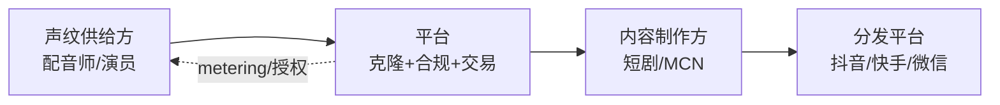
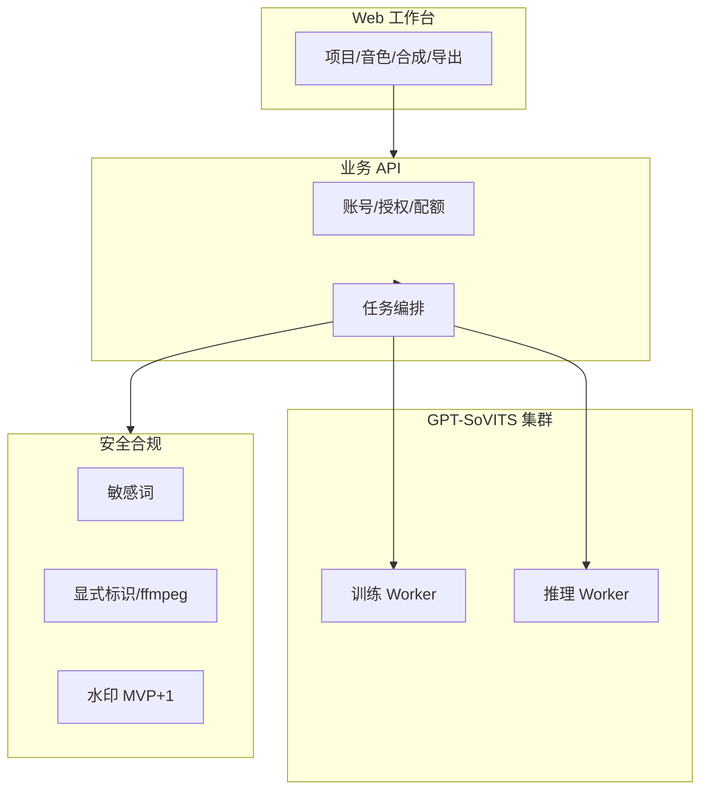

# GPT-SoVITS 语音克隆网络平台 · 产品调研报告

## 元信息

| 项 | 内容 |
|----|------|
| **调研日期** | 2026-06-01 |
| **文档版本** | v1.1（在 v1.0 基础上扩充市场、竞品剖面、技术/商业/合规细则） |
| **范围** | 用户画像 + 竞品分析；音色交易市场、国内合规、4 周 MVP-0 落地建议 |
| **目标市场** | **默认：中国大陆为主**；出海/API 为第二阶段（待验证） |
| **置信度说明** | 法规条款：**已验证**（国务院/网信办/广电总局公开文本）；竞品能力与定价：**部分已验证**（官网/帮助中心/博客）；国内平台音色交易细节：**待验证**（需试用与商务对接）；市场规模数字：**假设**（见第 1 节） |

---

## 执行摘要（≤300 字）

面向 **AI 短剧与多角色配音** 的 GPT-SoVITS 网络平台，核心商业增量在 **「用户自制音色 → 授权上架 → 按量分成」**，而非单纯 TTS 工具。国际标杆 **ElevenLabs Voice Library** 已验证「按字符分成 + 授权撤回期 + 平台审核」模式（公开称创作者累计分成超 2200 万美元，2025–2026），而 **Fish Audio** 强在零样本克隆、情感标签与社区音色规模，**尚未形成同等级官方分成市场**（竞品页面/社区，**待验证**是否已有内测分成）。

国内上线音色交易 **必须先于功能设计合规**：人声编辑需 **被编辑者单独同意**（《深度合成管理规定》）；声纹属敏感个人信息；音频导出需满足 **显式标识**（《人工智能生成合成内容标识办法》+ GB 45438-2025，2025-09-01 起施行）。产品差异化应押注：**GPT-SoVITS 小样本（~10min）+ 音色/韵律解耦 + 内置指纹/水印/敏感词**，并以 **「授权链可追溯的交易市场」** 区别于仅「音色库共享」的竞品。

**MVP 必须验证**：① 买家愿为「带授权音色」付溢价多少；② 10min 克隆在中文短剧场景的相似度与稳定性；③ 合规流程（授权证明 + 标识 + 审核）对转化率的影响。

> **排期约束（2026-06-01 更新）**：首版交付 **4 周（MVP-0）** 仅验证克隆+批量工作流+合规最低集；音色交易市场验证顺延至 **第 5–8 周（MVP+1）**，详见需求规格 v1.1。

---

## 1. 市场与场景（精简）

> 用户未要求全量市场模块；此处仅支撑画像与竞品判断。

### 1.1 场景优先级矩阵（1–5 分，越高越优先）

| 场景 | 市场规模 | 付费意愿 | 技术匹配 | 合规难度 | 加权建议 |
|------|:--------:|:--------:|:--------:|:--------:|:--------:|
| AI 短剧/微剧多角色配音 | 4 | 5 | 5 | 4 | **P0** |
| MCN/广告批量旁白 | 4 | 4 | 4 | 3 | P1 |
| 有声书/播客 | 3 | 4 | 4 | 3 | P1 |
| 游戏 NPC/互动叙事 | 3 | 5 | 4 | 3 | P1 |
| 企业培训/客服 | 4 | 3 | 3 | 2 | P2 |
| 虚拟主播实时互动 | 3 | 3 | 2 | 5 | P2（法规趋严） |

**对产品决策的影响**：MVP 工作流应围绕 **「项目 → 角色 → 绑定音色 → 台词批量合成 → 分轨导出」**，而非仅单次 TTS。

### 1.2 市场规模（假设 + 验证方法）

| 层级 | 逻辑 | 区间（假设） |
|------|------|----------------|
| **TAM** | 中国数字内容配音 + AI 工具支出 | 数百亿人民币/年（含传统配音外包替代） |
| **SAM** | 可接受 AI 克隆且需多角色的创作者/工作室 | 数十亿 |
| **SOM** | 3 年内可获取的付费团队 + 音色交易抽成 | 需通过 50+ 短剧工作室访谈验证 |

**验证方法**：短剧行业协会/接单平台抽样、竞品 ARPU 反推。

### 1.3 行业驱动与趋势（2025–2026）

| 趋势 | 对产品的含义 | 置信度 |
|------|--------------|--------|
| 微短剧产量高增长，周期压缩至数天/集 | **批量合成、改词重生成** 比「单次精品 TTS」更重要 | 假设 |
| AI 配音从实验走向常规工序 | 用户愿为 **省时** 付费，但 **版权与标识** 成平台审核硬门槛 | 已验证（平台规则趋严，待逐平台核实） |
| 开源 TTS（GPT-SoVITS、CosyVoice、Fish Speech）降低技术门槛 | 差异化不在「能克隆」，在 **工作流 + 合规 + 交易** | 已验证 |
| 音色 IP 化（声线可授权、可分成） | 交易市场是 **毛利中心**；工具订阅是 **获客入口** | 假设（ElevenLabs 分成数据支撑） |
| 监管从「事后查处」转向「标识可检测、授权可追溯」 | 安全三件套与授权链应 **产品内建** | 已验证 |

### 1.4 价值链与定位



**我方切入点**：卡在 **B 层**——不做剪辑、不做分发，做「**可合规交付的配音中间件**」。4 周内只验证 B 的前半段（克隆+批量+标识），交易模块在第 5–8 周补齐。

### 1.5 场景 × 4 周 MVP 映射

| 场景 | MVP-0（4 周）覆盖 | MVP+1 增强 |
|------|-------------------|------------|
| AI 短剧多角色 | ✓ 项目/CSV/批量/标识 | 情感、市场购音 |
| 广告旁白 | △ 单音色+批量可用 | 多语种、商用凭证 |
| 有声书 | △ 长文本单次合成 | 章节管理、主播市场 |
| 企业培训 | ✗ 暂不主攻 | 实名、审计、私有化 |

---

## 2. 用户画像

### 2.1 短剧工作室 · 配音统筹（买方 + 重度用户）

| 字段 | 内容 |
|------|------|
| **组织特征** | 10–50 人微短剧团队；月产 5–20 部；分布在郑州、西安、横店周边及一线城市分包 |
| **JTBD** | 在 tight 排期内为多角色生成一致、可迭代的配音，降低真人配音排期与改词成本 |
| **痛点** | 真人配音贵、改词重录慢；通用 TTS 角色区分度差；担心 **侵权与平台下架**（未授权声纹） |
| **行为路径** | 剧本定稿 → 选音色（库内购买/自有克隆）→ 批量生成 → 剪辑对轨 → 平台提审 |
| **支付意愿** | 项目制：¥3k–2万/部（配音线）；愿为 **「商用授权清晰」** 音色支付 **20–40% 溢价**（**假设**，待 AB） |
| **成功指标** | 单角色改词重生成 <10 分钟；角色听感一致；平台审核不因「AI 未标识」驳回 |
| **平台能力依赖** | **必须平台化**：项目管理、多角色绑定、批量合成、授权证书、导出含合规标识；可自助：上传自有演员 10min 素材训练 |

**典型一天（压缩）**：上午收终版台词 → 中午在平台导入 CSV、绑定 6 个角色音 → 下午批量生成 → 剪辑对轨；改词则只重跑受影响行。**替代方案**：真人配音（贵、慢）、剪映/必剪内置 TTS（角色同质化）、Fish/Eleven 外站（授权链弱）。

**4 周 MVP 触点**：项目+CSV+合规导出；购音/凭证 **不做**，由运营微信群手动开权限。

---

### 2.2 配音师 / 声线创作者（卖方 · 音色市场核心供给）

| 字段 | 内容 |
|------|------|
| **组织特征** | 个人配音员、电台主持、表演系学生；兼职为主；部分已有粉丝群或接单社群 |
| **JTBD** | 将声线资产化：一次录制 → 多次 **合规授权** 获利，而非单次劳务费 |
| **痛点** | 盗用/二次克隆；分成透明性差；平台审核慢；不懂法律文本 |
| **行为路径** | 录制样本 → 平台训练克隆 → 设置授权范围/价格 → 上架 → 看数据 → 提现 |
| **支付意愿** | 接受 **交易额 15–30% 平台抽成**（对标应用商店/素材站，**假设**）；关心 **最低分成单价** 是否高于 ElevenLabs 默认 ~$0.03/千字符（国内需本地化测算） |
| **成功指标** | 月被动收入可预期；侵权可一键下架；授权范围可限制（如禁止金融/政治） |
| **平台能力依赖** | **必须**：实名/权属证明、授权模板、收益仪表盘、水印/指纹溯源、争议处理；GPT-SoVITS：**高相似度 + 情感标签** 作为上架质量门槛 |

**典型一天**：在家录音 10min 干声 → 上传训练 →（MVP+1）设置价格与授权范围 → 查看昨日分成。**关键焦虑**：「平台会不会偷我的声纹再训练给别人？」→ 需 **水印/指纹 + 明确 ToS** 回应。

**4 周 MVP 触点**：可训练私有音色；**不上架**；种子配音师协议可线下签署「后续优先入驻」。

---

### 2.3 独立创作者 / 小 MCN（买卖双方一体）

| 字段 | 内容 |
|------|------|
| **组织特征** | 1–5 人；抖音/B 站/小红书；做解说、漫画剧、AI 短剧实验 |
| **JTBD** | 低成本完成系列化角色音；偶尔出售自己打造的「角色音」 |
| **痛点** | 工具链割裂（克隆在一个 App、剪辑在另一个）；免费工具无商用授权 |
| **行为路径** | 免费试用 → 单项目付费 → 订阅 → 考虑上架音色 |
| **支付意愿** | ¥29–99/月订阅 + 按量包（**假设**锚定 Fish/Eleven 国内代理价） |
| **成功指标** | 10 分钟内完成首个可用音色；导出即可剪映/import |
| **能力依赖** | 低门槛克隆 + 模板情感；市场为 **增值**，非首日必需 |

**获客路径**：B 站/抖音「AI 配音教程」→ 免费额度 → 订阅。对价格敏感，**4 周内免费额度需够用完成 1 条成片**。

---

### 2.4 企业品牌 / 营销负责人（买方 · 合规敏感）

| 字段 | 内容 |
|------|------|
| **组织特征** | 品牌市场部、4A 下游；需 **独家/商用授权** 与合同存档 |
| **JTBD** | 品牌专属声线用于广告、客服话术、培训片，可审计、可追责 |
| **痛点** | 供应商无法提供 **授权链与生成标识**；跨境工具数据出境风险 |
| **支付意愿** | 年费 ¥5–50 万 + 私有化（**假设**） |
| **成功指标** | 合同、发票、授权 PDF、隐式/显式标识报告 |
| **能力依赖** | **必须**：企业认证、独家授权、私有化部署选项、审计日志；指纹/水印为 **采购加分项** |

**4 周策略**：不主攻；可收集 2–3 家需求访谈，用于 MVP+1 企业套餐设计。

---

### 2.5 非目标用户（避免资源分散）

| 类型 | 为何不是首期重点 |
|------|------------------|
| 追求实时变声的游戏玩家 | 需 <200ms 链路，与 GPT-SoVITS 批处理场景不同 |
| 仅需一次性克隆恶搞 | 合规与品牌风险高、LTV 低 |
| 需 100% 复刻特定名人的营销号 | 法律红线，平台应技术+审核拒绝 |

### 2.6 画像 × 功能优先级矩阵

| 功能 | 短剧统筹 | 配音师 | 独立创作者 | 企业 |
|------|:--------:|:------:|:----------:|:----:|
| 10min 训练 | ● | ● | ● | ○ |
| CSV 批量 | ● | ○ | ○ | ○ |
| 合规标识导出 | ● | ○ | ○ | ● |
| 音色市场 | ○ | ● | ○ | ○ |
| 授权凭证 PDF | ● | ● | ○ | ● |

图例：● 强需求 · ○ 弱/延后

---

## 3. 竞品分析

### 3.1 对比总表（1–5 分，5=最强）

| 维度 | **我方目标定位** | ElevenLabs | Fish Audio | 火山引擎语音 | 科大讯飞 | GPT-SoVITS（自建） |
|------|------------------|:----------:|:----------:|:------------:|:--------:|:------------------:|
| 克隆门槛 | ~10min 小样本适配 | 4（Instant 短样本 + Pro 需长素材） | 5（10–30s 零样本宣传） | 4（企业定制样本） | 4 | 5（项目核心） |
| 合成质量与情感 | 解耦+强度映射 | 5 | 5（inline 情感标签） | 4 | 4 | 4（依赖训练，**待验证**） |
| 短剧多角色/项目 | 原生项目工作流 | 3 | 3 | 3 | 3 | 2（需平台封装） |
| **音色市场/交易** | **核心战略** | **5**（分成+授权条款） | 3（大规模社区音，分成弱） | 2 | 2 | 1（仅开源） |
| API/私有化 | API + 可选私有化 | 5 | 4（可自托管权重） | 5 | 5 | 5（自托管） |
| **安全与合规** | 指纹+水印+敏感词 | 4（审核+政策） | 3 | 4 | 4 | 2（需自研） |
| 定价 | 订阅+算力+交易抽成 | 4（偏高） | 5（低价/开源） | 4 | 4 | 5（算力成本） |
| 中文/跨语言 | 重点优化 | 4 | 5 | 5 | 5 | 4 |

**依据类型**：ElevenLabs 市场与分成 — **竞品官网/帮助中心（已验证）**；Fish S2 克隆与情感 — **Fish Audio README/博客（已验证）**；火山/讯飞 — **行业公开能力描述 + 待验证试用**。

---

### 3.2 音色交易市场专项对比（重点）

| 能力 | ElevenLabs Voice Library | Fish Audio | 我方（规划） |
|------|--------------------------|------------|--------------|
| **供给模式** | 用户上传 Professional Clone，审核后上架 | 海量社区/用户克隆音色，偏「选用」 | UGC + 平台认证音色 + 独家签约 |
| **定价** | 默认 ~$0.03/千字符，可提价；HQ/稀有声线更高 | API 按量，社区音多免费或含在订阅 | 建议：**按字符 + 按项目包 + 独家买断** |
| **授权** | 商用许可随库；创作者设 use case、撤回 notice（最长 2 年） | 商用需单独授权（开源协议限制，**已验证** README 类声明） | **分级：个人/商用/独家/禁止领域** |
| **分成与结算** | Stripe；周结；$10 起提；需保持付费订阅才收款（**已验证** FAQ） | 无公开对标 Eleven 的分成体系（**待验证**） | 国内：**微信/支付宝 + 电子合同 + 发票** |
| **发现机制** | 搜索、合集、音频相似匹配 | 社区标签、模型 ID | 短剧「角色 archetype」标签 + 试听对比 |
| **风控** | 名人/儿童/仇恨言论审核 | 依赖社区与平台政策 | **授权证明 OCR + 声纹比对 + 敏感词** |
| **对国内合规** | 境外主体，数据出境 | 需注意跨境与标识义务 | **原生适配标识办法与单独同意流程** |

**洞察（可行动）**：

1. **交易市场不是「有个音色列表」**，而是 **授权 + metering + 结算 + 风控** 四件套；ElevenLabs 已跑通，是国内平台的 **直接参考架构**。
2. Fish Audio 证明 **低价 + 强克隆 + 情感标签** 会抢走工具型用户；我方若只做市场而无 **10min 高质量+短剧工作流**，易被压在中间。
3. 国内大厂（火山/讯飞）强在 **政企合规与渠道**，弱在 **创作者分成生态** — 中小团队与配音师仍是切入点。

---

### 3.3 差异化机会（3–5 条）

| # | 机会 | 对产品决策的影响 |
|---|------|------------------|
| 1 | **「授权链原生」音色市场**：上架即绑定权属材料、授权范围、交易哈希/水印 ID | 法务流程产品化，成为 B 端采购卖点 |
| 2 | **GPT-SoVITS 10min 适配 + 韵律解耦**：买家可只调情绪/语速不重训音色 | 短剧改词/改戏效率高，支撑溢价 |
| 3 | **安全三件套默认开启**：高频指纹 + 数字水印 + 敏感词（可出检测报告） | 对标 Resemble/Eleven 的企业需求，弥补开源信任缺口 |
| 4 | **短剧垂直工作流**：角色卡、台词表、分轨、批任务队列 | 与通用 TTS 工具错位竞争 |
| 5 | **国内合规一键包**：单独同意书模板 + GB 45438 显式标识导出预设 | 降低工作室过审风险，**国内合规即壁垒** |

---

### 3.4 竞争策略建议

| 策略 | 说明 |
|------|------|
| **侧翼进攻** | 不做「英文质量世界第一」，先做 **中文短剧 + 国内合规交易** |
| **供给侧冷启动** | 签约 50–100 位配音师 **独家/非独家** 音色，避免空市场 |
| **需求侧** | 与短剧制作工具/剪辑模板合作导入台词表 |
| **技术叙事** | 对外强调 **可检测、可溯源**，建立平台信任 |
| **定价** | 工具订阅略低于 Fish 档，交易抽成对标素材站 20% 左右（**待验证**） |

---

### 3.5 不建议正面硬刚的能力

| 能力 | 原因 |
|------|------|
| 全球 celebrity 授权音色库 | ElevenLabs 已布局，法务与 IP 成本极高 |
| 超低延迟实时对话（<200ms）全栈 | Fish/Cartesia 等已深耕；可二期接 API |
| 纯英文顶级自然度 | ElevenLabs 品牌与生态领先 |
| 无审核的完全开放克隆 | 国内监管与侵权风险不可接受 |

### 3.6 竞品剖面（摘要）

#### ElevenLabs（国际 · 交易标杆）

- **强项**：音质、Voice Library、按字符分成（公开称累计分成超 2200 万美元）、授权撤回期、专业克隆审核。
- **弱项**：国内数据合规、中文短剧工作流、微信生态支付。
- **定价锚点**：Creator ~$22/月；合成高价档约 $100/百万字符量级（第三方评测，**待核实**）。
- **可借鉴**：`LicensePolicy` + `Authorization` + metering 三表结构；HQ 音色溢价策略。

#### Fish Audio（华人团队 · 工具+社区）

- **强项**：10–30s 零样本、inline 情感标签（`[whisper]` 等）、开源可自托管、中文表现口碑。
- **弱项**：商用需单独授权；分成市场未公开对标 Eleven。
- **定价锚点**：约 $15/百万字符量级；免费档约 7 分钟/月（**待核实**）。
- **威胁**：同一批创作者若已习惯 Fish，我方需 **短剧 CSV + 国内标识** 拉回。

#### 火山引擎 / 科大讯飞（国内云厂商）

- **强项**：政企合规、渠道、中文与方言、API 稳定。
- **弱项**：创作者分成生态弱；产品偏「能力组件」非「创作工作台」。
- **策略**：B 端大单可互补（我方前台 + 其云备案），C 端短剧不硬碰。

#### CosyVoice / GPT-SoVITS（开源）

- **强项**：可私有化、成本低、社区活跃。
- **弱项**：无交易市场、无合规封装、运维门槛高。
- **策略**：我方 = **开源引擎的商业化壳 + 合规 + 交易**。

#### Resemble AI / Play.ht（开发者向）

- **强项**：API、企业安全叙事、工作流集成（Play.ht 被 Meta 收购后偏基础设施，**待跟踪**）。
- **弱项**：短剧创作者自助体验弱。
- **借鉴**：水印/检测 API 的产品包装方式。

### 3.7 定位图（战略草图）

```
        高合规/交易能力
              ↑
    [我方目标] |  ElevenLabs
              |
  低 —————————+————————— 高
  工具属性     |      平台/生态
              |
    Fish/RVC  |  火山/讯飞
              ↓
        低合规封装
```

---

## 4. 技术可行性

| 主题 | 结论 | 置信度 |
|------|------|--------|
| GPT-SoVITS 10min 适配 | 与项目愿景一致；需自建 **测评集** 验证相似度≥90% | 待验证 |
| 音色-韵律解耦 / 情感映射 | 研究可行；**工程化需自研管线** | 假设 |
| 交易市场技术需求 | 音色 **版本号、授权 JSON、试听水印样本、用量 metering、指纹登记** | 已验证（行业惯例） |
| 训练/推理成本 | 10min 微调 GPU 分钟级～小时级/音色；需队列与配额 | 假设，需 Spike |
| 防滥用 | 导出音频嵌指纹/水印；争议时解码比对 | 假设，需选型 |

### 4.1 参考架构（逻辑分层）



### 4.2 GPT-SoVITS 工程要点

| 环节 | 建议 | 4 周 MVP |
|------|------|----------|
| 数据预处理 | 降噪、切片、响度归一；拒绝 BGM 过重素材 | ✓ 规则质检 |
| 训练 | 单说话人 fine-tune；记录 seed/checkpoint | ✓ |
| 推理 | 固定 checkpoint per VoiceVersion；参数 JSON 化 | ✓ |
| 评测 | 20 句中文测评集 + speaker embedding 相似度 | 离线，W3 前 |
| 韵律/情感 | 解耦模块接 inference 前处理 | MVP+1 |

### 4.3 资源粗算（单租户内测，**假设**）

| 资源 | 训练 1 音色 | 合成 1000 字 | 备注 |
|------|-------------|--------------|------|
| GPU | 1×A10 ~1–3h | 秒级～十秒级 | 与模型大小强相关 |
| 存储 | ~500MB 素材+模型 | ~5MB 音频 | OSS 生命周期 90 天 |
| 并发 | 队列 2–4 路 | 可水平扩推理 | W1 先单卡跑通 |

### 4.4 交易市场数据模型（MVP+1 预埋，4 周只建表可选）

- `Voice` → `VoiceVersion` → `LicensePolicy` → `Authorization` → `UsageRecord`
- 试听文件：**带噪水印** 的 15s demo，防直接盗用干声
- 订单与授权 **不可变日志**（append-only），支撑纠纷

**对产品决策的影响**：4 周 **不开发市场 UI**，但数据库表建议 **W2 前定稿**，避免 MVP+1 迁表。

---

## 5. 商业模式假设（精简）

| 收入来源 | 说明 |
|----------|------|
| 订阅 | 创作者档 / 团队档（含项目数、并发） |
| 算力包 | 训练次数 + 合成字符 |
| **交易抽成** | 音色购买或按量使用抽 15–30% |
| 企业 | 私有化、SLA、专属合规包 |
| API | 按字符/按秒 |

**单位经济粗算（模板，需填参）**：

```
单音色月毛利 ≈ (交易额 × 抽成率) − (GPU训练摊销 + 存储 + 审核人力摊销)
平台盈亏平衡字符量 ≈ 固定成本 / (每千字符毛利)
```

### 5.1 定价套餐草案（**假设**，内测用）

| 套餐 | 月费（人民币） | 训练次数 | 合成字符 | 目标用户 |
|------|----------------|----------|----------|----------|
| 免费 | 0 | 1 | 2 万 | 试用/学生 |
| 创作者 | 49 | 5 | 50 万 | 独立 UP 主 |
| 团队 | 199 | 20 | 300 万 | 短剧工作室 |
| 算力包 | 29 起 | +N | +100 万 | 叠加 |

**交易抽成（MVP+1）**：建议 20% 起；独家音色可议价 10–15% 以吸引头部供给。

### 5.2 4 周阶段商业化

- **不收费**或仅 **邀请码限额**；重点收集 **完成率、重生成率、NPS**。
- 第 4 周结束时输出 **愿付价格区间**（Van Westendorp 简版 4 题问卷）。

---

## 6. 合规要点（国内 · 重点）

### 6.1 法规清单（已验证来源：政府公开文本）

| 法规/标准 | 与本产品关系 | 产品要求（摘要） |
|-----------|--------------|------------------|
| 《互联网信息服务深度合成管理规定》 | TTS、仿声、声纹编辑 | 提示用户对被编辑人 **告知并获单独同意**；易被误认的生成内容 **显著标识** |
| 《生成式人工智能服务管理暂行办法》 | 境内公众提供音频生成 | 内容标识、安全评估、投诉机制等 |
| 《个人信息保护法》 | 声纹、生物识别 | 声纹为敏感个人信息 → **单独同意、最小必要、安全保护** |
| 《人工智能生成合成内容标识办法》+ **GB 45438-2025** | 2025-09-01 起音频显式标识 | 音频头/尾/中 **语音提示或「短长短短」节奏标识**；下载/导出须含标识 |
| 《人工智能拟人化互动服务管理暂行办法（征求意见稿）》 | 2025-12 征求意见 | 若做「角色对话」需关注标识、时长提醒、退出机制等（**待跟踪定稿**） |

### 6.2 音色交易市场合规设计（可落地）

| 环节 | 要求 | 产品形态建议 |
|------|------|--------------|
| **训练前** | 仅本人或已获权声纹 | 上传授权书/视频声明；禁止名人/他人未授权 |
| **上架前** | 权属与授权范围明确 | 标准授权合同（个人/商用/独家/期限） |
| **交易中** | 买家获得可追溯许可 | 订单附带授权 ID、范围、过期时间 |
| **生成后** | 显式+隐式标识 | 导出预设「AI 合成」片头/节奏标识；可选隐式水印 |
| **侵权** | 投诉与下架 | 24–72h 处理 SLA（**假设**目标） |
| **未成年人** | 监护人同意 | 禁止未成年声线上架或需监护人签章 |

### 6.3 与「安全三件套」的映射

| 能力 | 合规价值 |
|------|----------|
| 敏感词拦截 | 降低违法违规内容生成 |
| 数字水印/高频指纹 | 支撑侵权举证、平台免责与溯源 |
| 相似度检测 | 降低冒用他人声纹上架 |

**对产品决策的影响**：**无「单独同意 + 标识」则不应开放公开交易市场**；可先内测封闭交易。

### 6.4 合规 × 发布阶段对照

| 控制项 | MVP-0（4 周） | MVP+1 | GA |
|--------|---------------|-------|-----|
| 授权书上传 | ✓ 必做 | 电子签章 | 与 KYC 联动 |
| 显式标识导出 | ✓ 必做 | 可配置模板 | 多语种提示 |
| 敏感词 | ✓ 本地词库 | + 云审 | 行业包 |
| 三方实名 | ✗ | ✓ | ✓ |
| 算法备案/评估 | 法务评估中 | 视业务量级 | ✓ |
| 隐私政策/用户协议 | ✓ 简版上线 | 律师审版 | ✓ |

### 6.5 用户协议要点清单（法务待审）

1. 用户仅上传 **本人或已获授权** 声纹；侵权责任由上传者承担。  
2. 平台对生成内容加标识；用户不得恶意去除标识。  
3. 音色交易授权范围以订单/凭证为准。  
4. 敏感内容与名人声纹禁止规则及下架权。  
5. 数据境内存储与保留期限。

---

## 7. 风险与缓解

| 风险 | 等级 | 缓解 |
|------|:----:|------|
| 未授权声纹克隆引发诉讼 | 高 | 实名+授权存证+审核+快速下架 |
| 法规升级（标识/算法备案） | 高 | 法务监测；标识模块可配置升级 |
| 空市场（无买家无卖家） | 高 | 签约种子配音师；买量试单短剧团队 |
| GPT-SoVITS 质量不稳定 | 中 | 测评集、人工 QA、失败退款 |
| ElevenLabs/Fish 降价挤压 | 中 | 垂直场景+合规+交易而非纯工具 |
| GPU 成本过高 | 中 | 队列、缓存音色 embedding、混合云 |
| 跨境数据合规 | 中 | 境内存储；出海单独主体 |
| 4 周工期导致质量/合规缩水 | 高 | 范围冻结；合规项不砍；市场整块延后 |
| 种子用户留存低 | 中 | 驻场支持 1 次/周；CSV 模板与示例项目 |
| 开源社区负面（「卖声纹」伦理） | 低 | 透明授权与分成；禁止未授权克隆 |

---

## 8. 待验证问题清单（按优先级）

| P | 问题 | 验证方法 | 成功标准 |
|---|------|----------|----------|
| P0 | 短剧团队愿为「带授权音色」多付多少？ | 15 家工作室访谈 + 试付费 | ≥30% 愿付溢价 |
| P0 | 10min GPT-SoVITS 中文相似度是否达 ≥90%？ | 固定测评集 + MOS/AB | 内部 AB 胜率 ≥90% |
| P0 | 标识片头对成片接受度？ | 2 平台过审测试 | 不因标识拒审 |
| P1 | 配音师最低可接受分成比例？ | 30 人问卷 | 抽成≤25% 仍愿上架 |
| P1 | 火山/讯飞是否已有音色分成产品？ | 商务/文档调研 | 确认差异化空白 |
| P1 | 国内支付+发票+电子合同最佳方案？ | 法务+支付服务商 | 全流程 <7 日上线 |
| P2 | 指纹/水印对听感影响？ | 主观听测 | MOS 下降 <0.2 |

---

## 附录

### A. 参考资料

| 类型 | 来源 |
|------|------|
| 官方 | [深度合成管理规定](https://www.gov.cn/gongbao/content/2023/content_5741257.htm)、[生成式人工智能服务管理暂行办法](https://www.gov.cn/zhengce/zhengceku/202307/content_6891752.htm)、[人工智能生成合成内容标识办法](https://www.nrta.gov.cn/art/2025/3/14/art_113_70340.html)、GB 45438-2025 |
| 竞品 | [ElevenLabs Payouts](https://elevenlabs.io/payouts)、[Voice Actor Payouts FAQ](https://help.elevenlabs.io/hc/en-us/articles/22976234546705)、[Fish Audio README.zh](https://speech.fish.audio/README.zh/) |
| 行业 | 第三方评测文章（Memeburn、Neuronad 等，**待独立复现**） |

### B. 访谈提纲（音色交易市场）

**卖方（配音师）**

1. 您是否愿意将声线上架？最低月收入期望？
2. 可接受的授权范围（商用/独家/禁止品类）？
3. 最担心的盗用形式？需要平台提供什么证明？
4. 可接受的平台抽成上限？是否需要独家保底价？
5. 训练素材准备习惯：是否愿意录满 10 分钟干声？

**买方（短剧统筹）**

1. 当前配音流程与单部成本？改词频率？
2. 购买他人音色时，需要哪些法律文件？
3. 对 AI 标识片头的接受度？可接受时长上限？
4. CSV/Excel 现用格式？是否使用剪映/CapCut 对轨？
5. 何种情况下仍坚持真人配音？

**4 周内测后补访（第 4 周）**

- 完成一集配音耗时对比（AI vs 原流程）？
- 最大阻塞点（质量/合规/操作）？
- 愿付月费区间？

### C. 术语表

| 术语 | 定义 |
|------|------|
| 音色 Voice | 可复用说话人身份，含多版本 |
| 显式标识 | 用户可感知的 AI 生成提示（语音/节奏） |
| 隐式标识 | 水印、指纹等不可感知溯源 |
| metering | 按字符/次数计量授权消耗 |
| MVP-0 | 4 周技术与合规闭环，无交易市场 |

### D. 4 周验证里程碑（与 SRS 对齐）

| 周末 | 里程碑 | 成功信号 |
|------|--------|----------|
| W1 | 训练+单句合成 | 内部 Demo 视频 |
| W2 | CSV 10 行批量 | 剪辑可导入 |
| W3 | 合规导出短剧试单 | ≥1 家工作室愿意继续试用 |
| W4 | 5 家内测 | 收集付费意愿问卷 |

---

## 对产品决策的影响（摘要）

1. **4 周 MVP-0** 应优先 **短剧多角色工作流 + 合规最低集**（授权书、显式标识、敏感词），不做交易市场前端。
2. **第 5–8 周 MVP+1** 再上线邀请制市场，对标 ElevenLabs **分成 + 授权撤回 + 审核**。
3. 国内合规（单独同意、GB 45438 标识）在 4 周内必须落地 **可导出标识**，水印/指纹可延后。
4. 差异化：先证明 **10min GPT-SoVITS 中文可生产**，再叠加交易与完整安全三件套。
5. 需求规格见：`docs/requirements/2026-06-01-mvp-voice-platform-需求规格说明.md`（v1.2，含 API/测试/运营手册）。
